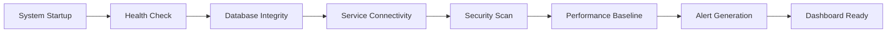
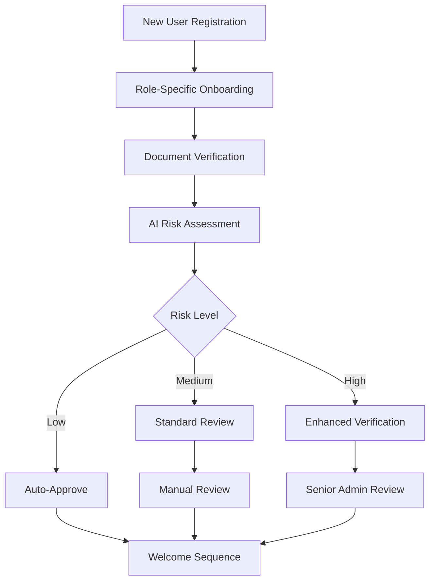

# 🔐 **Admin Workflow and Management Guide**
## Lewisham Charity - Advanced Administrative Operations Manual

### **Table of Contents**
1. [Overview & System Architecture](#overview--system-architecture)
2. [Admin Setup & Authentication](#admin-setup--authentication)
3. [Daily Operations & Workflow Automation](#daily-operations--workflow-automation)
4. [Advanced User Management](#advanced-user-management)
5. [Document Verification & AI Integration](#document-verification--ai-integration)
6. [Help Request Management & Decision Engine](#help-request-management--decision-engine)
7. [Volunteer Coordination & Performance Analytics](#volunteer-coordination--performance-analytics)
8. [System Administration & Monitoring](#system-administration--monitoring)
9. [Analytics, Reporting & Business Intelligence](#analytics-reporting--business-intelligence)
10. [Communication Management & Automation](#communication-management--automation)
11. [Emergency Procedures & Crisis Management](#emergency-procedures--crisis-management)
12. [Performance Optimization & Scaling](#performance-optimization--scaling)

---

## 🎯 **Overview & System Architecture**

The Lewisham Donation Hub administrative system provides a comprehensive, AI-enhanced platform for managing all aspects of community support services. This guide covers advanced workflows, automation features, and integrated management across all user types (visitors, volunteers, donors, staff).

### **Core Administrative Capabilities**
- **Unified Dashboard**: Real-time oversight of all system operations
- **AI-Powered Decision Support**: Automated eligibility checking and risk assessment
- **Cross-System Integration**: Seamless management across all user workflows
- **Advanced Analytics**: Predictive modeling and performance optimization
- **Automated Workflows**: Intelligent routing and processing
- **Emergency Response**: Crisis management and rapid response protocols

### **System Integration Architecture**

```mermaid
graph TB
    A[Admin Dashboard] --> B[User Management Hub]
    A --> C[Request Processing Engine]
    A --> D[Volunteer Coordination]
    A --> E[Donor Relations]
    A --> F[Analytics Engine]
    
    B --> B1[Visitor Management]
    B --> B2[Volunteer Management]
    B --> B3[Donor Management]
    B --> B4[Staff Management]
    
    C --> C1[Help Requests]
    C --> C2[Document Verification]
    C --> C3[Eligibility Engine]
    C --> C4[Ticket Generation]
    
    D --> D1[Shift Management]
    D --> D2[Performance Tracking]
    D --> D3[Training Coordination]
    D --> D4[Team Leadership]
    
    E --> E1[Donation Processing]
    E --> E2[Impact Tracking]
    E --> E3[Donor Engagement]
    E --> E4[Campaign Management]
    
    F --> F1[Real-time Analytics]
    F --> F2[Predictive Modeling]
    F --> F3[Performance Metrics]
    F --> F4[Business Intelligence]
```



### **Enhanced Workflow Integration**

#### **Cross-User Type Management**
- **Visitor-to-Volunteer Pipeline**: Track and facilitate visitor engagement in volunteering
- **Donor-Volunteer Coordination**: Manage donors who also volunteer their time
- **Staff-User Interaction**: Comprehensive oversight of all staff-user interactions
- **Community Impact Tracking**: Holistic view of community support ecosystem

#### **AI-Enhanced Decision Making**
- **Predictive Analytics**: Forecast demand and optimize resource allocation
- **Risk Assessment**: Automated fraud detection and security monitoring
- **Performance Optimization**: Continuous improvement through data analysis
- **Automated Workflows**: Reduce manual processing through intelligent automation

---

## 🚀 **Admin Setup & Authentication**

### **Initial Admin Account Setup**
**URL**: `https://lewishamhub.org/admin/dashboard`

#### **Environment Configuration (First Time Setup)**
**Required Environment Variables:**
```bash
ADMIN_EMAIL=admin@lewishamhub.org
ADMIN_PASSWORD=secure_admin_password_123
ADMIN_FIRST_NAME=System
ADMIN_LAST_NAME=Administrator
```

#### **Default Admin Creation Process**
1. **Automatic Setup**: Default admin is created on first system startup
2. **Credentials**: Use environment variables or contact system administrator
3. **Email Verification**: Admin accounts are pre-verified
4. **Role Assignment**: Automatic admin role allocation

#### **Admin Login Process**
1. **Access Login**: Navigate to `/login`
2. **Enter Credentials**: Use admin email and password
3. **Two-Factor Authentication**: If enabled, complete 2FA verification
4. **Dashboard Access**: Redirected to admin dashboard upon successful login

### **Admin Role Hierarchy**
- **Super Admin**: Full system access, user role management
- **Admin**: Standard administrative functions
- **Staff**: Limited admin functions (specific modules only)

---

## 📊 **Daily Operations & Workflow Automation**

### **Intelligent Morning Startup Sequence**
**URL**: `https://lewishamhub.org/admin/operations/daily-startup`

#### **Automated System Health Check (7:30 AM)**


**Automated Checks Include:**
1. **Infrastructure Status**
   - Database connectivity and response times
   - API endpoint availability and latency
   - File storage accessibility and capacity
   - Network connectivity and bandwidth

2. **Data Integrity Verification**
   - User account consistency checks
   - Document verification status validation
   - Help request processing queue integrity
   - Financial transaction reconciliation

3. **Security Assessment**
   - Failed login attempt analysis
   - Unusual access pattern detection
   - System vulnerability scan results
   - Data backup verification

#### **AI-Powered Priority Queue Management**
**URL**: `https://lewishamhub.org/admin/queue/ai-management`

**Smart Prioritization Algorithm:**
```
🔴 CRITICAL (0-2 hours):
- Emergency situations with safety concerns
- System failures affecting service delivery
- Urgent help requests with risk factors
- Volunteer safety incidents

🟠 HIGH (2-8 hours):
- Time-sensitive help requests
- Document verification backlogs
- Volunteer scheduling conflicts
- Donor issue resolution

🟡 MEDIUM (8-24 hours):
- Standard help request processing
- Routine document verification
- User account management
- Performance optimization tasks

🟢 LOW (24-72 hours):
- Administrative tasks and reporting
- System maintenance and updates
- Training and development activities
- Long-term planning initiatives
```

#### **Workflow Automation Rules Engine**
**URL**: `https://lewishamhub.org/admin/automation/rules`

**Automated Decision Trees:**
1. **Help Request Auto-Processing**
   ```
   IF visitor.verification_status == "VERIFIED" 
   AND visitor.last_request_date > 7_days_ago
   AND request.urgency_level == "STANDARD"
   AND system.capacity_available == true
   THEN auto_approve_request()
   ```

2. **Document Verification Routing**
   ```
   IF document.type == "PHOTO_ID" 
   AND document.quality_score > 0.85
   AND document.fraud_risk < 0.15
   THEN route_to_junior_admin()
   ELSE route_to_senior_admin()
   ```

3. **Volunteer Assignment Optimization**
   ```
   IF shift.required_skills IN volunteer.skills
   AND volunteer.reliability_score > 0.8
   AND volunteer.availability == true
   THEN auto_assign_volunteer()
   ```

### **Enhanced Daily Workflow Dashboard**
**URL**: `https://lewishamhub.org/admin/dashboard/enhanced`

#### **Real-Time Operations Monitor**
```
📊 LIVE SYSTEM STATUS:
- Active Users: 234 (Visitors: 156, Volunteers: 45, Donors: 33)
- Pending Requests: 23 (Emergency: 2, High: 7, Standard: 14)
- Processing Queue: 89% efficiency
- System Performance: 97.3% optimal

🎯 TODAY'S TARGETS:
- Help Requests to Process: 45 (Completed: 32, Remaining: 13)
- Documents to Verify: 67 (Approved: 51, Pending: 16)
- Volunteer Shifts: 12 (Filled: 12, Coverage: 100%)
- System Uptime: 99.8% (Target: 99.5%)
```

#### **Intelligent Task Prioritization**
- **AI-Suggested Actions**: Machine learning recommendations for next tasks
- **Deadline Tracking**: Automated SLA monitoring and alerts
- **Resource Optimization**: Dynamic task assignment based on admin capacity
- **Impact Scoring**: Priority ranking based on community impact potential

---

## 👥 **Advanced User Management**

### **Unified User Management Hub**
**URL**: `https://lewishamhub.org/admin/users/unified-hub`

#### **Cross-Role User Analytics**
**Real-time User Metrics Dashboard:**
```
📊 USER STATISTICS (Live):
- Total Active Users: 2,847 (+12 today)
- Visitors: 1,923 (67.5%)
- Volunteers: 456 (16.0%)
- Donors: 398 (14.0%)
- Staff: 70 (2.5%)

🎯 ENGAGEMENT METRICS:
- Daily Active Users: 234 (8.2% of total)
- Weekly Retention Rate: 73.5%
- Monthly Churn Rate: 4.2%
- Average Session Duration: 12.3 minutes

🔄 CROSS-ROLE TRANSITIONS:
- Visitor → Volunteer: 23 this month
- Donor → Volunteer: 8 this month
- Visitor → Donor: 15 this month
- Multi-role Users: 89 (3.1% of total)
```

#### **Advanced User Lifecycle Management**

**1. Intelligent User Onboarding**


**2. Proactive User Support System**
- **Predictive Issue Detection**: AI identifies users likely to need help
- **Automated Outreach**: Proactive support messages and resources
- **Personalized Guidance**: Tailored help based on user behavior
- **Escalation Triggers**: Automatic escalation for complex issues

**3. User Relationship Mapping**
```
VISITOR ←→ VOLUNTEER: Track visitors who become volunteers
DONOR ←→ VOLUNTEER: Monitor donor engagement in volunteering
VISITOR ←→ DONOR: Identify visitors who later donate
STAFF ←→ ALL ROLES: Comprehensive staff interaction tracking
```

#### **Enhanced User Management Functions**

**1. Advanced User Search & Filtering**
```
🔍 SEARCH CAPABILITIES:
- Multi-criteria search across all user types
- Behavioral pattern matching
- Geographic clustering analysis
- Service utilization patterns
- Cross-role activity tracking

📊 FILTERING OPTIONS:
- Role: Visitor, Volunteer, Donor, Staff, Multi-role
- Status: Active, Inactive, Pending, Suspended, Graduated
- Verification: Verified, Partial, Pending, Flagged
- Engagement: High, Medium, Low, Inactive
- Risk Level: Low, Medium, High, Monitored
```

**2. Intelligent User Account Operations**
- **Smart User Creation**: AI-assisted profile completion
- **Dynamic Profile Updates**: Real-time information synchronization
- **Automated Status Management**: Rule-based status changes
- **Predictive Password Reset**: Proactive security measures
- **Graduated Account Closure**: Phased deactivation with data retention

#### **Individual User Management**
**URL**: `https://lewishamhub.org/admin/users/:id`

**User Profile Management:**
1. **Personal Information**
   - Name, email, phone number
   - Address and contact details
   - Emergency contact information
   - Accessibility requirements

2. **Account Settings**
   - Role assignment and permissions
   - Email verification status
   - Account status management
   - Notification preferences

3. **Activity History**
   - Login history and timestamps
   - Help requests submitted
   - Volunteer shift history
   - Document upload history

#### **Bulk User Operations**
**Available Actions:**
- Export user data to CSV
- Bulk email notifications
- Mass status updates
- Role reassignments

---

## 📄 **Document Verification Process**

### **Document Verification Dashboard**
**URL**: `https://lewishamhub.org/admin/documents`

#### **Daily Document Review Workflow**

**1. Pending Documents Queue**
```
Priority Order:
1. Emergency requests (red flag)
2. Standard requests (7+ days old)
3. Recent submissions (0-6 days)
4. Resubmissions after rejection
```

**2. Document Categories**
- **Photo ID**: Passport, Driving License, National ID
- **Proof of Address**: Utility bills, Bank statements, Council tax
- **Supporting Documents**: Benefits letters, Medical certificates

#### **Verification Process Steps**

**Step 1: Document Review**
1. **Open Document**: Click "View" to open in new tab
2. **Quality Check**:
   - Image clarity and legibility
   - All corners visible
   - No tampering or alterations
   - Recent date (for time-sensitive documents)

3. **Information Validation**:
   - Name matches user profile
   - Address consistency
   - Document authenticity
   - Expiration dates (if applicable)

**Step 2: Decision Making**
```
Approval Criteria:
✓ Clear, legible document
✓ Valid and current
✓ Matches user information
✓ Authentic appearance
✓ All required fields visible

Rejection Criteria:
✗ Poor image quality
✗ Expired document
✗ Information mismatch
✗ Suspected tampering
✗ Incomplete document
```

**Step 3: Action Processing**
1. **Approve Document**:
   - Click "Approve" button
   - Add verification notes (optional)
   - System sends approval email to user
   - Updates user verification status

2. **Reject Document**:
   - Click "Reject" button
   - **Required**: Select rejection reason
   - Add specific feedback for resubmission
   - System sends rejection email with guidance

#### **Bulk Document Operations**
- **Mass Approval**: For straightforward documents
- **Bulk Rejection**: With standardized reasons
- **Export Verification Report**: CSV download
- **Filter by Date Range**: Custom time periods

#### **Document Security & Compliance**
- **Access Logging**: All document views are logged
- **Retention Policy**: Documents stored securely for legal requirements
- **Privacy Protection**: No document downloads, view-only access
- **Audit Trail**: Complete verification history maintained

---

## 🆘 **Help Request Management**

### **Help Request Dashboard**
**URL**: `https://lewishamhub.org/admin/help-requests`

#### **Request Processing Workflow**

**1. Help Request Categories**
```
Priority Levels:
🔴 URGENT (0-24 hours): Emergency situations
🟡 STANDARD (2-5 days): Regular requests
🟢 LOW (5-14 days): Non-urgent needs
```

**2. Request Status Management**
- **Pending**: Awaiting admin review
- **Under Review**: Being evaluated
- **Approved**: Ready for ticket issuance
- **Rejected**: Not meeting criteria
- **On Hold**: Awaiting additional information

#### **Request Evaluation Process**

**Step 1: Request Review**
1. **Open Request Details**: Review all submitted information
2. **Check User Eligibility**:
   - Document verification status
   - Previous request history
   - Account standing
   - Geographic eligibility

3. **Validate Request Details**:
   - Household size accuracy
   - Stated need assessment
   - Supporting documentation
   - Priority level evaluation

**Step 2: Decision Processing**
```
Approval Checklist:
✓ User fully verified (documents approved)
✓ Genuine need demonstrated
✓ Household size appropriate
✓ Within service area
✓ No recent fulfilled requests
✓ All required information provided

Rejection Criteria:
✗ Incomplete verification
✗ Duplicate recent request
✗ Outside service area
✗ Insufficient documentation
✗ Suspected fraudulent activity
```

**Step 3: Action Implementation**
1. **Approve Request**:
   - Select approval with reasoning
   - Add admin notes
   - **Automatic**: Generate visit tickets
   - **Email**: Send approval notification with ticket details

2. **Reject Request**:
   - Choose rejection reason from dropdown
   - Provide detailed feedback
   - **Email**: Send rejection with improvement guidance
   - **Option**: Allow resubmission with corrections

#### **Ticket Management**
**URL**: `https://lewishamhub.org/admin/tickets`

1. **Bulk Ticket Issuance**:
   - Select multiple approved requests
   - Assign visit dates/times
   - Generate ticket numbers
   - Send batch notifications

2. **Individual Ticket Operations**:
   - Modify visit dates
   - Cancel tickets (with notification)
   - Transfer tickets between users
   - Generate replacement tickets

---

## 🤝 **Volunteer Management**

### **Volunteer Administration Dashboard**
**URL**: `https://lewishamhub.org/admin/volunteers`

#### **Volunteer Lifecycle Management**

**1. Volunteer Application Review**
```
Application Stages:
1. Initial Application Submitted
2. Background Check Initiated
3. Interview Scheduled
4. Training Completed
5. Probation Period
6. Full Volunteer Status
```

**2. Volunteer Status Management**
- **Pending**: Application under review
- **Active**: Currently volunteering
- **Inactive**: Temporarily not available
- **Suspended**: Disciplinary action
- **Alumni**: Former volunteers

#### **Daily Volunteer Operations**

**Shift Management**
**URL**: `https://lewishamhub.org/admin/shifts`

1. **Create Shifts**:
   - Set date, time, and duration
   - Define required volunteer count
   - Assign specific roles/responsibilities
   - Set skill requirements

2. **Assign Volunteers**:
   - Match skills to requirements
   - Consider volunteer preferences
   - Ensure adequate coverage
   - Send assignment notifications

3. **Manage No-Shows**:
   - Mark volunteers absent
   - Find replacement coverage
   - Update volunteer reliability scores
   - Follow up with absent volunteers

#### **Volunteer Performance Monitoring**
1. **Reliability Tracking**:
   - Attendance percentage
   - No-show frequency
   - Last-minute cancellations
   - Overall punctuality

2. **Performance Metrics**:
   - Hours contributed
   - Tasks completed
   - Feedback scores
   - Training completion

3. **Recognition and Development**:
   - Acknowledge outstanding performance
   - Identify training needs
   - Career development opportunities
   - Volunteer appreciation events

---

## ⚙️ **System Administration**

### **System Settings Management**
**URL**: `https://lewishamhub.org/admin/settings`

#### **Core System Configuration**

**1. Notification Settings**
- **Email Templates**: Customize all system emails
- **Notification Triggers**: Define when notifications are sent
- **Frequency Controls**: Manage notification timing
- **Template Variables**: Personalization options

**2. Security Settings**
- **Password Policies**: Complexity requirements
- **Session Management**: Timeout configurations
- **Two-Factor Authentication**: Enable/disable 2FA
- **Access Controls**: Role-based permissions

**3. System Parameters**
- **Visit Capacities**: Daily limits by category
- **Operating Hours**: System availability windows
- **Geographic Boundaries**: Service area definitions
- **Document Requirements**: Verification criteria

#### **System Health Monitoring**
**URL**: `https://lewishamhub.org/admin/system/health`

**1. Performance Metrics**
```
Real-time Monitoring:
- Database response times
- Server CPU/Memory usage
- Active user sessions
- API response rates
- Error rates and types
```

**2. Alert Management**
- **Critical Alerts**: Immediate attention required
- **Warning Alerts**: Monitor but not urgent
- **Info Alerts**: System status updates
- **Maintenance Alerts**: Scheduled downtime

**3. Backup and Recovery**
- **Daily Backups**: Automated data backup
- **Recovery Procedures**: Step-by-step restoration
- **Disaster Recovery**: Business continuity plans
- **Data Integrity**: Regular validation checks

---

## 📈 **Analytics & Reporting**

### **Analytics Dashboard**
**URL**: `https://lewishamhub.org/admin/analytics`

#### **Key Performance Indicators (KPIs)**

**1. Service Delivery Metrics**
```
Daily/Weekly/Monthly Views:
- Help requests processed
- Tickets issued and redeemed
- Document verification rates
- User registration trends
- Volunteer engagement levels
```

**2. Operational Efficiency**
- **Processing Times**: Average time for approvals
- **Capacity Utilization**: Visit slot usage
- **Volunteer Coverage**: Shift fulfillment rates
- **Document Turnaround**: Verification timelines
- **User Satisfaction**: Feedback scores

#### **Custom Report Generation**
**URL**: `https://lewishamhub.org/admin/reports/custom`

**1. Report Builder**:
- **Date Range Selection**: Custom time periods
- **Metric Selection**: Choose specific data points
- **Filter Options**: Segment by various criteria
- **Export Formats**: PDF, CSV, Excel

**2. Scheduled Reports**:
- **Daily Summaries**: Sent to admin email
- **Weekly Overviews**: Comprehensive statistics
- **Monthly Reports**: Detailed analysis
- **Quarterly Reviews**: Trend analysis

#### **Data Export Options**
**Available Exports:**
- User data (CSV)
- Help request history (Excel)
- Volunteer shift records (CSV)
- Document verification logs (PDF)
- Financial transaction records (CSV)

---

## 📢 **Communication Management**

### **Communication Dashboard**
**URL**: `https://lewishamhub.org/admin/communications`

#### **Notification System Management**

**1. Broadcast Messaging**
- **System-wide Announcements**: All users
- **Role-based Messaging**: Specific user groups
- **Emergency Notifications**: Urgent communications
- **Maintenance Alerts**: Scheduled downtime notices

**2. Targeted Communications**
```
Message Types:
- Individual user messages
- Group notifications
- Automated system messages
- Follow-up reminders
- Welcome series for new users
```

#### **Email Template Management**
**URL**: `https://lewishamhub.org/admin/communications/templates`

**1. Template Categories**:
- **Verification**: Document approval/rejection
- **Help Requests**: Status updates
- **Volunteers**: Shift assignments, reminders
- **General**: Welcome messages, password resets

**2. Template Customization**:
- **Content Editing**: Modify message text
- **Variable Insertion**: Dynamic content
- **Branding**: Logo and color scheme
- **Multi-language**: Support for multiple languages

#### **Feedback Management**
**URL**: `https://lewishamhub.org/admin/feedback`

**1. Feedback Review Process**:
- **Priority Sorting**: Address urgent feedback first
- **Response Management**: Track response status
- **Resolution Tracking**: Monitor issue closure
- **Trend Analysis**: Identify recurring issues

**2. Bulk Response Operations**:
- **Template Responses**: Standard reply templates
- **Mass Communication**: Multiple feedback items
- **Status Updates**: Bulk status changes
- **Follow-up Scheduling**: Automated reminders

---

## 🚨 **Emergency Procedures**

### **Emergency Response Protocol**

#### **Critical System Issues**
**Immediate Actions (Priority 1 - Within 15 minutes):**

1. **System Outage**:
   - Check server status dashboard
   - Verify database connectivity
   - Contact technical support if needed
   - Implement backup communication plan

2. **Security Breach**:
   - Immediately secure affected systems
   - Change all admin passwords
   - Review access logs
   - Contact security team
   - Document all actions taken

3. **Data Loss/Corruption**:
   - Stop all write operations
   - Initiate backup restoration
   - Verify data integrity
   - Document extent of loss
   - Notify stakeholders

#### **Urgent User Situations**
**Response Time: Within 2 hours**

1. **Emergency Help Requests**:
   - **Immediate Review**: Bypass normal queue
   - **Priority Processing**: Direct approval if eligible
   - **Same-day Tickets**: Emergency slot allocation
   - **Follow-up Contact**: Confirm receipt and next steps

2. **Volunteer Safety Issues**:
   - **Immediate Assistance**: Contact emergency services if needed
   - **Incident Documentation**: Complete incident report
   - **Volunteer Support**: Provide necessary support
   - **System Updates**: Update volunteer status if required

#### **Communication During Emergencies**

**Internal Communication**:
- **Admin Team**: Immediate notification via secure channels
- **Technical Team**: System issue escalation
- **Management**: Stakeholder updates
- **Documentation**: Real-time incident logging

**External Communication**:
- **User Notifications**: System status updates
- **Website Banner**: Service disruption notices
- **Social Media**: Public announcements if needed
- **Email Alerts**: Direct user notification

### **Recovery Procedures**

#### **Post-Emergency Checklist**
1. **System Verification**:
   - Full functionality testing
   - Data integrity validation
   - Security audit completion
   - Performance monitoring

2. **User Communication**:
   - Service restoration announcement
   - Apology for disruption
   - Summary of actions taken
   - Prevention measures implemented

3. **Documentation and Review**:
   - Complete incident report
   - Root cause analysis
   - Prevention strategy development
   - Emergency procedure updates

---

## 📚 **Additional Resources**

### **Quick Reference Links**
- **Admin Dashboard**: `/admin/dashboard`
- **User Management**: `/admin/users`
- **Document Verification**: `/admin/documents`
- **Help Requests**: `/admin/help-requests`
- **Volunteer Management**: `/admin/volunteers`
- **System Settings**: `/admin/settings`
- **Analytics**: `/admin/analytics`
- **Reports**: `/admin/reports`

### **Support Contacts**
- **Technical Support**: tech-support@lewishamhub.org
- **System Administrator**: admin@lewishamhub.org
- **Emergency Hotline**: [Emergency Phone Number]
- **Help Desk**: help@lewishamhub.org

### **Training Resources**
- **Admin Training Videos**: Internal portal
- **Documentation Library**: System knowledge base
- **Best Practices Guide**: Administrative procedures
- **Policy Documents**: Operational guidelines

---

**📋 Document Version**: 1.0  
**📅 Last Updated**: [Current Date]  
**👤 Document Owner**: System Administration Team  
**🔄 Review Cycle**: Quarterly  

**⚠️ Important**: This guide contains sensitive administrative information. Access should be restricted to authorized personnel only.
