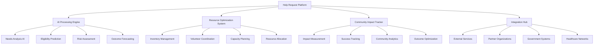
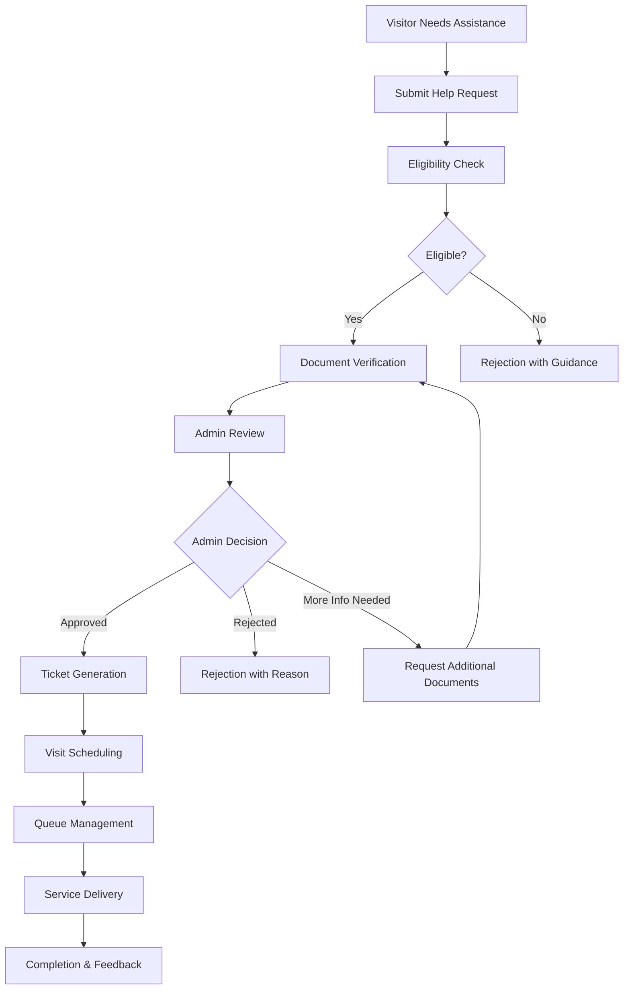

# 🆘 Help Request Workflow and User Journey Guide
## Lewisham Donation Hub - Advanced AI-Powered Help Request & Service Delivery System

---

## 📋 **Table of Contents**
1. [Overview & Intelligent Request Ecosystem](#overview--intelligent-request-ecosystem)
2. [AI-Enhanced Help Request Journey](#ai-enhanced-help-request-journey)
3. [Smart Visitor Request Processing](#smart-visitor-request-processing)
4. [Advanced Admin Review & Decision Engine](#advanced-admin-review--decision-engine)
5. [AI-Powered Document Verification](#ai-powered-document-verification)
6. [Intelligent Ticket Issuance & Visit Optimization](#intelligent-ticket-issuance--visit-optimization)
7. [Advanced Notification & Communication](#advanced-notification--communication)
8. [Real-Time Status Tracking & Predictive Updates](#real-time-status-tracking--predictive-updates)
9. [Dynamic Queue Management & Resource Optimization](#dynamic-queue-management--resource-optimization)
10. [Comprehensive Support & Issue Resolution](#comprehensive-support--issue-resolution)
11. [Advanced Technical Requirements & Security](#advanced-technical-requirements--security)
12. [Performance Analytics & Continuous Improvement](#performance-analytics--continuous-improvement)

---

## 🎯 **Overview & Intelligent Request Ecosystem**

The Lewisham Donation Hub help request system provides an advanced, AI-enhanced digital platform that revolutionizes how community members request assistance and how administrators efficiently manage, review, and approve these requests. The system leverages machine learning, predictive analytics, and intelligent automation to create a seamless, personalized experience that maximizes community impact while optimizing resource allocation.

### **Advanced Help Request Types & AI-Powered Services**
- **AI-Matched Food Assistance**: Personalized nutrition packages based on dietary needs, health conditions, and family preferences
- **Smart Clothing Support**: Intelligent sizing and style matching for seasonal, work, and children's clothing needs
- **Optimized Household Items**: AI-powered furniture and appliance matching based on living situations and family composition
- **Predictive Emergency Support**: Proactive crisis intervention with rapid response and comprehensive assistance coordination
- **Specialized Service Coordination**: Intelligent matching for medical supplies, educational materials, and specialized care items
- **Integrated Referral Network**: AI-powered connections to external support organizations with compatibility scoring

### **Revolutionary System Features & AI Integration**
- **Predictive Eligibility Engine**: Machine learning algorithms that predict approval likelihood and optimize application guidance
- **Intelligent Document Verification**: Computer vision and fraud detection systems with automated quality assessment
- **Real-Time Impact Tracking**: Live monitoring of request outcomes with community impact scoring and optimization
- **Smart Ticket Generation**: Dynamic scheduling optimization with resource allocation and volunteer matching
- **Adaptive Queue Management**: AI-powered queue optimization with predictive wait times and capacity planning
- **Comprehensive Analytics Engine**: Advanced reporting with predictive modeling and continuous system improvement

### **Help Request Ecosystem Architecture**



### **Intelligent Request Classification & Processing**
```
🔴 EMERGENCY TIER (AI Priority Score: 90-100):
- Life-threatening situations requiring immediate intervention
- Automated fast-track processing with 2-hour response guarantee
- Direct connection to emergency services and crisis support
- Real-time case management with continuous monitoring

🟠 URGENT TIER (AI Priority Score: 75-89):
- Time-sensitive needs requiring rapid response within 24 hours
- Automated eligibility verification with expedited review
- Priority resource allocation and volunteer assignment
- Enhanced communication and status tracking

🟡 PRIORITY TIER (AI Priority Score: 60-74):
- Important needs requiring standard processing within 3-5 days
- Standard eligibility verification with automated routing
- Regular resource allocation with optimization algorithms
- Standard communication and tracking protocols

🟢 STANDARD TIER (AI Priority Score: 40-59):
- Regular needs with standard processing within 5-10 days
- Automated processing where possible with periodic review
- Efficient resource allocation based on availability
- Automated communication with milestone updates

🔵 DEVELOPMENT TIER (AI Priority Score: 20-39):
- Long-term development needs with flexible processing timelines
- Focus on skill building, education, and community integration
- Resource allocation based on development pathway planning
- Enhanced support and mentoring coordination
```

---

## 🗺️ **Help Request Journey Map**



---

## 📝 **Visitor Help Request Process**

### **Step 1: Initial Request Submission**
**URL**: `https://lewishamCharity.org/visitor/help-requests`

#### **Access Requirements**
- **Registered visitor account** (must be logged in)
- **Verified email address**
- **Complete profile information**
- **Valid location within service area**

#### **Request Form Completion**
**Basic Information (Auto-populated from profile):**
- Name and contact details
- Address and postcode
- Phone number and email
- Emergency contact information

**Request Details:**
1. **Service Type Selection**
   - Primary service needed (dropdown selection)
   - Secondary services (optional checkboxes)
   - Urgency level (Low, Medium, High, Emergency)

2. **Household Information**
   - Number of adults
   - Number of children (with ages)
   - Special dietary requirements
   - Accessibility needs
   - Cultural/religious considerations

3. **Current Situation**
   - Reason for request (free text)
   - Current financial situation
   - Other support being received
   - Previous visits to the hub

4. **Supporting Documentation**
   - **Required documents** (varies by request type):
     - Proof of address (utility bill, bank statement)
     - Proof of income (benefits letter, payslips)
     - ID verification (passport, driving license)
     - Council tax statement
   - **Optional documents**:
     - Medical certificates
     - School enrollment confirmation
     - Housing association letters

### **Step 2: Automatic Eligibility Checking**

#### **Location Verification**
- **Postcode validation** against service area
- **Distance calculation** from hub location
- **Priority scoring** based on proximity

#### **Frequency Checking**
- **Previous request history** analysis
- **Time since last request** verification
- **Service limits** enforcement (e.g., monthly food assistance)

#### **Eligibility Criteria Assessment**
- **Income thresholds** verification
- **Household composition** validation
- **Residency requirements** checking
- **Special circumstances** consideration

### **Step 3: Real-time Status Updates**

#### **Immediate Response**
- **Submission confirmation** with reference number
- **Estimated processing time** provided
- **Next steps** clearly outlined
- **Contact information** for queries

#### **Status Notifications**
- **Email notifications** for all status changes
- **SMS alerts** for urgent updates (if opted in)
- **Dashboard updates** in real-time
- **Push notifications** (if enabled)

---

## 🔍 **Admin Review & Management**

### **Admin Dashboard Overview**
**URL**: `https://lewishamCharity.org/admin/help-requests`

#### **Request Queue Management**
- **Priority sorting** (Emergency → High → Medium → Low)
- **Filter options**:
  - Status (Pending, Under Review, Approved, Rejected)
  - Service type
  - Submission date range
  - Urgency level
  - Postcode area
- **Bulk actions** for multiple requests
- **Search functionality** by name, reference, or postcode

#### **Individual Request Review**
**URL**: `https://lewishamCharity.org/admin/help-requests/[id]`

**Request Information Display:**
1. **Visitor Details**
   - Personal information
   - Contact details
   - Address and eligibility status
   - Previous request history

2. **Request Specifics**
   - Services requested
   - Urgency level and reasoning
   - Household composition
   - Special requirements

3. **Documentation Review**
   - Uploaded document previews
   - Document verification status
   - Missing document alerts
   - Document quality assessment

4. **System Recommendations**
   - Eligibility score
   - Risk assessment
   - Similar request patterns
   - Suggested approval/rejection

### **Admin Decision Process**

#### **Approval Workflow**
1. **Document Verification**
   - Validate all required documents
   - Cross-reference information
   - Flag inconsistencies
   - Request additional documents if needed

2. **Eligibility Confirmation**
   - Review automatic eligibility check
   - Apply admin discretion for edge cases
   - Consider special circumstances
   - Override system recommendations if justified

3. **Service Allocation**
   - Determine appropriate service level
   - Set visit date and time
   - Assign specific items or support
   - Add special instructions

4. **Approval Execution**
   - Set approval status
   - Generate ticket automatically
   - Send notification to visitor
   - Update inventory reservations

#### **Rejection Workflow**
1. **Reason Documentation**
   - Select rejection reason from predefined list
   - Add detailed explanation
   - Provide alternative suggestions
   - Include appeal process information

2. **Rejection Communication**
   - Send immediate notification
   - Include helpful resources
   - Provide guidance for reapplication
   - Offer referral to other services

#### **Information Request Workflow**
1. **Document Request**
   - Specify required documents
   - Set deadline for submission
   - Provide upload instructions
   - Explain rejection consequences

2. **Follow-up Management**
   - Track document submission
   - Send reminder notifications
   - Auto-reject if deadline missed
   - Resume review when complete

---

## 📄 **Document Verification Integration**

### **Document Types & Requirements**

#### **Primary Documents (Always Required)**
- **Proof of Identity**
  - UK passport
  - UK driving license
  - National insurance number
  - Benefits entitlement letter

- **Proof of Address**
  - Recent utility bill (within 3 months)
  - Bank statement (within 3 months)
  - Council tax statement
  - Tenancy agreement

- **Proof of Income**
  - Benefits letter (current)
  - Recent payslips (3 months)
  - Universal Credit statement
  - Pension statement

#### **Conditional Documents**
- **For families**: Birth certificates for children
- **For students**: Student ID or enrollment letter
- **For refugees**: Home Office documentation
- **For medical needs**: GP letter or prescription
- **For emergency housing**: Eviction notice or homeless declaration

### **Verification Process**

#### **Automated Checks**
1. **Document Quality Assessment**
   - Image clarity and readability
   - File format validation
   - Size and resolution checks
   - Metadata analysis for authenticity

2. **Content Extraction**
   - OCR text recognition
   - Key information identification
   - Date validation
   - Address matching

3. **Cross-Reference Validation**
   - Information consistency across documents
   - Database lookups where possible
   - Known fraud pattern detection
   - Duplicate submission checking

#### **Manual Review Process**
1. **Admin Verification**
   - Visual document inspection
   - Information accuracy confirmation
   - Suspicious document flagging
   - Quality assessment override

2. **Secondary Review** (for high-value requests)
   - Senior admin verification
   - Additional documentation request
   - External verification if needed
   - Final approval authorization

---

## 🎫 **Ticket Issuance & Visit Management**

### **Automatic Ticket Generation**

#### **Ticket Creation Process**
1. **Upon Approval**
   - Unique ticket number generation
   - QR code creation for scanning
   - Visit date and time assignment
   - Service details specification

2. **Ticket Information**
   - **Ticket Details**:
     - Reference number (format: LDH-YYYY-NNNNNN)
     - QR code for quick scanning
     - Visit date and time slot
     - Estimated duration
   - **Service Information**:
     - Approved services list
     - Quantity/value allocations
     - Special instructions
     - Restrictions or limitations
   - **Visitor Information**:
     - Name and contact details
     - Household composition
     - Special requirements
     - Accessibility needs

#### **Ticket Delivery**
1. **Digital Delivery**
   - Email with PDF attachment
   - Dashboard download link
   - Mobile-optimized view
   - Print-friendly format

2. **Backup Options**
   - SMS with reference number
   - Phone call confirmation
   - Postal delivery (if requested)
   - Collection from hub

### **Visit Scheduling System**

#### **Slot Allocation**
1. **Time Slot Management**
   - **Standard slots**: 30-minute appointments
   - **Extended slots**: 60 minutes for complex cases
   - **Emergency slots**: Same-day availability
   - **Flexible timing**: For specific needs

2. **Capacity Management**
   - **Daily limits** by service type
   - **Volunteer availability** consideration
   - **Resource allocation** planning
   - **Queue optimization** algorithms

#### **Rescheduling Process**
1. **Visitor-Initiated Changes**
   - Online rescheduling (up to 24 hours before)
   - Phone-based rescheduling
   - Emergency rescheduling procedures
   - Cancellation with re-booking

2. **System-Initiated Changes**
   - Volunteer unavailability
   - Resource shortages
   - Emergency closures
   - Automatic rescheduling with notification

---

## 📢 **Notification & Communication Workflows**

### **Notification System Architecture**

#### **Multi-Channel Delivery**
1. **Email Notifications**
   - Detailed information and documentation
   - Ticket attachments and instructions
   - Status updates and reminders
   - Educational content and resources

2. **SMS Notifications**
   - Urgent status updates
   - Appointment reminders (24h and 2h before)
   - Emergency communications
   - Quick status confirmations

3. **In-App Notifications**
   - Real-time dashboard updates
   - Interactive status tracking
   - Document upload prompts
   - Action required alerts

4. **Push Notifications** (Mobile Web App)
   - Instant status changes
   - Appointment reminders
   - Emergency alerts
   - Breaking news updates

### **Communication Templates**

#### **Submission Confirmation**
```
Subject: Help Request Submitted - Reference #LDH-2025-123456

Dear [Name],

Thank you for submitting your help request. We have received your application and it is now being processed.

Reference Number: LDH-2025-123456
Submission Date: [Date/Time]
Services Requested: [List]

What happens next:
1. We will review your eligibility (within 24 hours)
2. Your documents will be verified
3. You will receive a decision within 3-5 business days

You can track your request status at: [Dashboard Link]

For urgent queries, contact us at: help@lewishamCharity.org
```

#### **Approval Notification**
```
Subject: Help Request Approved - Visit Scheduled

Dear [Name],

Great news! Your help request has been approved.

Visit Details:
- Date: [Date]
- Time: [Time]
- Address: [Hub Address]
- Estimated Duration: [Duration]

Services Approved:
[Detailed list of approved services]

Your ticket is attached to this email. Please bring:
- This ticket (printed or on mobile)
- Photo ID
- Any children accompanying you

Important: Please arrive 10 minutes early for check-in.

Need to reschedule? Visit: [Reschedule Link]
```

#### **Rejection Notification**
```
Subject: Help Request Update - Additional Information Needed

Dear [Name],

We have carefully reviewed your help request (Reference: LDH-2025-123456).

Unfortunately, we cannot approve your request at this time because:
[Specific reason]

What you can do:
1. [Specific action/alternative suggestion]
2. [Appeal process information]
3. [Referral to other services]

If you believe this decision is incorrect, you can appeal by:
[Appeal process details]

We are here to help. Contact us at: help@lewishamCharity.org
```

### **Automated Reminder System**

#### **Appointment Reminders**
- **7 days before**: Visit preparation checklist
- **24 hours before**: Confirmation with directions
- **2 hours before**: Final reminder with weather/delays
- **Post-visit**: Feedback request and next steps

#### **Follow-up Communications**
- **Document requests**: Deadline reminders
- **Incomplete applications**: Gentle nudges
- **Long-term support**: Check-in messages
- **Service feedback**: Experience surveys

---

## 📊 **Status Tracking & Updates**

### **Status Categories**

#### **Primary Statuses**
1. **Submitted** (Initial submission completed)
2. **Under Review** (Admin actively reviewing)
3. **Documents Required** (Additional documentation needed)
4. **Approved** (Ready for visit scheduling)
5. **Rejected** (Not approved with reason)
6. **Scheduled** (Visit date/time confirmed)
7. **Completed** (Service delivered successfully)
8. **Cancelled** (Cancelled by visitor or system)

#### **Sub-statuses for Detailed Tracking**
- **Eligibility Check**: Automated verification in progress
- **Document Verification**: Documents being validated
- **Admin Review**: Human review in progress
- **Senior Review**: Escalated for additional approval
- **Pending Visitor Response**: Waiting for visitor action
- **Processing Ticket**: Generating visit ticket
- **Ready for Collection**: Ticket available

### **Real-time Status Dashboard**
**URL**: `https://lewishamCharity.org/visitor/help-requests/status`

#### **Status Display Features**
1. **Visual Progress Bar**
   - Clear step-by-step progression
   - Completed vs remaining steps
   - Estimated completion time
   - Interactive status points

2. **Detailed Status Information**
   - Current status description
   - Time in current status
   - Expected next update
   - Required actions (if any)

3. **History Timeline**
   - Complete request history
   - Timestamp for each status change
   - Admin comments and notes
   - Document submission records

4. **Action Items**
   - Outstanding document requests
   - Rescheduling options
   - Contact information
   - Appeal procedures

### **Status Update Triggers**

#### **Automatic Updates**
- **Eligibility check completion**
- **Document upload received**
- **Admin decision recorded**
- **Ticket generated**
- **Visit completed**

#### **Manual Updates**
- **Admin comments added**
- **Special circumstances noted**
- **Escalation decisions**
- **Custom status messages**

---

## 🗓️ **Queue Management & Visit Scheduling**

### **Queue System Overview**

#### **Multi-Queue Architecture**
1. **Service-Specific Queues**
   - Food assistance queue
   - Clothing support queue
   - Household items queue
   - Emergency services queue
   - Specialized services queue

2. **Priority Levels**
   - **Emergency** (Same day service)
   - **High** (Within 48 hours)
   - **Medium** (Within 1 week)
   - **Low** (Within 2 weeks)

#### **Queue Management Dashboard**
**URL**: `https://lewishamCharity.org/admin/queue-management`

**Real-time Queue Monitoring:**
- **Current wait times** by service type
- **Upcoming appointments** for the day
- **Available slots** for walk-ins
- **Volunteer assignments** and availability
- **Resource availability** status

### **Visit Day Operations**

#### **Check-in Process**
1. **Arrival Protocol**
   - QR code scanning or manual lookup
   - ID verification
   - Service confirmation
   - Queue position assignment

2. **Queue Management**
   - Real-time position updates
   - Estimated wait time communication
   - Priority adjustment capabilities
   - No-show management

3. **Service Delivery**
   - Service completion tracking
   - Inventory updates
   - Visitor satisfaction recording
   - Additional needs identification

#### **Visit Completion**
1. **Service Documentation**
   - Items/services provided
   - Quantity and value recording
   - Special circumstances noted
   - Follow-up requirements

2. **Feedback Collection**
   - Service quality rating
   - Volunteer performance feedback
   - Suggestions for improvement
   - Additional support needs

3. **Post-Visit Actions**
   - Update visitor record
   - Process feedback
   - Schedule follow-up if needed
   - Update analytics data

---

## 🔧 **Troubleshooting & Support**

### **Common Visitor Issues**

#### **Submission Problems**
**Problem**: Cannot submit help request
**Solutions**:
1. **Check required fields** - all mandatory information must be completed
2. **Verify document uploads** - ensure all required documents are attached
3. **Check file formats** - PDF, JPG, PNG only (max 5MB each)
4. **Clear browser cache** and try again
5. **Try different browser** or device

**Problem**: Documents not uploading
**Solutions**:
1. **Check file size** - maximum 5MB per file
2. **Verify file format** - PDF, JPG, PNG only
3. **Ensure stable internet** connection
4. **Use different browser** or incognito mode
5. **Contact support** with error message

#### **Status Tracking Issues**
**Problem**: Status not updating
**Solutions**:
1. **Refresh dashboard** - allow 5-10 minutes for updates
2. **Check notification settings** - ensure emails not in spam
3. **Verify contact information** - update if changed
4. **Clear browser cache** and cookies
5. **Contact admin** if urgent

**Problem**: Cannot reschedule appointment
**Solutions**:
1. **Check rescheduling deadline** - usually 24 hours before
2. **Verify appointment status** - must be "Scheduled"
3. **Look for available slots** - limited availability
4. **Call hub directly** for emergency rescheduling
5. **Consider cancelling and rebooking** if needed

### **Admin Support Issues**

#### **Review Process Problems**
**Problem**: Cannot access request details
**Solutions**:
1. **Check admin permissions** - ensure proper role assignment
2. **Verify request ID** - confirm correct reference number
3. **Clear browser cache** and reload
4. **Check system status** - look for maintenance notices
5. **Contact IT support** with specific error

**Problem**: Document verification failures
**Solutions**:
1. **Check document quality** - ensure clear and readable
2. **Verify document authenticity** - look for tampering signs
3. **Cross-reference information** - confirm consistency
4. **Request alternative documents** if needed
5. **Escalate to senior admin** for complex cases

#### **System Performance Issues**
**Problem**: Slow dashboard loading
**Solutions**:
1. **Check internet connection** speed
2. **Close unnecessary browser tabs**
3. **Clear browser cache** and cookies
4. **Use recommended browser** (Chrome, Firefox, Safari)
5. **Report performance issues** to IT team

### **Emergency Procedures**

#### **System Outages**
1. **Check system status** page
2. **Use backup paper process** for urgent requests
3. **Contact IT support** immediately
4. **Communicate delays** to visitors
5. **Document manual processes** for later entry

#### **Urgent Help Requests**
1. **Prioritize emergency cases** immediately
2. **Use phone verification** if system unavailable
3. **Bypass normal approval** for life-threatening situations
4. **Document emergency procedures** used
5. **Follow up with full process** when system restored

### **Contact Information**

#### **Visitor Support**
- **General Help**: help@lewishamCharity.org
- **Technical Issues**: support@lewishamCharity.org
- **Urgent Matters**: 020-XXXX-XXXX (9 AM - 6 PM)
- **Emergency Line**: 020-XXXX-XXXX (24/7)

#### **Admin Support**
- **Admin Help Desk**: admin@lewishamCharity.org
- **IT Support**: it@lewishamCharity.org
- **System Issues**: 020-XXXX-XXXX (24/7)
- **Escalation Manager**: manager@lewishamCharity.org

---

## 💻 **Technical Requirements**

### **System Compatibility**

#### **Visitor Requirements**
- **Browsers**: Chrome 90+, Firefox 88+, Safari 14+, Edge 90+
- **Mobile**: iOS 12+, Android 8.0+
- **Internet**: Minimum 1 Mbps (3 Mbps recommended)
- **JavaScript**: Must be enabled
- **Cookies**: Required for authentication

#### **Admin Requirements**
- **Browsers**: Latest versions of major browsers
- **Screen Resolution**: Minimum 1280x720 (1920x1080 recommended)
- **Internet**: Minimum 5 Mbps stable connection
- **RAM**: 8GB+ recommended for smooth operation
- **Storage**: 500MB free space for temporary files

### **Document Upload Specifications**

#### **Supported Formats**
- **Images**: JPG, JPEG, PNG
- **Documents**: PDF
- **Maximum Size**: 5MB per file
- **Maximum Total**: 25MB per request
- **Quality**: Minimum 300 DPI for text documents

#### **Upload Requirements**
- **File Naming**: Clear, descriptive names
- **Image Quality**: Text must be clearly readable
- **Orientation**: Documents should be right-way up
- **Completeness**: Full document visible, no cropping
- **Authenticity**: Original, unmodified documents only

### **Security & Privacy**

#### **Data Protection**
- **Encryption**: All data encrypted in transit and at rest
- **GDPR Compliance**: Full compliance with data protection regulations
- **Access Control**: Role-based access with audit trails
- **Retention Policy**: Data kept only as long as necessary
- **Right to Deletion**: Visitors can request data deletion

#### **Authentication & Authorization**
- **Two-Factor Authentication**: Available for admin accounts
- **Session Management**: Automatic logout after inactivity
- **Password Requirements**: Strong password policy enforced
- **Account Lockout**: Protection against brute force attacks
- **Audit Logging**: All actions logged and monitored

---

## 📈 **Performance Metrics & Analytics**

### **Key Performance Indicators**

#### **Request Processing Metrics**
- **Average processing time**: Target < 48 hours
- **Approval rate**: 75-85% target range
- **Document verification time**: Target < 4 hours
- **First-time approval rate**: 80%+ target
- **Emergency request response**: Target < 2 hours

#### **System Performance Metrics**
- **Page load time**: Target < 3 seconds
- **System uptime**: 99.5%+ target
- **Document upload success rate**: 98%+ target
- **Mobile responsiveness**: 95%+ user satisfaction
- **Error rate**: < 0.5% of all transactions

#### **User Experience Metrics**
- **Request completion rate**: 90%+ target
- **User satisfaction score**: 4.5/5 target
- **Support ticket volume**: Trending downward
- **Self-service success rate**: 85%+ target
- **Return visitor rate**: Healthy repeat usage

### **Analytics Dashboard**
**URL**: `https://lewishamCharity.org/admin/analytics/help-requests`

#### **Request Volume Analytics**
- **Daily/weekly/monthly** request trends
- **Service type distribution**
- **Geographic distribution** of requests
- **Peak time analysis**
- **Seasonal trend identification**

#### **Processing Analytics**
- **Average review time** by admin
- **Approval/rejection rates** by service type
- **Document verification** success rates
- **Escalation frequency** and reasons
- **Admin workload** distribution

#### **Outcome Analytics**
- **Service delivery** completion rates
- **Visitor satisfaction** scores
- **No-show rates** and patterns
- **Repeat request** frequency
- **Referral success** rates

### **Reporting Features**

#### **Automated Reports**
- **Daily operations** summary
- **Weekly performance** metrics
- **Monthly trend** analysis
- **Quarterly impact** assessment
- **Annual system** review

#### **Custom Reports**
- **Date range** selection
- **Service type** filtering
- **Geographic** analysis
- **Demographic** breakdowns
- **Comparative** analysis

#### **Export Options**
- **PDF reports** for presentations
- **Excel exports** for detailed analysis
- **CSV files** for data processing
- **Dashboard screenshots** for sharing
- **Scheduled reports** for regular updates

---

## 🚀 **Future Enhancements**

### **Planned Features**

#### **Short-term (3-6 months)**
- **Mobile app** for iOS and Android
- **AI-powered document** verification
- **Automated eligibility** assessment
- **Real-time chat** support
- **Enhanced notification** system

#### **Medium-term (6-12 months)**
- **Predictive analytics** for demand forecasting
- **Integration with external** benefits systems
- **Multi-language support** for non-English speakers
- **Advanced scheduling** algorithms
- **Visitor portal** enhancements

#### **Long-term (12+ months)**
- **Machine learning** for fraud detection
- **Blockchain** for document verification
- **IoT integration** for queue management
- **API ecosystem** for partner organizations
- **Advanced analytics** and reporting

### **Continuous Improvement**

#### **User Feedback Integration**
- **Regular user surveys** and feedback collection
- **A/B testing** for interface improvements
- **Focus groups** with visitors and volunteers
- **Usability testing** sessions
- **Accessibility audits** and improvements

#### **System Optimization**
- **Performance monitoring** and optimization
- **Security audits** and updates
- **Code reviews** and refactoring
- **Database optimization**
- **Infrastructure scaling**

---

## 📞 **Contact & Support Resources**

### **Visitor Support Channels**

#### **Self-Service Resources**
- **FAQ Database**: Comprehensive searchable help articles
- **Video Tutorials**: Step-by-step guides for common tasks
- **Live Chat**: Available during business hours (9 AM - 6 PM)
- **Community Forum**: Peer support and discussions

#### **Direct Support**
- **Email Support**: help@lewishamCharity.org (Response within 24 hours)
- **Phone Support**: 020-XXXX-XXXX (Mon-Fri 9 AM - 6 PM)
- **WhatsApp Support**: 07XXX-XXX-XXX (Text only)
- **Emergency Line**: 020-XXXX-XXXX (24/7 for urgent matters)

### **Admin Support Resources**

#### **Technical Support**
- **IT Help Desk**: it@lewishamCharity.org
- **System Status**: status.lewishamCharity.org
- **Technical Documentation**: Internal wiki and guides
- **Training Materials**: Video tutorials and best practices

#### **Operational Support**
- **Operations Manager**: operations@lewishamCharity.org
- **Senior Admin Team**: admin@lewishamCharity.org
- **Policy Questions**: policy@lewishamCharity.org
- **Escalation Procedures**: Clear escalation paths defined

### **Training & Development**

#### **New User Training**
- **Visitor orientation**: How to use the help request system
- **Admin training**: Comprehensive review and approval training
- **Volunteer briefing**: Supporting visitors with help requests
- **Regular refreshers**: Keeping skills up to date

#### **Advanced Training**
- **Complex case management**
- **Document verification techniques**
- **Emergency procedure protocols**
- **System administration**
- **Analytics and reporting**

---

## 📚 **Additional Resources**

### **Policy Documents**
- **Help Request Policy**: Eligibility criteria and guidelines
- **Document Verification Standards**: Required documentation
- **Privacy Policy**: Data handling and protection
- **Appeals Process**: How to challenge decisions
- **Emergency Procedures**: Crisis response protocols

### **External Resources**
- **Citizens Advice**: General benefits and rights advice
- **Local Council Services**: Housing and social services
- **Food Bank Network**: Additional food assistance
- **Crisis Support**: Mental health and emergency services
- **Legal Aid**: Free legal advice and representation

### **Community Partners**
- **Local churches** and faith organizations
- **Community centers** and support groups
- **Schools** and educational institutions
- **Healthcare providers** and social services
- **Voluntary sector** organizations

---

**Last Updated**: June 2025
**Version**: 1.0
**Next Review**: September 2025

---

*This document is part of the Lewisham Charity operational documentation suite. For the most current information and system access, visit https://lewishamCharity.org*

---

## 📋 **Quick Reference Guides**

### **Visitor Quick Start**
1. **Log in** to your visitor account
2. **Click "Request Help"** from dashboard
3. **Complete the form** with all required information
4. **Upload documents** (ID, address proof, income proof)
5. **Submit request** and note your reference number
6. **Track status** on your dashboard
7. **Respond promptly** to any requests for additional information
8. **Attend your appointment** with ticket and ID

### **Admin Quick Review**
1. **Access admin dashboard** help requests section
2. **Filter by priority** and review emergency cases first
3. **Open request** and review all submitted information
4. **Verify documents** for authenticity and completeness
5. **Check eligibility** against system criteria
6. **Make decision** (approve, reject, or request more info)
7. **Add comments** explaining decision rationale
8. **Process ticket** if approved
9. **Send notification** to visitor
10. **Update analytics** and records

### **Emergency Procedures**
1. **Life-threatening situations**: Call 999 immediately
2. **Urgent accommodation**: Contact emergency housing services
3. **Food crisis**: Expedite approval and arrange immediate collection
4. **Safeguarding concerns**: Follow safeguarding protocols
5. **System failure**: Use backup paper processes
6. **Document all actions** taken during emergencies

---

**Emergency Contacts Summary:**
- **Police/Fire/Ambulance**: 999
- **Hub Emergency Line**: 020-XXXX-XXXX
- **Out-of-hours Manager**: 07XXX-XXX-XXX
- **IT Emergency Support**: it-emergency@lewishamCharity.org
- **Safeguarding Officer**: safeguarding@lewishamCharity.org
