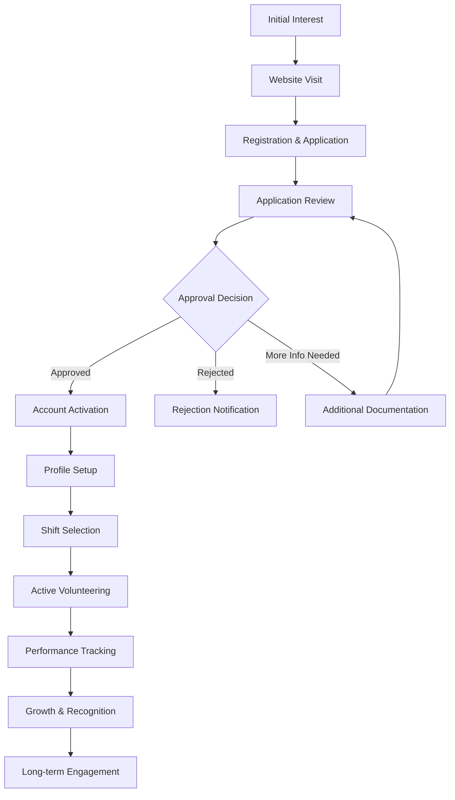

# 🤝 Volunteer Workflow and User Journey Guide
## Lewisham Charity - Advanced Volunteer Engagement & Development Platform

---

## 📋 **Table of Contents**
1. [Overview & Volunteer Ecosystem](#overview--volunteer-ecosystem)
2. [Enhanced Volunteer Journey Map](#enhanced-volunteer-journey-map)
3. [Smart Registration & Skills Assessment](#smart-registration--skills-assessment)
4. [AI-Powered Approval & Matching](#ai-powered-approval--matching)
5. [Advanced Daily Operations & Impact](#advanced-daily-operations--impact)
6. [Intelligent Shift Management & Optimization](#intelligent-shift-management--optimization)
7. [Performance Analytics & Career Development](#performance-analytics--career-development)
8. [Community Leadership & Mentoring](#community-leadership--mentoring)
9. [Advanced Support & Communication Hub](#advanced-support--communication-hub)
10. [Technical Requirements & Mobile Experience](#technical-requirements--mobile-experience)
11. [Optimization & Troubleshooting Guide](#optimization--troubleshooting-guide)

---

## 🎯 **Overview**

The Lewisham Charity volunteer system provides a comprehensive digital platform for community volunteers to contribute to local support services. Volunteers can apply, manage shifts, track performance, assist visitors, and grow their community impact through an integrated web-based dashboard.

### **Volunteer Roles & Capabilities**

Our volunteer system includes a comprehensive role hierarchy with specific capabilities and permissions for each level:

#### **🟢 General Volunteers** *(Entry Level)*
- **Primary Activities**: Food distribution, visitor assistance, basic administrative support
- **Dashboard Features**: 
  - Personal shift scheduling and history
  - Basic performance metrics and achievements
  - Community interaction features
  - Standard training modules
- **System Access**: 
  - View own shifts and availability
  - Sign up for available shifts
  - Access general training materials
  - Participate in community forums

#### **🟡 Specialized Volunteers** *(Intermediate Level)*
- **Advanced Capabilities**: 
  - **Specialization Areas**: Translation services, IT support, counseling, childcare, emergency response
  - **Enhanced Training**: Access to specialized skill development modules
  - **Mentor Assignments**: May be assigned mentors for skill development
- **Dashboard Features**:
  - Role badge showing specialization areas
  - Advanced performance analytics
  - Specialized shift recommendations
  - Access to role-specific training materials
- **System Access**:
  - Priority access to specialized shifts
  - Enhanced reporting capabilities
  - Skill-based task assignments

#### **🔴 Lead Volunteers** *(Advanced Level)*
- **Leadership Responsibilities**:
  - **Team Management**: Supervise and coordinate volunteer teams
  - **Training Authority**: Authorized to train and mentor other volunteers
  - **Shift Management**: Can create, modify, and manage volunteer shifts
  - **Emergency Response**: Certified for emergency volunteer coordination
- **Dashboard Features**:
  - Crown badge indicating leadership status
  - Team management dashboard with member overview
  - Advanced analytics and reporting tools
  - Emergency response notification system
- **System Access**:
  - Full team member management
  - Shift creation and modification permissions
  - Advanced reporting and analytics
  - Emergency alert system access
  - Mentor assignment capabilities

#### **Role Progression & Recognition**
- **Automatic Progression**: Based on hours, performance, and skill development
- **Manual Promotion**: Through supervisor recommendation and assessment
- **Role Badges**: Prominently displayed in dashboard and profile
- **Capability Indicators**: Visual badges for training, shift management, and emergency response
- **Team Information**: Lead volunteers see their team member count and management tools

---

## 🗺️ **Volunteer Journey Map**

---

## 📝 **Registration & Application Process**

### **Step 1: Initial Registration**
**URL**: `https://lewishamCharity.org/register`

1. **Account Creation**
   - Visit the registration page
   - Select "Volunteer" role from the tab options
   - Complete basic information:
     - First Name & Last Name
     - Email Address
     - Password (minimum 8 characters)
     - Phone Number
     - Address & Postcode
     - City

2. **Volunteer-Specific Information**
   - **Skills**: Select from predefined options or add custom skills
     - Driving, Administration, Counselling
     - Food handling, Customer service
     - IT support, Translation services
   - **Experience**: Describe relevant volunteer or work experience
   - **Availability**: When you're available to volunteer
     - Weekdays, Weekends, Evenings
     - Holiday periods, Emergency coverage

3. **Account Verification**
   - Email verification link sent automatically
   - Must verify email before proceeding
   - Check spam/junk folder if not received

### **Step 2: Detailed Application**
**URL**: `https://lewishamCharity.org/volunteer/apply`

#### **Personal Information (Step 1/5)**
- Full contact details
- Date of birth
- Complete address
- Emergency contact information

#### **Availability & Skills (Step 2/5)**
- Detailed availability schedule:
  - Morning shifts (6 AM - 12 PM)
  - Afternoon shifts (12 PM - 6 PM)
  - Evening shifts (6 PM - 10 PM)
  - Weekend availability
  - Holiday coverage
- Skill selection from comprehensive list:
  - Food distribution & kitchen assistance
  - Administrative support & data entry
  - Visitor reception & customer service
  - Transportation & delivery services
  - Event support & organization
  - Fundraising & community outreach
  - IT & digital support
  - Counseling & emotional support
  - Childcare support
  - Translation services

#### **Experience & Motivation (Step 3/5)**
- Previous volunteer experience
- Relevant work experience
- Motivation for volunteering
- Personal goals and expectations

#### **References (Step 4/5)**
- Two character references required
- Reference contact information
- Relationship to applicant

#### **Agreements & Consent (Step 5/5)**
- Background check consent
- Data protection agreement
- Terms and conditions acceptance
- Code of conduct acknowledgment

### **Application Submission**
- Comprehensive review before submission
- Application status: "Pending Review"
- Automated confirmation email sent
- Reference contact notifications sent

---

## ✅ **Approval & Onboarding**

### **Application Review Process**
1. **Initial Review** (1-3 business days)
   - Application completeness check
   - Basic eligibility verification
   - Reference contact initiation

2. **Background Check** (3-7 business days)
   - DBS check (if required)
   - Reference verification
   - Identity confirmation

3. **Interview Process** (Optional)
   - Phone or video interview
   - Skills assessment
   - Role matching discussion

### **Approval Outcomes**

#### **✅ Approved Applications**
- **Welcome email** with login credentials
- **Account activation** with volunteer dashboard access
- **Role Assignment**: Automatic assignment as General Volunteer with progression path
- **Onboarding checklist** provided with role-specific training requirements
- **Initial shift recommendations** based on skills and role level

#### **❌ Rejected Applications**
- **Rejection notification** with reason
- **Appeal process** information
- **Reapplication guidance** (if applicable)

#### **⏳ Pending More Information**
- **Specific requirements** outlined
- **Document upload** instructions
- **Timeline for completion**

### **Account Activation Process**
1. **Login Credentials**
   - Email: [Your registration email]
   - Temporary password: Provided in welcome email
   - **Must change password** on first login

2. **Profile Completion**
   - Update personal information
   - Set availability preferences
   - Upload profile photo (optional)
   - Complete safety training modules

3. **Dashboard Orientation**
   - Interactive tour of volunteer features
   - **Role-specific feature explanation**
   - Key navigation explanation
   - Quick start guide tailored to volunteer level

---

## 💼 **Daily Volunteer Operations**

### **Volunteer Dashboard Overview**
**URL**: `https://lewishamCharity.org/volunteer`

#### **Main Dashboard Features**
- **Role Information Display**
  - **Role Badge**: Prominently shows current volunteer level (General/Specialized/Lead)
  - **Capability Indicators**: Visual badges for special permissions:
    - 🎓 **Trainer Badge**: Can train other volunteers
    - 📅 **Shift Manager Badge**: Can manage volunteer shifts  
    - 🛡️ **Emergency Response Badge**: Certified for emergency situations
  - **Specialization Tags**: Shows areas of expertise for specialized volunteers
  - **Team Information**: Lead volunteers see team member count and management access

- **Quick Stats**
  - Upcoming shifts count
  - Hours this month
  - Total volunteer hours
  - People helped counter
  - Impact score percentage

- **Role-Specific Quick Actions**
  - **All Volunteers**: Schedule management, shift browsing, training hub, performance metrics
  - **Specialized Volunteers**: Advanced training modules, specialized shift access
  - **Lead Volunteers**: Team management dashboard, training coordinator access, emergency response center

- **Next Shift Information**
  - Date, time, and location
  - Role and responsibilities
  - Special instructions
  - Contact information

- **Recent Activity Feed**
  - Completed shifts
  - Achievements earned
  - System announcements
  - Community updates

- **Role Capabilities Panel**
  - **Training Authorization**: Shows if volunteer can train others
  - **Shift Management**: Displays shift management permissions
  - **Emergency Response**: Shows emergency response certification status
  - **Team Leadership**: For lead volunteers, shows team member count and management link
  - **Mentor Information**: Displays assigned mentor details if applicable

### **Core Volunteer Activities**

#### **1. Visitor Assistance**
**URL**: `https://lewishamCharity.org/volunteer/check-in`

**Check-in Process:**
1. **Visitor Search**
   - Search by name, ticket number, or email
   - Verify visitor identity
   - Check eligibility status

2. **Service Assignment**
   - Determine visitor needs
   - Assign to appropriate queue
   - Provide estimated wait time

3. **Documentation**
   - Record visit details
   - Note special requirements
   - Update visitor status

#### **2. Queue Management**
**URL**: `https://lewishamCharity.org/volunteer/queue`

**Queue Operations:**
- **Monitor queue status**
  - Real-time visitor count
  - Average wait times
  - Service desk availability

- **Call next visitor**
  - Notify visitors when ready
  - Manage priority cases
  - Handle no-shows

- **Assist with special needs**
  - Wheelchair accessibility
  - Language barriers
  - Emergency situations

#### **3. Administrative Support**
- **Data entry and filing**
- **Phone support and enquiries**
- **Document verification**
- **Inventory management**

---

## 📅 **Shift Management**

### **Finding Available Shifts**
**URL**: `https://lewishamCharity.org/volunteer/shifts/available`

#### **Search & Filter Options**
- **Date range selection**
- **Time preferences**
- **Location filtering**
- **Role type filtering**
- **Skill requirements**
- **Priority levels**

#### **Shift Information Display**
- **Basic Details**
  - Date and time
  - Duration
  - Location
  - Number of volunteers needed

- **Requirements**
  - Required skills
  - Experience level
  - Training prerequisites
  - Physical requirements

- **Additional Information**
  - Shift supervisor
  - Contact details
  - Special instructions
  - Equipment provided

### **Shift Application Process**
1. **Select shift** from available list
2. **Review requirements** and details
3. **Confirm availability** for full duration
4. **Submit application** with optional message
5. **Receive confirmation** via email and dashboard

### **My Shifts Management**
**URL**: `https://lewishamCharity.org/volunteer/shifts/my-shifts`

#### **Upcoming Shifts**
- **Shift details** with countdown timer
- **Preparation reminders**
- **Contact information**
- **Cancellation options** (with notice requirements)

#### **Shift History**
- **Completed shifts** with feedback
- **Hours logged** and verified
- **Performance ratings** received
- **Notes and comments** from coordinators

#### **Shift Actions**
- **Request changes** to scheduled shifts
- **Cancel shifts** (with advance notice)
- **Add notes** or special requests
- **Download shift confirmations**

### **Shift Attendance Process**
1. **Pre-shift preparation**
   - Review shift details
   - Prepare required materials
   - Check in early if needed

2. **Arrival and check-in**
   - Report to shift supervisor
   - Confirm attendance in system
   - Receive specific assignments

3. **During the shift**
   - Follow role responsibilities
   - Log activities as required
   - Communicate issues promptly

4. **Post-shift completion**
   - Confirm completion in system
   - Submit any required reports
   - Log hours accurately

---

## 📊 **Performance & Growth**

### **Performance Analytics**
**URL**: `https://lewishamCharity.org/volunteer/performance`

#### **Key Metrics Tracked**
- **Total volunteer hours** with role-based milestones
- **Number of people helped** with impact scoring
- **Average rating** from coordinators and team members
- **Reliability score** (attendance rate)
- **Role progression score** based on contributions and skill development
- **Leadership activities** for advanced volunteers

#### **Role-Specific Metrics**
- **General Volunteers**: Focus on hours, reliability, and basic skill development
- **Specialized Volunteers**: Track specialization-specific metrics and advanced training completion
- **Lead Volunteers**: Include team management effectiveness, training delivery, and emergency response performance

#### **Goal Setting & Progress**
- **Monthly hour targets** adjusted by volunteer level
- **Skill development goals** with role-specific pathways
- **Service quality targets** with peer and supervisor feedback
- **Role advancement objectives** with clear progression criteria

#### **Skills Assessment**
- **Radar charts** showing skill levels
- **Growth tracking** over time
- **Training recommendations**
- **Certification progress**

### **Recognition & Achievements**
- **Role Progression Badges**: Visual recognition for advancing through volunteer levels
- **Milestone badges** for hour milestones (adjusted by role)
- **Service awards** for exceptional contributions
- **Leadership recognition** for taking initiative and team management
- **Specialization certificates** for completing advanced training
- **Community impact** certifications with measurable outcomes

### **Volunteer Ranking & Progression**
- **Role-based leaderboards** by category (hours, impact, reliability, leadership)
- **Progression tracking** towards next volunteer level
- **Mentorship opportunities** for specialized and lead volunteers
- **Trend tracking** (improving, stable, declining) with role-specific insights

---

## 💬 **Support & Communication**

### **Notification System**
**URL**: `https://lewishamCharity.org/volunteer/notifications`

#### **Notification Types**
- **Shift reminders** and confirmations
- **New shift opportunities** matching your skills and role level
- **Role progression notifications** and advancement opportunities
- **Training requirements** and certification deadlines
- **Team management alerts** for lead volunteers
- **System announcements** and updates
- **Achievement notifications** and badge awards
- **Emergency alerts** and urgent needs (role-dependent access)

#### **Communication Preferences**
- **Email notifications** (customizable frequency)
- **SMS alerts** for urgent matters
- **In-app notifications** for real-time updates
- **Push notifications** on mobile devices

### **Profile Management**
**URL**: `https://lewishamCharity.org/volunteer/profile`

#### **Personal Information**
- **Contact details** (editable)
- **Emergency contact** information
- **Profile photo** and bio

#### **Volunteer Preferences**
- **Role preferences** and advancement interests
- **Availability schedule** updates
- **Skill set** modifications and specialization requests
- **Training preferences** and certification goals
- **Location preferences** and travel capabilities
- **Team leadership interest** for future advancement

#### **Settings & Privacy**
- **Notification preferences**
- **Privacy settings**
- **Data sharing** permissions
- **Account security** options

### **Support Resources**
- **FAQ section** with common questions
- **Video tutorials** for system features
- **Contact forms** for specific issues
- **Emergency contact** information

---

## 🎖️ **Volunteer Role System Implementation**

### **Role Display Features**
The volunteer dashboard now prominently displays your current role and capabilities:

#### **Role Badge System**
- **🟢 General Volunteer Badge**: Green gradient with UserCog icon
- **🟡 Specialized Volunteer Badge**: Purple gradient with GraduationCap icon  
- **🔴 Lead Volunteer Badge**: Golden/orange gradient with Crown icon

#### **Capability Indicators**
Visual badges that appear based on your permissions:
- **🎓 Trainer Badge**: "Can train other volunteers" - Blue accent
- **📅 Shift Manager Badge**: "Can manage volunteer shifts" - Purple accent
- **🛡️ Emergency Response Badge**: "Certified for emergency response" - Red accent

#### **Specialization Display**
- **Specialized volunteers** see their areas of expertise as individual badges
- **Count indicator** shows number of specializations
- **Clickable tags** provide more details about each specialization

#### **Team Management (Lead Volunteers Only)**
- **Team member count** displayed prominently
- **Quick access link** to team management dashboard
- **Leadership skills** description if available
- **Direct team member contact** options

#### **Mentor Information**
- **Assigned mentor details** for volunteers with mentors
- **Contact information** and direct communication options
- **Mentorship progress** tracking and goals

### **Role-Specific Dashboard Features**

#### **General Volunteers**
- Standard shift scheduling and performance tracking
- Basic training module access
- Community participation features
- Progression pathway display

#### **Specialized Volunteers**  
- Advanced training module recommendations
- Specialization-specific shift priorities
- Enhanced skill development tracking
- Mentor assignment display

#### **Lead Volunteers**
- Team management quick actions
- Training coordination tools
- Emergency response center access
- Advanced reporting and analytics
- Shift creation and management tools

### **API Integration Points**
- **Endpoint**: `/api/v1/volunteer/role/info`
- **Authentication**: Bearer token required
- **Response**: Complete role information including permissions and team data
- **Real-time updates**: Role changes reflected immediately in dashboard
- **Fallback handling**: Graceful degradation if API unavailable

---

## 💻 **Technical Requirements**

### **Device Compatibility**
- **Desktop/Laptop**: Windows 10+, macOS 10.14+, Linux (Ubuntu 18.04+)
- **Mobile Devices**: iOS 12+, Android 8.0+
- **Tablets**: iPad (iOS 12+), Android tablets (8.0+)

### **Browser Requirements**
- **Recommended**: Chrome 90+, Firefox 88+, Safari 14+, Edge 90+
- **JavaScript**: Must be enabled
- **Cookies**: Required for authentication
- **Local Storage**: Used for preferences

### **Internet Connection**
- **Minimum**: 1 Mbps for basic functionality
- **Recommended**: 5 Mbps for optimal experience
- **Mobile data**: Works on 3G/4G/5G networks

### **Accessibility Features**
- **Screen reader** compatible
- **Keyboard navigation** supported
- **High contrast** mode available
- **Text scaling** options
- **Voice recognition** support

---

## 🔧 **Troubleshooting Guide**

### **Common Login Issues**
**Problem**: Cannot log in with credentials
**Solutions**:
1. **Verify email address** is correct
2. **Check password** for typos or caps lock
3. **Use password reset** if forgotten
4. **Clear browser cache** and cookies
5. **Try different browser** or incognito mode

**Problem**: Email verification not received
**Solutions**:
1. **Check spam/junk** folder
2. **Wait 10-15 minutes** for delivery
3. **Request new verification** email
4. **Check email address** spelling
5. **Contact support** if still not received

### **Shift Management Issues**
**Problem**: Cannot see available shifts
**Solutions**:
1. **Check application status** - must be approved
2. **Verify profile completion** - all required fields
3. **Update availability** settings
4. **Refresh page** or clear cache
5. **Contact coordinator** if still issues

**Problem**: Shift cancellation not working
**Solutions**:
1. **Check cancellation deadline** (usually 24-48 hours)
2. **Use proper cancellation** form/button
3. **Contact shift supervisor** directly
4. **Follow emergency cancellation** procedure if urgent

### **Performance Issues**
**Problem**: Page loading slowly or not at all
**Solutions**:
1. **Check internet connection** speed
2. **Close other browser tabs** to free memory
3. **Disable browser extensions** temporarily
4. **Clear browser cache** and reload
5. **Try different browser** or device

**Problem**: Mobile app functionality limited
**Solutions**:
1. **Update browser** to latest version
2. **Enable JavaScript** in mobile browser
3. **Use landscape mode** for better viewing
4. **Install as PWA** (Progressive Web App)
5. **Use desktop version** for full functionality

### **Data & Sync Issues**
**Problem**: Information not saving or updating
**Solutions**:
1. **Ensure stable internet** connection
2. **Complete all required fields** before saving
3. **Avoid browser back button** during forms
4. **Log out and log back in**
5. **Contact support** with specific details

### **Emergency Contacts**
- **Technical Support**: support@lewishamCharity.org
- **Volunteer Coordinator**: volunteers@lewishamCharity.org
- **Emergency Hotline**: 020-XXXX-XXXX (24/7)
- **System Status**: status.lewishamCharity.org

---

## 📱 **Mobile Volunteer Experience**

### **Mobile-Optimized Features**
- **Responsive design** adapts to screen size
- **Touch-friendly** interface elements
- **Quick actions** prominently displayed
- **Offline capability** for essential functions

### **Mobile-Specific Workflows**
1. **Quick check-in** from mobile device
2. **Emergency shift pickup** notifications
3. **Location-based** shift recommendations
4. **Photo uploads** for documentation
5. **GPS tracking** for mobile volunteers

---

## 🎯 **Success Metrics & KPIs**

### **Volunteer Engagement Metrics**
- **Registration completion rate**: 85%+
- **Application approval rate**: 75%+
- **First shift completion**: 90%+
- **Monthly retention rate**: 80%+
- **Average session duration**: 15+ minutes

### **Operational Efficiency**
- **Shift fill rate**: 95%+
- **Cancellation rate**: <5%
- **Average response time**: <2 hours
- **System uptime**: 99.5%+
- **User satisfaction**: 4.5/5 stars

### **Community Impact**
- **People helped per volunteer**: 50+ monthly
- **Total volunteer hours**: Growing 10%+ monthly
- **Skill development**: 2+ new skills per volunteer annually
- **Leadership progression**: 15% promoted to lead roles

---

## 🚀 **Future Enhancements**

### **Planned Features**
- **Mobile app** (iOS/Android)
- **AI-powered shift matching**
- **Virtual volunteering** opportunities
- **Gamification** elements
- **Social features** and volunteer networking
- **Advanced analytics** and reporting
- **Integration** with external volunteer platforms

### **Continuous Improvement**
- **Regular user feedback** collection
- **A/B testing** for interface improvements
- **Performance monitoring** and optimization
- **Security audits** and updates
- **Accessibility enhancements**

---

## 📞 **Contact & Support**

### **Getting Help**
- **In-app chat**: Available during business hours
- **Email support**: volunteers@lewishamCharity.org
- **Phone support**: 020-XXXX-XXXX (Mon-Fri 9AM-5PM)
- **FAQ database**: Searchable help articles
- **Video tutorials**: Step-by-step guides

### **Feedback & Suggestions**
- **Feature requests**: Submit via feedback form
- **Bug reports**: Include browser and device info
- **General feedback**: Annual volunteer survey
- **Improvement ideas**: Monthly suggestion box

---

**Last Updated**: June 2025
**Version**: 2.1
**Next Review**: September 2025

---

*This document is part of the Lewisham Charity volunteer onboarding package. For the most current information, always refer to the live system at https://lewishamCharity.org*
