<div align="center">

# Lewisham Charity – Comprehensive Community Service Platform

[](https://golang.org/)
[](https://gin-gonic.com/)
[](https://postgresql.org/)
[](https://jwt.io/)
[](https://swagger.io/)

**A comprehensive digital platform designed to enhance the real-world operations of Lewisham Charity, facilitating donations, volunteer management, help requests, and visitor services for the South London community.**

[Features](#-features) • [Installation](#-installation) • [API Documentation](#-api-documentation) • [Workflow Logic](#-comprehensive-workflow-logic) • [Architecture](#-system-architecture) • [Contributing](#-contributing)

</div>

---

## Technology Stack

- **Backend**: Go with Gin framework
- **Database**: PostgreSQL with GORM
- **Authentication**: JWT-based with role-based access control
- **API Documentation**: OpenAPI 3.0 with Swagger UI
- **Notifications**: Email, SMS, and in-app notifications
- **Real-time Updates**: WebSocket integration for queue management
- **File Management**: Secure document upload and verification system

## System Overview

The Lewisham Charity system facilitates community support through:
- **Complete Authentication System**: Registration, login, logout, email verification, and password reset
- Processing visitor help requests for food and general support
- Managing volunteer applications and shift scheduling
- Tracking donations (both monetary and physical items) with detailed inventory management
- Providing administrative oversight and reporting
- Queue management and visitor services
- Comprehensive document management and verification
- Real-time notifications and updates

---

## 🚀 Features

### Core Functionality
- **Multi-Role User Management**: Visitors, Volunteers, Donors, and Admins
- **Complete Authentication Suite**: Registration, login, logout, email verification, password reset, and token management
- **Advanced Help Request System**: Community members can request food and general support
- **Comprehensive Volunteer Management**: Application processing, shift scheduling, and activity tracking
- **Donation Tracking**: Monetary and item donations with real-time inventory management
- **Visitor Services**: Queue management, ticketing system, and check-in process
- **Administrative Dashboard**: Complete oversight with reporting and analytics

- **Document Management**: Secure upload, verification, and status tracking
- ****Comprehensive Feedback System**: Multi-dimensional visitor feedback with analytics and admin response workflow**

### Advanced Technical Capabilities
- **Complete Authentication System**: 
  - JWT-based authentication with role-based access control (RBAC)
  - Email verification workflow with token management
  - Secure password reset with time-limited tokens
  - Token blacklisting for secure logout
  - Refresh token rotation for enhanced security
- **Queue Management**: Real-time processing with WebSocket updates
- **Document Verification**: Admin-managed document approval workflow
- **Emergency Processing**: 4-hour review guarantee for emergency cases
- **Analytics Dashboard**: Comprehensive reporting and insights
- **Communication System**: Broadcast and targeted messaging
- **Ticket Management**: QR code generation and validation
- ****Visitor Feedback System**: Complete feedback collection, analysis, and response management**
- **API Documentation**: Complete OpenAPI 3.0 specification with Swagger UI
- **Internationalization**: Multi-language support with go-i18n
- **Audit Logging**: Comprehensive action tracking for compliance

---

## 📊 Comprehensive Visitor Feedback System

### Feedback Collection Features
- **Multi-Dimensional Ratings**: Overall satisfaction, staff helpfulness, wait time, facility quality, service speed, and food quality (when applicable)
- **Detailed Comments**: Positive feedback, areas for improvement, and suggestions for enhancement
- **Experience Metrics**: Would recommend, felt welcomed, and needs met indicators
- **Service Category Tracking**: Categorized feedback by type of service received
- **Visit-Specific Feedback**: Linked to specific visits for comprehensive tracking

### Admin Feedback Management
- **Review Workflow**: Pending → Reviewed → Responded → Escalated → Resolved status tracking
- **Admin Response System**: Direct responses to visitor feedback with timestamp tracking
- **Internal Notes**: Private admin notes for internal coordination
- **Priority Identification**: Automatic flagging of low ratings and escalated feedback
- **Advanced Filtering**: Search and filter by rating, date range, category, and review status
- **Bulk Response Management**: Efficient handling of multiple feedback entries simultaneously

### Feedback Analytics Dashboard
- **Comprehensive Metrics**: Average ratings across all dimensions with trend analysis
- **Rating Distribution**: Visual breakdown of 1-5 star ratings
- **Service Category Analysis**: Performance insights by service type
- **Experience Indicators**: Recommendation rates, welcome feelings, and needs fulfillment percentages
- **Daily Trends**: 30-day rolling analysis of feedback patterns
- **Priority Alerts**: Dashboard highlighting critical feedback requiring immediate attention

### Feedback API Endpoints

#### Visitor Feedback Endpoints
```http
POST   /api/v1/feedback/submit              # Submit comprehensive visit feedback
GET    /api/v1/feedback/history             # Get visitor's feedback history
GET    /api/v1/feedback/visit/{visit_id}    # Get feedback for specific visit
```

#### Admin Feedback Management
```http
GET    /admin/feedback                      # List all feedback with advanced filters
PUT    /admin/feedback/{id}/status          # Update feedback review status
GET    /admin/feedback/analytics           # Comprehensive feedback analytics
GET    /admin/feedback/priority            # Priority feedback requiring attention
POST   /admin/feedback/bulk-response       # Bulk response to multiple feedback entries
```

### Enhanced Feedback Workflow Examples

#### 1. Submit Comprehensive Feedback
```json
POST /api/v1/feedback/submit
{
  "visitId": 123,
  "overallRating": 4,
  "staffHelpfulness": 5,
  "waitTimeRating": 3,
  "facilityRating": 4,
  "serviceSpeedRating": 4,
  "foodQualityRating": 4,
  "serviceCategory": "Food Support",
  "positiveComments": "Staff were very welcoming and helpful",
  "areasForImprovement": "Wait time could be reduced",
  "suggestions": "Maybe add more seating in waiting area",
  "wouldRecommend": true,
  "feltWelcomed": true,
  "needsWereMet": true
}
```

#### 2. Admin Priority Feedback Review
```json
GET /admin/feedback/priority
{
  "priorityFeedback": [
    {
      "id": 42,
      "visitorId": 15,
      "visitId": 89,
      "overallRating": 2,
      "reviewStatus": "pending",
      "visitDate": "2024-01-15T10:30:00Z",
      "areasForImprovement": "Long wait time, staff seemed overwhelmed",
      "needsWereMet": false
    }
  ],
  "count": 5,
  "lastUpdated": "2024-01-15T14:30:00Z"
}
```

#### 3. Bulk Feedback Response
```json
POST /admin/feedback/bulk-response
{
  "feedback_ids": [42, 43, 44, 45],
  "review_status": "responded",
  "admin_response": "Thank you all for your feedback. We're implementing improvements to reduce wait times and have added additional staff during peak hours.",
  "admin_notes": "Bulk response addressing common wait time concerns from week of Jan 15-21"
}
```

#### 4. Enhanced Analytics Dashboard
```json
GET /admin/feedback/analytics?from_date=2024-01-01&to_date=2024-01-31
{
  "overview": {
    "totalFeedback": 145,
    "avgOverallRating": 4.2,
    "avgStaffRating": 4.6,
    "avgWaitTimeRating": 3.8,
    "avgFacilityRating": 4.3,
    "avgServiceSpeedRating": 4.1,
    "avgFoodQualityRating": 4.4
  },
  "experienceMetrics": {
    "wouldRecommendPercentage": 89.2,
    "feltWelcomedPercentage": 94.5,
    "needsMetPercentage": 87.8
  },
  "reviewStatusBreakdown": {
    "pending": 12,
    "reviewed": 45,
    "responded": 78,
    "escalated": 3,
    "resolved": 7
  },
  "categoryStats": {
    "Food Support": {
      "count": 89,
      "avgRating": 4.3,
      "avgFoodQuality": 4.4
    },
    "General Support": {
      "count": 56,
      "avgRating": 4.1
    }
  },
  "priorityFeedback": [
    // Low-rated or escalated feedback requiring immediate attention
  ],
  "dailyTrends": [
    // 30-day daily feedback trends
  ]
}
```

---

## 🌐 API Documentation

### Interactive Documentation
- **Development**: `http://localhost:8080/swagger/index.html`
- **Staging**: `https://staging-api.lewishamCharity.org/swagger/index.html`
- **Production**: `https://api.lewishamCharity.org/swagger/index.html`

### Complete API Endpoint Coverage

#### Authentication Endpoints
```http
POST   /api/v1/auth/register              # User registration with email verification
POST   /api/v1/auth/login                 # User login with JWT token generation
POST   /api/v1/auth/logout                # User logout with token blacklisting
POST   /api/v1/auth/refresh               # JWT token refresh
POST   /api/v1/auth/verify-email          # Email verification completion
POST   /api/v1/auth/resend-verification   # Resend verification email
POST   /api/v1/auth/reset-password        # Initiate password reset flow
POST   /api/v1/auth/confirm-reset         # Complete password reset
GET    /api/v1/auth/validate-token        # Validate JWT token
```

#### Help Request Management
```http
POST   /api/v1/help-requests               # Create new help request
GET    /api/v1/help-requests               # List user's help requests
POST   /api/v1/help-requests/check-visitor # Check visitor eligibility
GET    /api/v1/help-requests/time-slots    # Get available appointment slots
PUT    /api/v1/help-requests/{id}          # Update existing help request
DELETE /api/v1/help-requests/{id}          # Cancel help request
```

#### Visitor Services
```http
POST   /api/v1/visitors/checkin            # Visitor check-in process
GET    /api/v1/visitor/dashboard           # Visitor dashboard with stats
GET    /api/v1/visitor/visits              # Complete visit history
GET    /api/v1/visitor/eligibility         # Check service eligibility status
POST   /api/v1/documents/upload            # Document upload for verification
GET    /api/v1/documents                   # List uploaded documents with status
```

#### **Visitor Feedback System**
```http
POST   /api/v1/feedback/submit             # Submit comprehensive visit feedback
GET    /api/v1/feedback/history            # Visitor's complete feedback history
GET    /api/v1/feedback/visit/{visit_id}   # Feedback for specific visit
```

#### Volunteer Management
```http
POST   /api/v1/volunteers/apply            # Submit volunteer application
GET    /api/v1/volunteer/dashboard/stats   # Volunteer dashboard and statistics
GET    /api/v1/volunteer/shifts/available  # Available volunteer shifts
POST   /api/v1/volunteer/shifts/{id}/signup # Sign up for specific shift
GET    /api/v1/volunteer/shifts/my-shifts  # Personal shift schedule
PUT    /api/v1/volunteer/profile           # Update volunteer profile
```

#### Donation Tracking
```http
POST   /api/v1/donations                   # Submit new donation
GET    /api/v1/donations                   # List user's donations
GET    /api/v1/donor/dashboard             # Donor dashboard with impact metrics
GET    /api/v1/urgent-needs                # Current urgent donation needs
PUT    /api/v1/donations/{id}/status       # Update donation status
```

#### Queue Management
```http
GET    /api/v1/queue                       # Current queue status and position
POST   /api/v1/queue/join                  # Join service queue
PUT    /api/v1/queue/position              # Update queue position
GET    /ws/queue/updates                   # WebSocket real-time queue updates
```

#### Administrative Operations
```http
GET    /admin/dashboard                    # Comprehensive admin dashboard
GET    /admin/users                       # User management interface
PUT    /admin/users/{id}/status           # Update user account status
GET    /admin/help-requests               # Manage all help requests
PUT    /admin/help-requests/{id}/approve  # Approve/decline help requests
GET    /admin/volunteers                  # Volunteer management system
PUT    /admin/volunteers/{id}/approve     # Approve volunteer applications
GET    /admin/donations                   # Donation oversight and tracking
GET    /admin/analytics                   # System-wide analytics dashboard
GET    /admin/reports                     # Generate comprehensive reports
POST   /admin/communications/broadcast    # Send broadcast messages
GET    /admin/audit-logs                  # Complete audit trail access
```

#### **Advanced Admin Feedback Management**
```http
GET    /admin/feedback                    # List all feedback with advanced filtering
PUT    /admin/feedback/{id}/status        # Update feedback review status and response
GET    /admin/feedback/analytics          # Comprehensive feedback analytics
GET    /admin/feedback/priority           # Priority feedback requiring attention
POST   /admin/feedback/bulk-response      # Bulk response to multiple feedback entries
```

### API Architecture

#### Base URL Structure
- **API Base**: `/api/v1/`
- **Admin Routes**: `/admin/`
- **Health Checks**: `/health`, `/health-check`
- **Public Routes**: No authentication required
- **Protected Routes**: JWT Bearer token required
- **WebSocket Endpoints**: `/ws/` for real-time updates

#### Authentication Headers
```http
Authorization: Bearer <jwt_token>
Content-Type: application/json
Accept: application/json
```

#### **Feedback System Integration Examples**

##### Submit Comprehensive Feedback
```typescript
// Complete feedback submission with all rating dimensions
const submitFeedback = async (visitId: number, feedbackData: FeedbackSubmission) => {
  const response = await fetch('/api/v1/feedback/submit', {
    method: 'POST',
    headers: {
      'Authorization': `Bearer ${getToken()}`,
      'Content-Type': 'application/json'
    },
    body: JSON.stringify({
      visitId,
      overallRating: feedbackData.overallRating,
      staffHelpfulness: feedbackData.staffHelpfulness,
      waitTimeRating: feedbackData.waitTimeRating,
      facilityRating: feedbackData.facilityRating,
      serviceSpeedRating: feedbackData.serviceSpeedRating,
      foodQualityRating: feedbackData.foodQualityRating, // Optional for food services
      serviceCategory: feedbackData.serviceCategory,
      positiveComments: feedbackData.positiveComments,
      areasForImprovement: feedbackData.areasForImprovement,
      suggestions: feedbackData.suggestions,
      wouldRecommend: feedbackData.wouldRecommend,
      feltWelcomed: feedbackData.feltWelcomed,
      needsWereMet: feedbackData.needsWereMet
    })
  });

  if (response.ok) {
    const result = await response.json();
    toast.success('Feedback submitted successfully!');
    return result.feedback;
  }
  
  throw new Error('Failed to submit feedback');
};
```

##### Admin Feedback Dashboard
```typescript
// Fetch comprehensive feedback analytics for admin dashboard
const getFeedbackAnalytics = async (dateRange?: { from: string; to: string }) => {
  const params = new URLSearchParams();
  if (dateRange?.from) params.set('from_date', dateRange.from);
  if (dateRange?.to) params.set('to_date', dateRange.to);

  const response = await fetch(`/admin/feedback/analytics?${params}`, {
    headers: { 'Authorization': `Bearer ${getAdminToken()}` }
  });

  if (response.ok) {
    const analytics = await response.json();
    return {
      overview: analytics.overview,
      trends: analytics.dailyTrends,
      categoryBreakdown: analytics.categoryStats,
      experienceMetrics: analytics.experienceMetrics,
      priorityFeedback: analytics.priorityFeedback
    };
  }
  
  throw new Error('Failed to fetch feedback analytics');
};
```

##### Feedback Response Workflow
```typescript
// Admin response to visitor feedback
const respondToFeedback = async (feedbackId: number, response: AdminFeedbackResponse) => {
  const apiResponse = await fetch(`/admin/feedback/${feedbackId}/status`, {
    method: 'PUT',
    headers: {
      'Authorization': `Bearer ${getAdminToken()}`,
      'Content-Type': 'application/json'
    },
    body: JSON.stringify({
      review_status: response.status, // 'reviewed', 'responded', 'escalated', 'resolved'
      admin_response: response.message,
      admin_notes: response.internalNotes
    })
  });

  if (apiResponse.ok) {
    const result = await apiResponse.json();
    toast.success('Feedback updated successfully');
    
    // Trigger notification to visitor if public response provided
    if (response.message) {
      await notifyVisitor(result.feedback.visitorId, {
        type: 'feedback_response',
        message: 'We\'ve responded to your recent feedback'
      });
    }
    
    return result.feedback;
  }
  
  throw new Error('Failed to update feedback');
};
```

### **Frontend Feedback Components**

#### Comprehensive Feedback Form
```typescript
// Complete feedback submission with validation and error handling
export const ComprehensiveFeedbackForm: React.FC<{ visitId: number }> = ({ visitId }) => {
  const [feedback, setFeedback] = useState<FeedbackFormData>({
    visitId,
    overallRating: 0,
    staffHelpfulness: 0,
    waitTimeRating: 0,
    facilityRating: 0,
    serviceSpeedRating: 0,
    foodQualityRating: null,
    serviceCategory: '',
    positiveComments: '',
    areasForImprovement: '',
    suggestions: '',
    wouldRecommend: false,
    feltWelcomed: false,
    needsWereMet: false
  });

  const [isSubmitting, setIsSubmitting] = useState(false);
  const [validationErrors, setValidationErrors] = useState<string[]>([]);

  const validateFeedback = (data: FeedbackFormData): string[] => {
    const errors: string[] = [];
    
    if (data.overallRating === 0) {
      errors.push('Overall rating is required');
    }
    
    if (data.serviceCategory === 'Food Support' && !data.foodQualityRating) {
      errors.push('Food quality rating is required for food services');
    }
    
    return errors;
  };

  const handleSubmit = async (e: React.FormEvent) => {
    e.preventDefault();
    
    const errors = validateFeedback(feedback);
    if (errors.length > 0) {
      setValidationErrors(errors);
      return;
    }

    setIsSubmitting(true);
    setValidationErrors([]);
    
    try {
      const result = await submitFeedback(visitId, feedback);
      
      toast.success('Thank you for your feedback! Your input helps us improve our services.');
      
      // Track analytics event
      analytics.track('Feedback Submitted', {
        visitId,
        overallRating: feedback.overallRating,
        serviceCategory: feedback.serviceCategory,
        wouldRecommend: feedback.wouldRecommend
      });
      
      router.push('/visitor/dashboard');
    } catch (error) {
      toast.error('Failed to submit feedback. Please try again.');
      console.error('Feedback submission error:', error);
    } finally {
      setIsSubmitting(false);
    }
  };

  return (
    <form onSubmit={handleSubmit} className="comprehensive-feedback-form">
      <div className="feedback-header">
        <h2>How was your visit today?</h2>
        <p>Your feedback helps us improve our services for the community</p>
      </div>
      
      {validationErrors.length > 0 && (
        <div className="validation-errors">
          {validationErrors.map((error, index) => (
            <p key={index} className="error-message">{error}</p>
          ))}
        </div>
      )}

      {/* Multi-dimensional rating system */}
      <div className="rating-section">
        <h3>Rate Your Experience</h3>
        
        <StarRating
          label="Overall Satisfaction"
          value={feedback.overallRating}
          onChange={(rating) => setFeedback(prev => ({ ...prev, overallRating: rating }))}
          required
          helpText="How satisfied were you with your overall experience?"
        />
        
        <StarRating
          label="Staff Helpfulness"
          value={feedback.staffHelpfulness}
          onChange={(rating) => setFeedback(prev => ({ ...prev, staffHelpfulness: rating }))}
          helpText="How helpful and friendly were our staff members?"
        />
        
        <StarRating
          label="Wait Time"
          value={feedback.waitTimeRating}
          onChange={(rating) => setFeedback(prev => ({ ...prev, waitTimeRating: rating }))}
          helpText="How reasonable was the wait time for service?"
        />
        
        <StarRating
          label="Facility Quality"
          value={feedback.facilityRating}
          onChange={(rating) => setFeedback(prev => ({ ...prev, facilityRating: rating }))}
          helpText="How would you rate the cleanliness and comfort of our facilities?"
        />
        
        <StarRating
          label="Service Speed"
          value={feedback.serviceSpeedRating}
          onChange={(rating) => setFeedback(prev => ({ ...prev, serviceSpeedRating: rating }))}
          helpText="How efficient was the service delivery?"
        />
        
        {/* Conditional food quality rating */}
        {feedback.serviceCategory === 'Food Support' && (
          <StarRating
            label="Food Quality"
            value={feedback.foodQualityRating || 0}
            onChange={(rating) => setFeedback(prev => ({ ...prev, foodQualityRating: rating }))}
            helpText="How would you rate the quality and freshness of the food provided?"
            required
          />
        )}
      </div>

      {/* Service category selection */}
      <div className="service-category-section">
        <h3>Service Type</h3>
        <select
          value={feedback.serviceCategory}
          onChange={(e) => setFeedback(prev => ({ ...prev, serviceCategory: e.target.value }))}
          required
        >
          <option value="">Select service type...</option>
          <option value="Food Support">Food Support</option>
          <option value="General Support">General Support</option>
          <option value="Emergency Support">Emergency Support</option>
          <option value="Advice & Guidance">Advice & Guidance</option>
        </select>
      </div>

      {/* Experience indicators */}
      <div className="experience-section">
        <h3>Your Experience</h3>
        
        <label className="checkbox-label">
          <input
            type="checkbox"
            checked={feedback.wouldRecommend}
            onChange={(e) => setFeedback(prev => ({ ...prev, wouldRecommend: e.target.checked }))}
          />
          <span>I would recommend this service to others</span>
        </label>
        
        <label className="checkbox-label">
          <input
            type="checkbox"
            checked={feedback.feltWelcomed}
            onChange={(e) => setFeedback(prev => ({ ...prev, feltWelcomed: e.target.checked }))}
          />
          <span>I felt welcomed and respected during my visit</span>
        </label>
        
        <label className="checkbox-label">
          <input
            type="checkbox"
            checked={feedback.needsWereMet}
            onChange={(e) => setFeedback(prev => ({ ...prev, needsWereMet: e.target.checked }))}
          />
          <span>My needs were met during this visit</span>
        </label>
      </div>

      {/* Detailed comments */}
      <div className="comments-section">
        <h3>Additional Comments</h3>
        
        <div className="comment-field">
          <label htmlFor="positive-comments">What did we do well?</label>
          <textarea
            id="positive-comments"
            placeholder="Tell us what you appreciated about your visit..."
            value={feedback.positiveComments}
            onChange={(e) => setFeedback(prev => ({ ...prev, positiveComments: e.target.value }))}
            rows={3}
          />
        </div>
        
        <div className="comment-field">
          <label htmlFor="improvement-areas">What could we improve?</label>
          <textarea
            id="improvement-areas"
            placeholder="Share any areas where you think we could do better..."
            value={feedback.areasForImprovement}
            onChange={(e) => setFeedback(prev => ({ ...prev, areasForImprovement: e.target.value }))}
            rows={3}
          />
        </div>
        
        <div className="comment-field">
          <label htmlFor="suggestions">Any suggestions for us?</label>
          <textarea
            id="suggestions"
            placeholder="Do you have any specific suggestions for improvements or new services?"
            value={feedback.suggestions}
            onChange={(e) => setFeedback(prev => ({ ...prev, suggestions: e.target.value }))}
            rows={3}
          />
        </div>
      </div>

      <div className="form-actions">
        <button 
          type="submit" 
          disabled={isSubmitting || feedback.overallRating === 0}
          className="submit-button"
        >
          {isSubmitting ? 'Submitting...' : 'Submit Feedback'}
        </button>
        
        <button 
          type="button" 
          onClick={() => router.push('/visitor/dashboard')}
          className="cancel-button"
        >
          Skip for Now
        </button>
      </div>
    </form>
  );
};
```

#### Admin Feedback Analytics Dashboard
```typescript
// Enhanced admin feedback analytics with priority management
export const AdminFeedbackAnalyticsDashboard: React.FC = () => {
  const [analytics, setAnalytics] = useState<FeedbackAnalytics | null>(null);
  const [priorityFeedback, setPriorityFeedback] = useState<PriorityFeedback[]>([]);
  const [dateRange, setDateRange] = useState({
    from: format(subDays(new Date(), 30), 'yyyy-MM-dd'),
    to: format(new Date(), 'yyyy-MM-dd')
  });
  const [selectedFeedback, setSelectedFeedback] = useState<number[]>([]);
  const [bulkResponseModal, setBulkResponseModal] = useState(false);

  useEffect(() => {
    const loadData = async () => {
      try {
        const [analyticsData, priorityData] = await Promise.all([
          getFeedbackAnalytics(dateRange),
          getPriorityFeedback()
        ]);
        
        setAnalytics(analyticsData);
        setPriorityFeedback(priorityData.priorityFeedback);
      } catch (error) {
        toast.error('Failed to load feedback data');
      }
    };

    loadData();
  }, [dateRange]);

  const handleBulkResponse = async (response: BulkResponseData) => {
    try {
      await submitBulkFeedbackResponse({
        feedback_ids: selectedFeedback,
        review_status: response.status,
        admin_response: response.message,
        admin_notes: response.notes
      });
      
      toast.success(`Updated ${selectedFeedback.length} feedback entries`);
      setSelectedFeedback([]);
      setBulkResponseModal(false);
      
      // Refresh priority feedback
      const updatedPriority = await getPriorityFeedback();
      setPriorityFeedback(updatedPriority.priorityFeedback);
    } catch (error) {
      toast.error('Failed to update feedback');
    }
  };

  if (!analytics) return <LoadingSpinner />;

  return (
    <div className="feedback-analytics-dashboard">
      <div className="dashboard-header">
        <h1>Feedback Analytics</h1>
        <div className="date-range-selector">
          <DateRangePicker
            from={dateRange.from}
            to={dateRange.to}
            onChange={setDateRange}
          />
        </div>
      </div>

      {/* Key metrics overview */}
      <div className="metrics-grid">
        <MetricCard
          title="Total Feedback"
          value={analytics.overview.totalFeedback}
          change="+12% from last month"
          trend="up"
        />
        <MetricCard
          title="Average Rating"
          value={analytics.overview.avgOverallRating.toFixed(1)}
          suffix="/5.0"
          change="+0.3 from last month"
          trend="up"
        />
        <MetricCard
          title="Recommendation Rate"
          value={`${analytics.experienceMetrics.wouldRecommendPercentage.toFixed(1)}%`}
          change="+5% from last month"
          trend="up"
        />
        <MetricCard
          title="Priority Items"
          value={priorityFeedback.length}
          change={priorityFeedback.length > 10 ? "High" : "Normal"}
          trend={priorityFeedback.length > 10 ? "down" : "up"}
        />
      </div>

      {/* Priority feedback section */}
      {priorityFeedback.length > 0 && (
        <div className="priority-feedback-section">
          <div className="section-header">
            <h2>Priority Feedback ({priorityFeedback.length})</h2>
            {selectedFeedback.length > 0 && (
              <button 
                onClick={() => setBulkResponseModal(true)}
                className="bulk-action-button"
              >
                Bulk Response ({selectedFeedback.length})
              </button>
            )}
          </div>
          
          <div className="priority-feedback-list">
            {priorityFeedback.map((feedback) => (
              <PriorityFeedbackCard
                key={feedback.id}
                feedback={feedback}
                selected={selectedFeedback.includes(feedback.id)}
                onSelect={(selected) => {
                  if (selected) {
                    setSelectedFeedback(prev => [...prev, feedback.id]);
                  } else {
                    setSelectedFeedback(prev => prev.filter(id => id !== feedback.id));
                  }
                }}
                onRespond={(response) => handleIndividualResponse(feedback.id, response)}
              />
            ))}
          </div>
        </div>
      )}

      {/* Analytics charts */}
      <div className="analytics-charts">
        <div className="chart-container">
          <h3>Rating Distribution</h3>
          <RatingDistributionChart data={analytics.ratingDistribution} />
        </div>
        
        <div className="chart-container">
          <h3>Daily Feedback Trends</h3>
          <FeedbackTrendChart data={analytics.dailyTrends} />
        </div>
        
        <div className="chart-container">
          <h3>Service Category Performance</h3>
          <CategoryPerformanceChart data={analytics.categoryStats} />
        </div>
        
        <div className="chart-container">
          <h3>Experience Metrics</h3>
          <ExperienceMetricsChart data={analytics.experienceMetrics} />
        </div>
      </div>

      {/* Review status breakdown */}
      <div className="review-status-section">
        <h3>Review Status Breakdown</h3>
        <div className="status-cards">
          {Object.entries(analytics.reviewStatusBreakdown).map(([status, count]) => (
            <StatusCard
              key={status}
              status={status as ReviewStatus}
              count={count}
              percentage={(count / analytics.overview.totalFeedback) * 100}
            />
          ))}
        </div>
      </div>

      {/* Bulk response modal */}
      {bulkResponseModal && (
        <BulkResponseModal
          selectedCount={selectedFeedback.length}
          onSubmit={handleBulkResponse}
          onClose={() => setBulkResponseModal(false)}
        />
      )}
    </div>
  );
};
```

---

## 📋 Comprehensive User Role Workflows

### 🏠 **Visitor Workflow**

#### 1. Registration & Onboarding
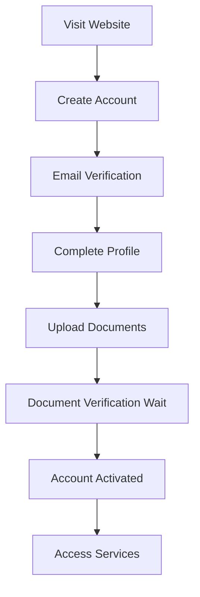

**Detailed Steps:**
1. **Account Creation**
   - Visit registration page
   - Provide: Name, Email, Phone, Address, DOB
   - Choose secure password
   - Agree to terms and conditions

2. **Email Verification**
   - Check email for verification link
   - Click link to verify account
   - Return to platform for next steps

3. **Profile Completion**
   - Add emergency contact information
   - Specify dietary requirements/allergies
   - Indicate household size and composition
   - Select preferred communication methods

4. **Document Upload**
   - Upload proof of ID (passport, driving license)
   - Upload proof of address (utility bill, bank statement)
   - Upload proof of income/benefits (if applicable)
   - Add any relevant medical documentation

5. **Verification Process**
   - Admin reviews submitted documents
   - Account status: "pending_verification"
   - Email notification when documents approved
   - Full platform access granted

#### 2. Help Request Process
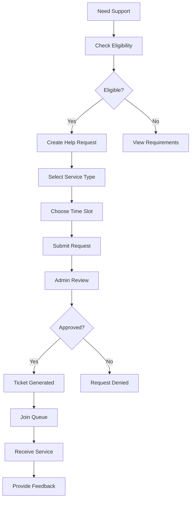

**Detailed Steps:**
1. **Eligibility Check**
   - System checks last visit date
   - Verifies waiting period compliance
   - Confirms document verification status
   - Displays eligibility status and next available date

2. **Service Selection**
   - **Food Support**: Fresh produce, dry goods, prepared meals
   - **General Support**: Advice, signposting, emergency assistance
   - **Emergency Support**: Urgent help with fast-track processing

3. **Time Slot Booking**
   - View available slots for next 7 days
   - Select preferred date and time
   - Confirm household size for service planning

4. **Request Submission**
   - Add specific needs/requests in notes
   - Confirm contact preferences
   - Submit request for admin review

5. **Admin Processing**
   - Admin reviews request within 24 hours (4 hours for emergency)
   - Checks eligibility and available resources
   - Approves or requests additional information

6. **Service Delivery**
   - Receive ticket with reference number
   - Join queue on service day
   - Check-in with staff
   - Receive allocated support
   - Complete visit feedback

#### 3. Daily Service Experience
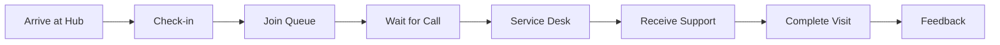

### 👥 **Volunteer Workflow**

#### 1. Application & Onboarding
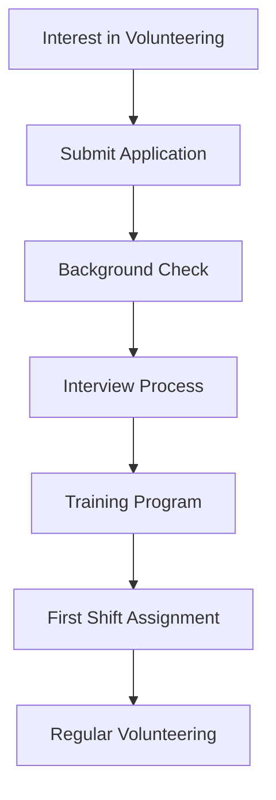

**Detailed Steps:**
1. **Application Submission**
   - Complete detailed volunteer application
   - Provide references (2 professional/personal)
   - Upload CV and cover letter
   - Specify availability and interests

2. **Screening Process**
   - DBS check initiation
   - Reference verification calls
   - Initial admin review and scoring

3. **Interview & Assessment**
   - Video/in-person interview
   - Scenario-based questions
   - Motivation and commitment assessment
   - Skills and experience evaluation

4. **Training & Induction**
   - Mandatory safeguarding training
   - Food hygiene certification (if applicable)
   - Platform and systems training
   - Shadowing experienced volunteers

5. **Ongoing Engagement**
   - Regular shift scheduling
   - Continuing education opportunities
   - Performance feedback and development
   - Recognition and appreciation events

#### 2. Shift Management
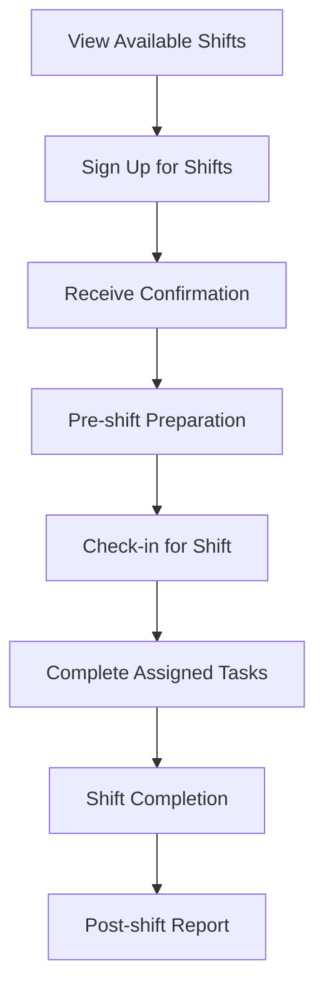

### 💝 **Donor Workflow**

#### 1. Donation Process
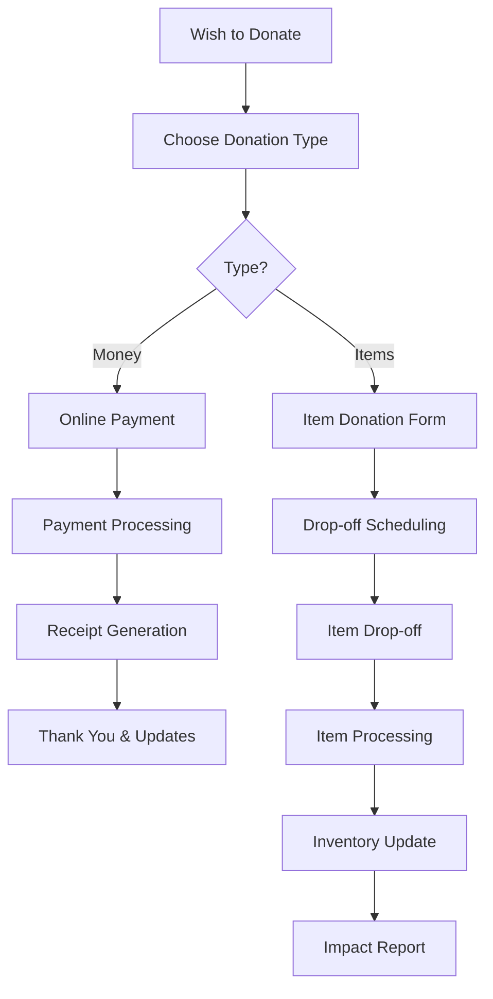

**Detailed Steps:**
1. **Monetary Donations**
   - Select donation amount or custom amount
   - Choose one-time or recurring donation
   - Add gift aid declaration (UK taxpayers)
   - Secure payment processing
   - Immediate receipt and confirmation

2. **Item Donations**
   - Check current urgent needs list
   - Complete item donation form
   - Schedule drop-off appointment
   - Prepare items according to guidelines
   - Drop-off and receive receipt
   - Items sorted and allocated to inventory

3. **Donor Engagement**
   - Regular impact updates via email
   - Quarterly impact reports
   - Invitation to donor appreciation events
   - Option to specify donation preferences

### 👤 **Admin Workflow**

#### 1. Daily Operations Management
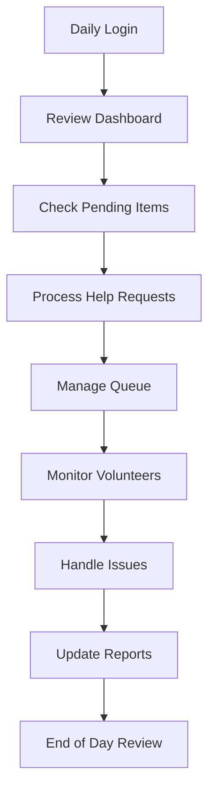

**Detailed Steps:**
1. **Morning Setup**
   - Review overnight notifications
   - Check emergency requests requiring immediate attention
   - Confirm volunteer shift attendance
   - Prepare for day's scheduled services

2. **Help Request Processing**
   - Review new requests in priority order
   - Verify visitor eligibility and documentation
   - Approve or decline requests with detailed notes
   - Communicate decisions to visitors

3. **Queue Management**
   - Monitor real-time queue status
   - Manage visitor flow and wait times
   - Handle no-shows and cancellations
   - Coordinate with volunteers for efficient service

4. **Issue Resolution**
   - Address visitor complaints or concerns
   - Resolve technical system issues
   - Escalate complex cases to senior management
   - Document all decisions and actions

#### 2. Weekly Administrative Tasks
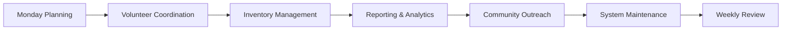

### 🔧 **Super Admin Workflow**

#### 1. System Administration
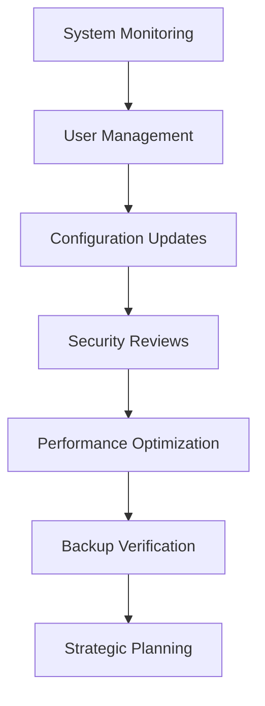

---

## 🔄 Help Request Lifecycle Workflow

### Complete Help Request Process
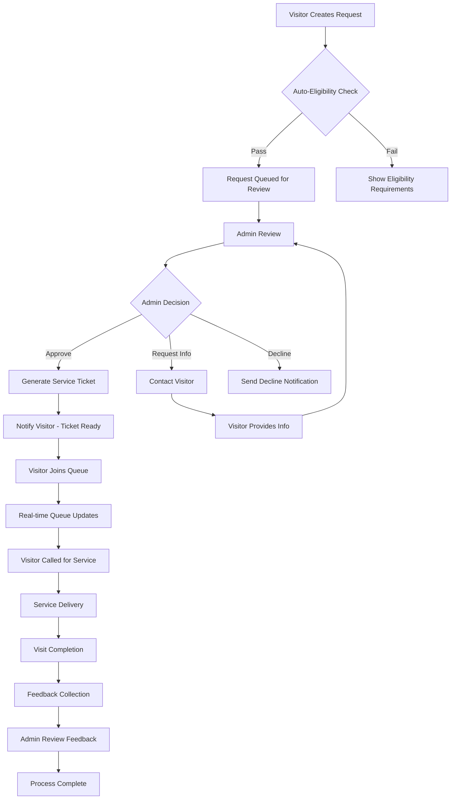

### 1. **Request Creation & Validation**

#### Visitor Actions:
- **Eligibility Check**: System automatically verifies visitor meets requirements
- **Service Selection**: Choose from available service categories
- **Details Provision**: Specify household needs, dietary requirements, special circumstances
- **Time Preference**: Select preferred service slots from available options
- **Submission**: Submit request with all required information

#### System Validation:
- **Last Visit Check**: Ensure compliance with visit frequency rules
- **Document Status**: Verify all required documents are approved
- **Service Availability**: Confirm requested services are available on selected dates
- **Capacity Check**: Ensure service slot has available capacity

### 2. **Admin Review Process**

#### Priority Classification:
- **Emergency**: Processed within 4 hours
- **Urgent**: Processed within 24 hours  
- **Standard**: Processed within 48 hours

#### Review Criteria:
- **Eligibility Verification**: Double-check system validation
- **Needs Assessment**: Evaluate specific requirements and circumstances
- **Resource Availability**: Confirm hub can meet the request
- **Risk Assessment**: Identify any safeguarding or special needs

#### Decision Options:
1. **Immediate Approval**: Standard requests meeting all criteria
2. **Conditional Approval**: Approval with specific conditions or limitations
3. **Information Request**: Request additional details from visitor
4. **Decline with Guidance**: Provide alternative support options
5. **Escalation**: Transfer complex cases to senior staff

### 3. **Ticket Generation & Communication**

#### Approved Requests:
- **Ticket Creation**: Generate unique reference number and QR code
- **Service Details**: Specify allocated services, quantities, and special instructions
- **Appointment Confirmation**: Confirm date, time, and what to expect
- **Visitor Notification**: Email/SMS with ticket details and preparation instructions

#### Communication Templates:
- **Approval Notification**: Welcome message with visit details
- **Information Request**: Specific questions requiring visitor response
- **Decline Notification**: Explanation with alternative support options
- **Reminder Messages**: 24-hour and 2-hour visit reminders

### 4. **Service Day Operations**

#### Pre-Service Preparation:
- **Staff Briefing**: Review day's appointments and special requirements
- **Resource Allocation**: Prepare service packages based on approved requests
- **Queue Management**: Set up efficient visitor flow and wait management

#### Visitor Journey:
1. **Arrival & Check-in**: QR code scan or reference number verification
2. **Queue Joining**: Automatic position assignment with wait time estimates
3. **Real-time Updates**: WebSocket notifications of queue progress
4. **Service Call**: Notification when visitor's turn arrives
5. **Service Delivery**: Receive allocated support with staff assistance
6. **Visit Completion**: Formal check-out and receipt of services

#### Quality Assurance:
- **Service Verification**: Confirm visitor received correct allocation
- **Special Needs Accommodation**: Ensure any special requirements were met
- **Issue Resolution**: Address any problems or concerns immediately
- **Documentation**: Record visit details and any notable incidents

### 5. **Post-Service Follow-up**

#### Immediate Actions:
- **Visit Logging**: Record successful service completion
- **Inventory Updates**: Adjust stock levels for items distributed
- **Payment Processing**: Handle any financial transactions

#### Feedback Collection:
- **Feedback Invitation**: Prompt visitor to provide service feedback
- **Multi-dimensional Rating**: Overall satisfaction, staff helpfulness, wait time, facility quality
- **Comment Collection**: Positive feedback, improvement areas, suggestions
- **Experience Metrics**: Recommendation likelihood, feeling welcomed, needs fulfillment

#### Continuous Improvement:
- **Feedback Analysis**: Regular review of visitor feedback patterns
- **Service Optimization**: Adjust processes based on feedback insights
- **Staff Training**: Address improvement areas through targeted training
- **System Enhancement**: Implement technology improvements based on user feedback

### 6. **Emergency Request Fast-Track Process**

#### Emergency Classification Criteria:
- **Immediate Food Need**: No food for next meal
- **Safeguarding Concerns**: Domestic violence, child welfare issues
- **Health Emergencies**: Medical dietary requirements, medication access
- **Housing Crisis**: Sudden homelessness, utility disconnections

#### Fast-Track Workflow:
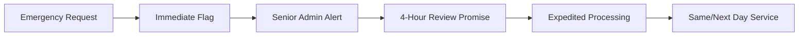

#### Emergency Response Actions:
- **Immediate Notification**: Alert senior admin within 1 hour
- **Priority Review**: Move to front of admin review queue
- **Resource Reservation**: Reserve emergency support allocation
- **Rapid Communication**: Phone call confirmation within 4 hours
- **Flexible Scheduling**: Accommodate urgent timing needs
- **Follow-up Support**: Additional check-ins and resource connection

---

## 🔔 Notification & Communication Workflows

### Automated Notification System

#### Visitor Notifications:
- **Registration Confirmation**: Welcome email with next steps
- **Document Status Updates**: Approval/rejection notifications with guidance
- **Help Request Updates**: Status changes and required actions
- **Appointment Reminders**: 24-hour and 2-hour service reminders
- **Queue Position Updates**: Real-time position and wait time estimates
- **Service Confirmation**: Post-visit summary and feedback request
- **Feedback Responses**: Admin replies to submitted feedback

#### Admin Notifications:
- **New Help Requests**: Priority-based alert system
- **Emergency Requests**: Immediate high-priority alerts
- **Document Reviews**: New uploads requiring verification
- **Volunteer Applications**: New applications and updates
- **System Alerts**: Technical issues and maintenance notifications
- **Daily Summaries**: End-of-day operational reports

#### Volunteer Notifications:
- **Shift Reminders**: 24-hour and 2-hour shift reminders
- **Schedule Changes**: Updates to assigned shifts
- **Training Opportunities**: New learning and development options
- **Recognition Messages**: Achievement and appreciation notifications
- **Emergency Calls**: Urgent volunteer assistance requests

#### Donor Notifications:
- **Donation Confirmations**: Receipt and thank you messages
- **Impact Updates**: Monthly reports on donation usage
- **Urgent Needs**: Alerts for critical item shortages
- **Success Stories**: Positive outcomes enabled by donations
- **Event Invitations**: Donor appreciation and engagement events

### Communication Preferences Management

#### Multi-Channel Options:
- **Email**: Detailed information and formal communications
- **SMS**: Urgent alerts and quick reminders
- **In-App**: Real-time updates and interactive notifications
- **Phone**: Emergency situations and complex discussions
- **Post**: Official documents and formal correspondence

#### Customization Features:
- **Frequency Control**: Choose notification frequency for each category
- **Channel Preferences**: Select preferred communication method per notification type
- **Quiet Hours**: Set times when non-urgent notifications are suppressed
- **Language Selection**: Choose from available language options
- **Accessibility Options**: Screen reader compatible and large text options

---

## 📊 Reporting & Analytics Workflows

### Reporting Workflows

#### 1. **Visitor Reports**
- **Daily Visitors**: Total number of visitors served
- **Service Usage**: Breakdown of services used by visitors
- **Feedback Summary**: Overview of visitor feedback and satisfaction
- **No-show Analysis**: Insights into missed appointments

#### 2. **Volunteer Reports**
- **Shift Coverage**: Analysis of volunteer shift fulfillment
- **Activity Reports**: Overview of volunteer activities and hours
- **Engagement Metrics**: Volunteer retention and engagement levels

#### 3. **Donation Reports**
- **Donation Trends**: Analysis of donation patterns and trends
- **Itemized Donations**: Detailed report of items donated
- **Financial Contributions**: Overview of monetary donations received

#### 4. **Help Request Reports**
- **Request Volume**: Number of help requests received and processed
- **Service Fulfillment**: Analysis of services provided through help requests
- **Emergency Request Handling**: Metrics on emergency request processing

#### 5. **Feedback Reports**
- **Satisfaction Trends**: Analysis of visitor satisfaction trends over time
- **Service Quality**: Insights into service quality based on feedback
- **Improvement Areas**: Identification of areas needing improvement

### Analytics Features

#### 1. **Real-time Analytics**
- **Visitor Tracking**: Monitor active visitors and sessions
- **Service Usage Stats**: Real-time data on services being used
- **Queue Status**: Live updates on queue lengths and wait times

#### 2. **Historical Data Analysis**
- **Trend Analysis**: Identify trends in visitor behavior and service usage
- **Seasonal Variations**: Analyze seasonal patterns in donations and requests
- **Longitudinal Studies**: Track changes in visitor demographics and needs

#### 3. **Predictive Analytics**
- **Demand Forecasting**: Predict future demand for services
- **Resource Allocation**: Optimize resource allocation based on predictions
- **Volunteer Needs**: Anticipate volunteer requirements for upcoming periods

#### 4. **Data Visualization**
- **Dashboard Widgets**: Customizable widgets for key metrics
- **Charting Tools**: Interactive charts for trend analysis
- **Map Visualizations**: Geospatial analysis of visitor locations and service coverage

---

## 🛠️ Installation & Setup

### Prerequisites
- **Go 1.21+**: [Download Go](https://golang.org/dl/)
- **PostgreSQL 13+**: [Install PostgreSQL](https://www.postgresql.org/download/)
- **Redis 6+**: [Install Redis](https://redis.io/download) (for caching and sessions)
- **Git**: For version control and repository management
- **Make**: For running build commands (optional but recommended)

### Environment Setup

#### 1. Clone Repository
```bash
git clone https://github.com/lewisham-donation-hub/backend.git
cd lewisham-donation-hub/backend
```

#### 2. Environment Configuration
```bash
# Copy environment template
cp .env.example .env

# Edit environment variables
nano .env
```

#### 3. Required Environment Variables
```env
# Database Configuration
DB_HOST=localhost
DB_PORT=5432
DB_USER=ldh_user
DB_PASSWORD=secure_password
DB_NAME=lewisham_donation_hub
DB_SSLMODE=disable

# JWT Configuration
JWT_SECRET=your-super-secure-jwt-secret-key-here
JWT_REFRESH_SECRET=your-refresh-token-secret-key
JWT_EXPIRY=24h
JWT_REFRESH_EXPIRY=7d

# Redis Configuration
REDIS_HOST=localhost
REDIS_PORT=6379
REDIS_PASSWORD=
REDIS_DB=0

# Email Configuration (SMTP)
SMTP_HOST=smtp.gmail.com
SMTP_PORT=587
SMTP_USERNAME=your-email@gmail.com
SMTP_PASSWORD=your-app-password
SMTP_FROM=noreply@lewishamCharity.org

# SMS Configuration (Twilio)
TWILIO_ACCOUNT_SID=your-twilio-account-sid
TWILIO_AUTH_TOKEN=your-twilio-auth-token
TWILIO_PHONE_NUMBER=+447123456789

# Application Configuration
APP_ENV=development
APP_PORT=8080
APP_HOST=localhost
APP_NAME=Lewisham Charity
APP_URL=http://localhost:8080

# File Upload Configuration
UPLOAD_PATH=./uploads
MAX_UPLOAD_SIZE=10MB
ALLOWED_FILE_TYPES=pdf,jpg,jpeg,png,doc,docx

# Security Configuration
CORS_ALLOWED_ORIGINS=http://localhost:3000,http://localhost:5173
RATE_LIMIT_REQUESTS=100
RATE_LIMIT_WINDOW=1h
SESSION_SECRET=your-session-secret-key

# External API Keys
GOOGLE_MAPS_API_KEY=your-google-maps-api-key
ANALYTICS_TRACKING_ID=your-google-analytics-id
```

#### 4. Database Setup
```bash
# Create PostgreSQL database
createdb -U postgres lewisham_donation_hub

# Or using psql
psql -U postgres -c "CREATE DATABASE lewisham_donation_hub;"
psql -U postgres -c "CREATE USER ldh_user WITH PASSWORD 'secure_password';"
psql -U postgres -c "GRANT ALL PRIVILEGES ON DATABASE lewisham_donation_hub TO ldh_user;"
```

### Installation Steps

#### 1. Install Dependencies
```bash
# Install Go dependencies
go mod download
go mod tidy

# Verify installation
go mod verify
```

#### 2. Database Migration
```bash
# Run database migrations
go run cmd/api/main.go migrate

# Or using make command
make migrate
```

#### 3. Seed Initial Data
```bash
# Seed database with initial admin user and test data
go run cmd/api/main.go seed

# Or using make command
make seed
```

#### 4. Generate Swagger Documentation
```bash
# Install swag tool
go install github.com/swaggo/swag/cmd/swag@latest

# Generate API documentation
swag init -g cmd/api/main.go -o docs

# Or using make command
make docs
```

### Running the Application

#### Development Mode
```bash
# Run with hot reload (requires air)
go install github.com/cosmtrek/air@latest
air

# Or run directly
go run cmd/api/main.go

# Or using make command
make dev
```

#### Production Mode
```bash
# Build the application
go build -o bin/api cmd/api/main.go

# Run the built binary
./bin/api

# Or using make command
make build && make start
```

### Docker Setup (Alternative)

#### 1. Using Docker Compose
```yaml
# docker-compose.yml
version: '3.8'
services:
  api:
    build: .
    ports:
      - "8080:8080"
    environment:
      - DB_HOST=postgres
      - REDIS_HOST=redis
    depends_on:
      - postgres
      - redis
    volumes:
      - ./uploads:/app/uploads

  postgres:
    image: postgres:13
    environment:
      POSTGRES_DB: lewisham_donation_hub
      POSTGRES_USER: ldh_user
      POSTGRES_PASSWORD: secure_password
    volumes:
      - postgres_data:/var/lib/postgresql/data
    ports:
      - "5432:5432"

  redis:
    image: redis:6-alpine
    ports:
      - "6379:6379"

volumes:
  postgres_data:
```

#### 2. Run with Docker
```bash
# Start all services
docker-compose up -d

# View logs
docker-compose logs -f api

# Stop services
docker-compose down
```

### Testing Setup

#### 1. Test Database
```bash
# Create test database
createdb -U postgres lewisham_donation_hub_test

# Set test environment
export DB_NAME=lewisham_donation_hub_test
export APP_ENV=test
```

#### 2. Run Tests
```bash
# Run all tests
go test ./...

# Run tests with coverage
go test -cover ./...

# Run specific test package
go test ./internal/handlers/...

# Run tests with verbose output
go test -v ./...
```

### Make Commands

```makefile
# Available make commands
make help          # Show available commands
make dev           # Run in development mode with hot reload
make build         # Build the application
make start         # Start the built application
make test          # Run all tests
make test-cover    # Run tests with coverage report
make migrate       # Run database migrations
make seed          # Seed database with initial data
make docs          # Generate Swagger documentation
make clean         # Clean build artifacts
make deps          # Download and verify dependencies
make lint          # Run code linting
make format        # Format code using gofmt
```

---

## 🏗️ System Architecture

### High-Level Architecture
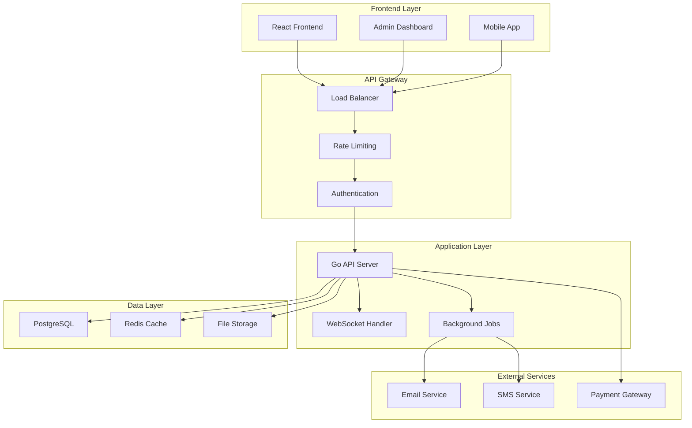

### Core Components

#### 1. **Authentication & Authorization**
- **JWT-based Authentication**: Stateless token-based security
- **Role-Based Access Control (RBAC)**: Multi-tier permission system
- **Refresh Token Rotation**: Enhanced security with token rotation
- **Email Verification**: Multi-step account verification process
- **Password Reset**: Secure password recovery workflow

#### 2. **API Layer**
- **RESTful API Design**: Standard HTTP methods and status codes
- **OpenAPI 3.0 Specification**: Complete API documentation
- **Request Validation**: Input sanitization and validation
- **Response Formatting**: Consistent API response structure
- **Error Handling**: Comprehensive error management and logging

#### 3. **Database Architecture**
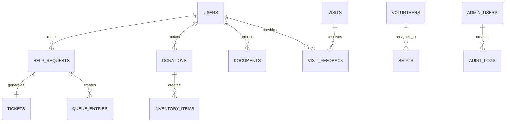

#### 4. **Security Framework**
- **Input Validation**: Comprehensive request validation and sanitization
- **SQL Injection Prevention**: Parameterized queries and ORM protection
- **XSS Protection**: Output encoding and content security policies
- **CSRF Protection**: Cross-site request forgery prevention
- **Rate Limiting**: API endpoint protection against abuse
- **Audit Logging**: Comprehensive action tracking for compliance

#### 5. **Real-time Systems**
- **WebSocket Integration**: Real-time queue updates and notifications
- **Event-Driven Architecture**: Asynchronous processing for scalability
- **Background Job Processing**: Deferred task execution
- **Push Notifications**: Real-time user engagement

### Data Models & Relationships

#### Core Entities
- **Users**: Multi-role user management (visitors, volunteers, donors, admins)
- **Help Requests**: Service request lifecycle management
- **Donations**: Monetary and item donation tracking
- **Inventory**: Real-time stock management and allocation
- **Queue Management**: Dynamic visitor flow and wait time optimization
- **Feedback System**: Multi-dimensional service quality tracking

#### Security & Compliance
- **Audit Trails**: Complete action logging for accountability
- **Data Encryption**: At-rest and in-transit data protection
- **GDPR Compliance**: Data privacy and user rights management
- **Backup & Recovery**: Automated data protection and disaster recovery

### Scalability & Performance

#### Performance Optimization
- **Database Indexing**: Optimized query performance
- **Redis Caching**: Session management and data caching
- **Connection Pooling**: Efficient database connection management
- **Query Optimization**: Efficient data retrieval strategies

#### Scalability Features
- **Horizontal Scaling**: Multi-instance deployment capability
- **Load Balancing**: Traffic distribution across instances
- **Database Sharding**: Data partitioning for large-scale operations
- **CDN Integration**: Static asset delivery optimization

### Monitoring & Observability

#### Application Monitoring
- **Health Checks**: System status and dependency monitoring
- **Performance Metrics**: Response time and throughput tracking
- **Error Tracking**: Exception monitoring and alerting
- **Resource Utilization**: CPU, memory, and storage monitoring

#### Business Intelligence
- **Analytics Dashboard**: Real-time operational insights
- **Reporting System**: Automated report generation
- **Trend Analysis**: Historical data pattern recognition
- **Predictive Analytics**: Capacity planning and demand forecasting

---

## 🧪 Testing Strategy

### Testing Pyramid

#### 1. **Unit Tests** (70%)
- **Handler Functions**: Individual endpoint testing
- **Service Layer**: Business logic validation
- **Utility Functions**: Helper function verification
- **Model Validation**: Data structure testing

```bash
# Run unit tests
go test ./internal/handlers/... -v
go test ./internal/services/... -v
go test ./internal/utils/... -v
```

#### 2. **Integration Tests** (20%)
- **Database Integration**: Repository layer testing
- **External API Integration**: Third-party service testing
- **Middleware Integration**: Request pipeline testing
- **Authentication Flow**: End-to-end auth testing

```bash
# Run integration tests
go test ./tests/integration/... -v
```

#### 3. **End-to-End Tests** (10%)
- **Complete User Workflows**: Full journey testing
- **API Contract Testing**: External interface validation
- **Performance Testing**: Load and stress testing
- **Security Testing**: Vulnerability assessment

```bash
# Run e2e tests
go test ./tests/e2e/... -v
```

### Test Data Management

#### Test Database Setup
```sql
-- Create test database
CREATE DATABASE lewisham_donation_hub_test;

-- Test data fixtures
INSERT INTO users (email, role, status) VALUES 
  ('test@example.com', 'visitor', 'active'),
  ('admin@example.com', 'admin', 'active');
```

#### Mocking & Fixtures
- **Database Mocking**: In-memory database for fast testing
- **External Service Mocking**: Mock email, SMS, and payment services
- **Test Data Fixtures**: Consistent test data across test suites
- **Cleanup Procedures**: Test isolation and cleanup automation

---

## 🚀 Deployment Guide

### Production Deployment

#### 1. **Server Requirements**
- **CPU**: 4+ cores for production workload
- **RAM**: 8GB+ for optimal performance
- **Storage**: 100GB+ SSD for database and file storage
- **Network**: Reliable internet with sufficient bandwidth
- **SSL Certificate**: HTTPS encryption for secure communication

#### 2. **Environment Setup**
```bash
# Production environment variables
export APP_ENV=production
export DB_HOST=your-production-db-host
export REDIS_HOST=your-production-redis-host
export JWT_SECRET=production-secure-secret
```

#### 3. **Database Configuration**
```bash
# Production database setup
psql -h production-db-host -U postgres -c "CREATE DATABASE lewisham_donation_hub;"
psql -h production-db-host -U postgres -c "CREATE USER ldh_user WITH PASSWORD 'secure-production-password';"

# Run migrations
./bin/api migrate
```

#### 4. **Reverse Proxy (Nginx)**
```nginx
server {
    listen 80;
    server_name api.lewishamCharity.org;
    return 301 https://$server_name$request_uri;
}

server {
    listen 443 ssl;
    server_name api.lewishamCharity.org;
    
    ssl_certificate /path/to/cert.pem;
    ssl_certificate_key /path/to/key.pem;
    
    location / {
        proxy_pass http://localhost:8080;
        proxy_set_header Host $host;
        proxy_set_header X-Real-IP $remote_addr;
        proxy_set_header X-Forwarded-For $proxy_add_x_forwarded_for;
        proxy_set_header X-Forwarded-Proto $scheme;
    }
}
```

#### 5. **Process Management (PM2)**
```bash
# Install PM2
npm install -g pm2

# Create PM2 ecosystem file
cat > ecosystem.config.js << EOF
module.exports = {
  apps: [{
    name: 'lewisham-donation-hub-api',
    script: './bin/api',
    instances: 'max',
    exec_mode: 'cluster',
    env: {
      NODE_ENV: 'production',
      PORT: 8080
    },
    error_file: './logs/api-error.log',
    out_file: './logs/api-out.log',
    log_file: './logs/api-combined.log',
    time: true
  }]
};
EOF

# Start application
pm2 start ecosystem.config.js
pm2 save
pm2 startup
```

### Staging Environment
```bash
# Staging-specific environment variables
export APP_ENV=staging
export DB_HOST=staging-db-host
export FRONTEND_URL=https://staging.lewishamCharity.org
```

### Health Checks & Monitoring
```bash
# Health check endpoint
curl https://api.lewishamCharity.org/health

# Monitoring endpoints
curl https://api.lewishamCharity.org/metrics
curl https://api.lewishamCharity.org/admin/system-info
```

---

## 🤝 Contributing

### Development Workflow

#### 1. **Fork & Clone**
```bash
# Fork the repository on GitHub
# Clone your fork
git clone https://github.com/YOUR_USERNAME/lewisham-donation-hub-backend.git
cd lewisham-donation-hub-backend

# Add upstream remote
git remote add upstream https://github.com/lewisham-donation-hub/backend.git
```

#### 2. **Branch Strategy**
```bash
# Create feature branch
git checkout -b feature/your-feature-name

# Or for bug fixes
git checkout -b fix/bug-description

# Or for documentation
git checkout -b docs/update-readme
```

#### 3. **Development Setup**
```bash
# Install dependencies
go mod tidy

# Set up pre-commit hooks
go install github.com/golangci/golangci-lint/cmd/golangci-lint@latest

# Run tests before committing
make test
make lint
```

### Code Standards

#### **Go Code Style**
- Follow [Effective Go](https://golang.org/doc/effective_go.html) guidelines
- Use `gofmt` for code formatting
- Write comprehensive unit tests (aim for >80% coverage)
- Document all exported functions and types
- Use meaningful variable and function names
- Handle errors appropriately - never ignore errors

#### **API Design Principles**
- Follow RESTful conventions
- Use consistent HTTP status codes
- Implement proper error responses
- Version APIs appropriately (`/api/v1/`)
- Document all endpoints with OpenAPI/Swagger

#### **Database Conventions**
- Use descriptive table and column names
- Implement proper indexes for performance
- Write reversible migrations
- Include sample data in seed files
- Follow PostgreSQL naming conventions

### Pull Request Process

#### 1. **Before Submitting**
```bash
# Ensure your branch is up to date
git fetch upstream
git rebase upstream/main

# Run full test suite
make test-all
make lint
make security-check

# Build successfully
make build
```

#### 2. **PR Requirements**
- **Clear Title**: Descriptive summary of changes
- **Detailed Description**: 
  - What changes were made and why
  - Any breaking changes
  - Testing instructions
  - Screenshots (if UI changes)
- **Link Issues**: Reference related issues using `Fixes #123`
- **Tests**: Include tests for new functionality
- **Documentation**: Update relevant documentation

#### 3. **PR Template**
```markdown
## Description
Brief description of what the bug is.

## Type of Change
- [ ] Bug fix (non-breaking change that fixes an issue)
- [ ] New feature (non-breaking change that adds functionality)
- [ ] Breaking change (fix or feature that would cause existing functionality to not work as expected)
- [ ] Documentation update

## Testing
- [ ] Tests pass locally
- [ ] Added tests for new functionality
- [ ] Manual testing completed

## Checklist
- [ ] Code follows project style guidelines
- [ ] Self-review completed
- [ ] Documentation updated
- [ ] No breaking changes (or documented)
```

### Issue Reporting

#### **Bug Reports**
```markdown
**Bug Description**
A clear description of what the bug is.

**To Reproduce**
Steps to reproduce the behavior:
1. Go to '...'
2. Click on '....'
3. Scroll down to '....'
4. See error

**Expected Behavior**
What you expected to happen.

**Screenshots**
If applicable, add screenshots.

**Environment:**
- OS: [e.g. Ubuntu 20.04]
- Go Version: [e.g. 1.21]
- Browser: [e.g. Chrome 91]

**Additional Context**
Any other context about the problem.
```

#### **Feature Requests**
```markdown
**Feature Description**
Clear description of the feature you'd like to see.

**Problem Statement**
What problem does this solve?

**Proposed Solution**
How would you like this implemented?

**Alternatives Considered**
Other solutions you've considered.

**Additional Context**
Any other context or screenshots.
```

### Development Environment

#### **Recommended Tools**
- **IDE**: VS Code with Go extension
- **API Testing**: Postman or Insomnia
- **Database**: pgAdmin or DBeaver
- **Git GUI**: GitKraken or Sourcetree (optional)
- **Terminal**: iTerm2 (macOS) or Windows Terminal

#### **VS Code Extensions**
```json
{
  "recommendations": [
    "golang.go",
    "ms-vscode.vscode-json",
    "redhat.vscode-yaml",
    "humao.rest-client",
    "ms-python.python",
    "bradlc.vscode-tailwindcss"
  ]
}
```

### Code Review Guidelines

#### **For Reviewers**
- Review for logic, performance, and security
- Check test coverage and quality
- Verify documentation updates
- Test locally when possible
- Provide constructive feedback
- Approve only when confident in changes

#### **For Contributors**
- Respond to feedback promptly
- Keep discussions focused and professional
- Update PR based on review comments
- Request re-review after changes
- Be patient with the review process

### Community Guidelines

#### **Communication**
- Be respectful and inclusive
- Use clear, professional language
- Help others learn and grow
- Ask questions when unsure
- Share knowledge and best practices

#### **Collaboration**
- Work together on complex features
- Share resources and learning materials
- Participate in code reviews
- Contribute to discussions and planning
- Help maintain project quality

---

## 📞 Support & Contact

### Getting Help

#### **Documentation**
- **API Docs**: [https://api.lewishamCharity.org/swagger/](https://api.lewishamCharity.org/swagger/)
- **User Guide**: [https://docs.lewishamCharity.org/](https://docs.lewishamCharity.org/)
- **Admin Manual**: [https://docs.lewishamCharity.org/admin/](https://docs.lewishamCharity.org/admin/)

#### **Community Support**
- **GitHub Discussions**: [Ask questions and share ideas](https://github.com/lewisham-donation-hub/backend/discussions)
- **Issues**: [Report bugs and request features](https://github.com/lewisham-donation-hub/backend/issues)
- **Wiki**: [Community-maintained documentation](https://github.com/lewisham-donation-hub/backend/wiki)

#### **Contact Information**
- **Technical Support**: tech@lewishamCharity.org
- **General Inquiries**: info@lewishamCharity.org
- **Emergency Support**: emergency@lewishamCharity.org (urgent technical issues only)

### Maintenance & Updates

#### **Update Schedule**
- **Security Updates**: Applied immediately
- **Bug Fixes**: Weekly releases (Fridays)
- **Feature Updates**: Monthly releases (first Monday)
- **Major Versions**: Quarterly releases

#### **Maintenance Windows**
- **Scheduled**: Sundays 2:00-4:00 AM GMT
- **Emergency**: As needed with 30-minute notice
- **Notifications**: via email and system announcements

---

## 📜 License

This project is licensed under the **MIT License** - see the [LICENSE](LICENSE) file for details.

### License Summary
- ✅ Commercial use
- ✅ Modification
- ✅ Distribution
- ✅ Private use
- ❌ Liability
- ❌ Warranty

---

## 🙏 Acknowledgments

### Contributors
Special thanks to all contributors who have helped build and improve the Lewisham Charity platform.

### Technologies
- **[Go](https://golang.org/)** - Primary backend language
- **[Gin](https://gin-gonic.com/)** - HTTP web framework
- **[GORM](https://gorm.io/)** - Object-relational mapping
- **[PostgreSQL](https://www.postgresql.org/)** - Database system
- **[Redis](https://redis.io/)** - Caching and session storage
- **[JWT](https://jwt.io/)** - Authentication tokens
- **[Swagger](https://swagger.io/)** - API documentation

### Community Partners
- **Lewisham Council** - Policy guidance and community support
- **Local Food Banks** - Resource sharing and coordination
- **Volunteer Organizations** - Community outreach and support
- **Technology Partners** - Infrastructure and development support

---

<div align="center">

**Built with ❤️ for the Lewisham Community**

[Website](https://lewishamCharity.org) • [Documentation](https://docs.lewishamCharity.org) • [API](https://api.lewishamCharity.org) • [Support](mailto:support@lewishamCharity.org)

---

*© 2024 Lewisham Charity. All rights reserved.*

</div>


🔧 Production Deployment Notes:
For production deployment, you'll need to:
Configure VAPID keys for real push notifications
Set up push service credentials (FCM, etc.)
Configure proper CORS settings for WebSocket connections
Set up SSL/TLS for secure WebSocket connections
Configure notification email/SMS services
