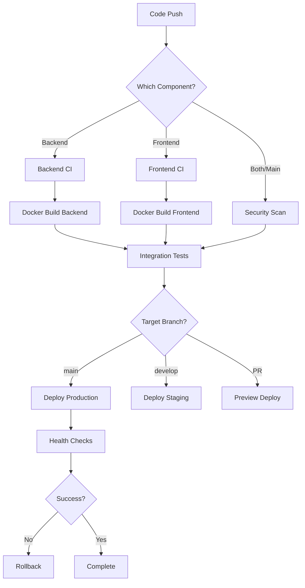

# 🚀 CI/CD Pipeline Documentation - Charity Management System

## Overview

This repository implements a comprehensive CI/CD pipeline using GitHub Actions for the Charity Management System. The pipeline ensures code quality, security, and reliable deployments for both the Go backend and Next.js frontend.

## 📋 Pipeline Architecture

### Workflows Overview

| Workflow | Purpose | Trigger | Key Features |
|----------|---------|---------|--------------|
| **Backend CI** | Go backend testing & quality | Push/PR on backend changes | Testing, linting, security, performance |
| **Frontend CI** | Next.js frontend quality | Push/PR on frontend changes | Testing, accessibility, security, building |
| **Docker CI** | Container building & security | Push to main/develop | Multi-arch builds, vulnerability scanning |
| **Security** | Comprehensive security scanning | Push/PR/Schedule | SAST, DAST, dependency scanning |
| **Deploy** | Production deployment | Push to main/tags | Blue-green deployment, rollback |

### Pipeline Flow Diagram



## 🔧 Workflow Details

### 1. Backend CI (`backend-ci.yml`)

**Triggers:**
- Push to `main`, `develop` branches (backend changes only)
- Pull requests targeting `main`, `develop`

**Jobs:**
- **Test & Quality Check**
  - Go formatting check
  - Static analysis (staticcheck, golangci-lint)
  - Unit tests with coverage
  - Database integration tests
- **Security Scan**
  - Gosec security scanner
  - Trivy vulnerability scanner
- **Build Application**
  - Cross-platform binary build
  - Binary validation
- **Docker Build & Push**
  - Multi-architecture container builds (amd64, arm64)
  - Push to GitHub Container Registry
- **Performance Testing**
  - k6 load testing on main branch
  - Performance regression detection

**Environment Requirements:**
```env
# No additional secrets required - uses built-in GITHUB_TOKEN
```

### 2. Frontend CI (`frontend-ci.yml`)

**Triggers:**
- Push to `main`, `develop` branches (frontend changes only)
- Pull requests targeting `main`, `develop`

**Jobs:**
- **Test & Quality Check**
  - TypeScript type checking
  - ESLint linting
  - Unit tests with coverage
  - Code formatting validation
- **Accessibility & Performance**
  - Accessibility testing
  - Lighthouse CI performance audit
  - Bundle size analysis
- **Security Scan**
  - npm audit for vulnerabilities
  - Snyk security scanning
  - Trivy filesystem scan
- **Build Application**
  - Production and staging builds
  - Static export generation
- **Docker Build & Push**
  - Optimized Next.js container builds
  - Multi-environment configurations
- **Deploy Options**
  - Vercel deployment (if configured)
  - Netlify deployment (if configured)

**Environment Requirements:**
```env
# Optional - for enhanced features
SNYK_TOKEN=your_snyk_token
VERCEL_TOKEN=your_vercel_token
VERCEL_ORG_ID=your_org_id
VERCEL_PROJECT_ID=your_project_id
NETLIFY_AUTH_TOKEN=your_netlify_token
NETLIFY_SITE_ID=your_site_id
```

### 3. Docker CI (`docker-ci.yml`)

**Triggers:**
- Push to `main`, `develop` branches
- Git tags starting with `v`
- Pull requests to `main`

**Jobs:**
- **Build Backend Image**
  - Optimized multi-stage Dockerfile
  - Security-hardened scratch-based final image
  - Multi-architecture builds
- **Build Frontend Image**
  - Next.js standalone optimized builds
  - Non-root user security
- **Integration Testing**
  - Full stack docker-compose testing
  - End-to-end API validation
  - Health check verification
- **Security Scanning**
  - Container vulnerability scanning
  - Docker Scout integration
- **SBOM Generation**
  - Software Bill of Materials creation
  - Supply chain security compliance

### 4. Security Workflow (`security.yml`)

**Triggers:**
- Push to any branch
- Pull requests
- Daily scheduled runs (2 AM UTC)
- Manual dispatch

**Jobs:**
- **Dependency Scanning**
  - Go vulnerability check (govulncheck)
  - npm audit for Node.js
  - License compliance verification
- **Static Application Security Testing (SAST)**
  - CodeQL analysis
  - Semgrep security rules
  - Go-specific Gosec scanning
- **Secret Detection**
  - TruffleHog for exposed secrets
  - GitLeaks historical scanning
- **Infrastructure as Code (IaC) Scanning**
  - Trivy configuration scanning
  - Checkov policy compliance
- **Dynamic Application Security Testing (DAST)**
  - OWASP ZAP baseline scanning
  - API security testing with Newman
- **Compliance Checking**
  - Security gate enforcement
  - Automated issue creation for failures

### 5. Deployment Workflow (`deploy.yml`)

**Triggers:**
- Push to `main` branch
- Git tags starting with `v`
- Manual workflow dispatch

**Jobs:**
- **Pre-deployment Validation**
  - Health checks and prerequisites
  - Environment determination
- **Staging Deployment**
  - Automated staging environment updates
  - Smoke testing validation
- **Production Deployment**
  - Blue-green deployment strategy
  - Comprehensive health checks
  - Database backup creation
- **Automatic Rollback**
  - Failure detection and automatic rollback
  - Service restoration verification
- **Post-deployment Tasks**
  - Monitoring configuration updates
  - Deployment reporting
  - Cleanup of old resources

## 🔐 Security Features

### Comprehensive Security Scanning

1. **Static Analysis Security Testing (SAST)**
   - **CodeQL**: GitHub's semantic code analysis
   - **Semgrep**: Rule-based static analysis
   - **Gosec**: Go-specific security scanner

2. **Dynamic Analysis Security Testing (DAST)**
   - **OWASP ZAP**: Web application security scanner
   - **API Security Testing**: Newman-based API security tests

3. **Dependency Scanning**
   - **Go modules**: govulncheck for Go vulnerabilities
   - **npm packages**: npm audit and Snyk scanning
   - **Container images**: Trivy multi-layer scanning

4. **Secret Detection**
   - **TruffleHog**: Entropy-based secret detection
   - **GitLeaks**: Pattern-based secret scanning
   - **Historical scanning**: Full repository history analysis

5. **Infrastructure Security**
   - **IaC scanning**: Trivy and Checkov for misconfigurations
   - **Container security**: Multi-layer vulnerability assessment
   - **Supply chain**: SBOM generation and attestation

### Security Gates & Compliance

- **Quality Gates**: Configurable thresholds for security issues
- **Automated Issues**: Critical findings create GitHub issues
- **Compliance Reporting**: Comprehensive security assessment reports
- **SARIF Integration**: Results uploaded to GitHub Security tab

## 🏗️ Container Strategy

### Multi-Stage Docker Builds

**Backend Container:**
- **Builder stage**: Go 1.23 with full toolchain
- **Final stage**: Scratch-based minimal container
- **Security**: Non-root user, static binary
- **Size**: ~10MB optimized container

**Frontend Container:**
- **Dependencies stage**: Node.js with production deps
- **Builder stage**: Next.js build with standalone output
- **Runner stage**: Minimal Node.js runtime
- **Security**: Non-root user, health checks
- **Size**: ~100MB optimized container

### Registry Strategy

- **Registry**: GitHub Container Registry (ghcr.io)
- **Tagging Strategy**:
  - `latest`: Latest main branch build
  - `main-<sha>`: Main branch with commit SHA
  - `develop-<sha>`: Develop branch builds
  - `v1.2.3`: Semantic version tags
- **Multi-Architecture**: Supports AMD64 and ARM64

## 🚀 Deployment Strategy

### Environment Strategy

| Environment | Branch | URL | Purpose |
|-------------|--------|-----|---------|
| **Development** | Any branch | Local | Developer testing |
| **Staging** | `develop` | staging.* | Integration testing |
| **Production** | `main`/tags | production | Live application |

### Deployment Methods

1. **Blue-Green Deployment**
   - Zero-downtime deployments
   - Instant rollback capability
   - Health check validation

2. **Rolling Updates**
   - Kubernetes-style progressive updates
   - Configurable update strategy
   - Automatic scaling

3. **Canary Deployments**
   - Gradual traffic shifting
   - A/B testing capabilities
   - Risk mitigation

### Rollback Strategy

- **Automatic Rollback**: Triggers on health check failures
- **Manual Rollback**: Available via workflow dispatch
- **Database Rollback**: Automated backup and restore
- **Monitoring Integration**: Alerting on deployment issues

## 📊 Monitoring & Observability

### CI/CD Metrics

- **Pipeline Success Rate**: Track deployment success/failure
- **Build Times**: Monitor CI/CD performance
- **Security Findings**: Track vulnerability trends
- **Test Coverage**: Maintain quality metrics

### Integration Points

- **Prometheus**: Metrics collection from applications
- **Grafana**: Deployment annotations and dashboards
- **Alerting**: Slack/Teams integration for failures
- **Logging**: Centralized log aggregation

## ⚙️ Configuration & Setup

### Required Secrets

```bash
# Container Registry (automatically available)
GITHUB_TOKEN                    # Provided by GitHub Actions

# Optional - Enhanced Security Scanning
SNYK_TOKEN                     # Snyk security scanning
GITLEAKS_LICENSE               # GitLeaks Pro features

# Optional - Deployment Platforms
VERCEL_TOKEN                   # Vercel deployment
VERCEL_ORG_ID                  # Vercel organization
VERCEL_PROJECT_ID              # Vercel project
NETLIFY_AUTH_TOKEN             # Netlify deployment
NETLIFY_SITE_ID                # Netlify site

# Optional - Notifications
SLACK_WEBHOOK                  # Slack notifications
TEAMS_WEBHOOK                  # Teams notifications
```

### Repository Settings

1. **Branch Protection Rules**
   ```yaml
   main:
     required_status_checks:
       strict: true
       contexts:
         - "Test and Quality Check"
         - "Security Scan" 
         - "Build Application"
     enforce_admins: true
     required_pull_request_reviews:
       required_approving_review_count: 2
   ```

2. **Environment Protection**
   ```yaml
   production:
     protection_rules:
       required_reviewers: 2
       wait_timer: 5  # 5 minute delay
     deployment_branch_policy: main
   ```

### Custom Configuration

**Backend Configuration:**
```yaml
# .github/workflows/backend-ci.yml - customizable sections
env:
  GO_VERSION: '1.23'           # Go version
  TEST_TIMEOUT: '10m'          # Test timeout
  COVERAGE_THRESHOLD: '80'     # Coverage requirement
```

**Frontend Configuration:**
```yaml
# .github/workflows/frontend-ci.yml - customizable sections  
env:
  NODE_VERSION: '18'           # Node.js version
  BUILD_TIMEOUT: '10m'         # Build timeout
  LIGHTHOUSE_BUDGET: '100'     # Performance budget
```

## 🎯 Best Practices

### Code Quality

1. **Automated Testing**: Comprehensive test coverage with quality gates
2. **Static Analysis**: Multiple linters and security scanners
3. **Code Reviews**: Required reviews before merging
4. **Format Enforcement**: Automated code formatting checks

### Security

1. **Shift-Left Security**: Security scanning in every pipeline stage
2. **Dependency Management**: Regular vulnerability scanning and updates
3. **Secret Management**: Automated secret detection and prevention
4. **Supply Chain Security**: SBOM generation and verification

### Deployment

1. **Immutable Infrastructure**: Container-based deployments
2. **Blue-Green Strategy**: Zero-downtime deployment approach
3. **Automated Rollback**: Fast recovery from deployment issues
4. **Health Monitoring**: Comprehensive health checks and alerting

### Performance

1. **Parallel Execution**: Jobs run in parallel where possible
2. **Caching Strategy**: Aggressive caching of dependencies and builds
3. **Resource Optimization**: Right-sized runners for different tasks
4. **Artifact Management**: Efficient artifact storage and cleanup

## 🔍 Troubleshooting

### Common Issues

**Build Failures:**
```bash
# Check specific job logs
gh run view <run-id>

# Restart failed jobs
gh run rerun <run-id>

# View workflow status
gh run list --workflow=backend-ci.yml
```

**Security Scan Failures:**
```bash
# Check security findings
gh api repos/{owner}/{repo}/code-scanning/alerts

# Review SARIF uploads
gh api repos/{owner}/{repo}/code-scanning/sarifs
```

**Deployment Issues:**
```bash
# Check deployment status
kubectl get deployments -n production

# View deployment logs
kubectl logs -f deployment/backend -n production

# Rollback deployment
kubectl rollout undo deployment/backend -n production
```

### Debug Mode

Enable debug logging by adding to workflow:
```yaml
env:
  ACTIONS_STEP_DEBUG: true
  ACTIONS_RUNNER_DEBUG: true
```

## 📈 Metrics & KPIs

### Pipeline Metrics

- **Deployment Frequency**: Daily deployment capability
- **Lead Time**: < 30 minutes from commit to production
- **Mean Time to Recovery**: < 5 minutes with automatic rollback
- **Change Failure Rate**: < 15% target with quality gates

### Security Metrics

- **Vulnerability Detection Time**: Real-time in CI/CD
- **Mean Time to Fix**: < 7 days for high/critical issues
- **Security Coverage**: 100% code coverage with SAST/DAST
- **Compliance Score**: Automated compliance reporting

### Quality Metrics

- **Test Coverage**: > 80% for both backend and frontend
- **Build Success Rate**: > 95% target
- **Code Quality Score**: A-grade with multiple static analyzers
- **Performance Budget**: Lighthouse scores > 90

## 🔄 Maintenance

### Regular Tasks

1. **Dependency Updates**
   - Weekly automated dependency updates
   - Security patch verification
   - Compatibility testing

2. **Workflow Updates**  
   - Monthly review of GitHub Actions versions
   - Security scanner version updates
   - Performance optimization reviews

3. **Security Reviews**
   - Quarterly security assessment
   - Pipeline security audit
   - Access control review

### Scaling Considerations

1. **Runner Management**
   - Self-hosted runners for sensitive workloads
   - Resource allocation optimization
   - Cost management strategies

2. **Workflow Optimization**
   - Parallel execution improvements
   - Caching strategy enhancement
   - Artifact lifecycle management

## 📚 Additional Resources

- **GitHub Actions Documentation**: https://docs.github.com/en/actions
- **Security Best Practices**: https://docs.github.com/en/actions/security-guides
- **Container Security**: https://docs.docker.com/engine/security/
- **Go Testing Guide**: https://go.dev/doc/tutorial/add-a-test
- **Next.js Deployment**: https://nextjs.org/docs/deployment

---

**Pipeline Status**: ✅ **Production Ready**  
**Last Updated**: September 27, 2025  
**Maintenance**: Automated with quarterly reviews