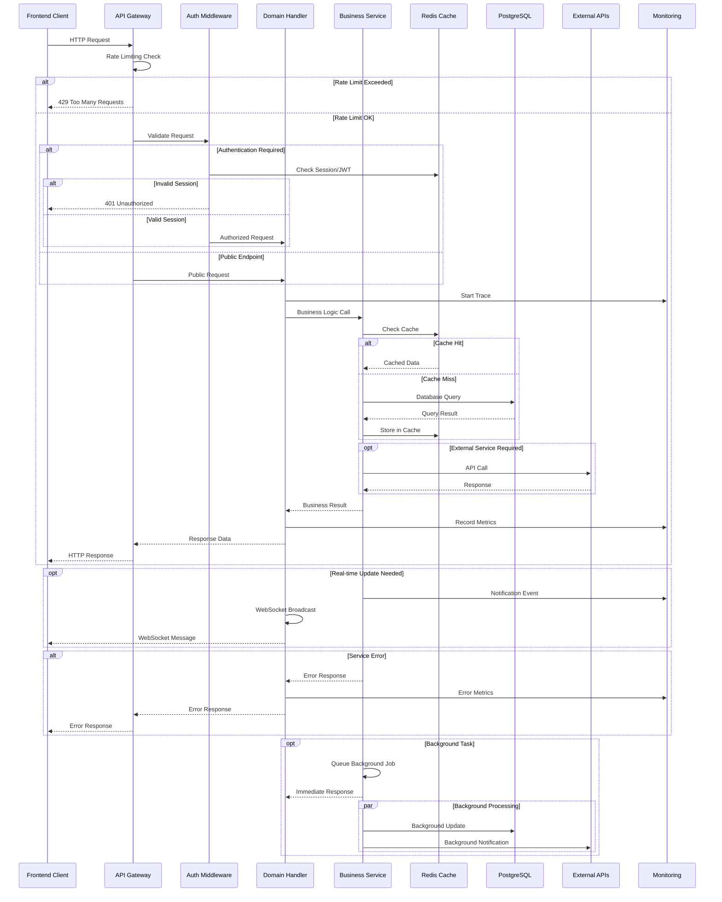

```mermaid
sequenceDiagram
    participant Client as Frontend Client
    participant Gateway as API Gateway
    participant Auth as Auth Middleware
    participant Handler as Domain Handler
    participant Service as Business Service
    participant Cache as Redis Cache
    participant DB as PostgreSQL
    participant External as External APIs
    participant Monitor as Monitoring

    %% Request Flow
    Client->>Gateway: HTTP Request
    Gateway->>Gateway: Rate Limiting Check
    
    alt Rate Limit Exceeded
        Gateway-->>Client: 429 Too Many Requests
    else Rate Limit OK
        Gateway->>Auth: Validate Request
        
        alt Authentication Required
            Auth->>Cache: Check Session/JWT
            alt Invalid Session
                Auth-->>Client: 401 Unauthorized
            else Valid Session
                Auth->>Handler: Authorized Request
            end
        else Public Endpoint
            Gateway->>Handler: Public Request
        end
        
        Handler->>Monitor: Start Trace
        Handler->>Service: Business Logic Call
        
        %% Service Layer Processing
        Service->>Cache: Check Cache
        alt Cache Hit
            Cache-->>Service: Cached Data
        else Cache Miss
            Service->>DB: Database Query
            DB-->>Service: Query Result
            Service->>Cache: Store in Cache
        end
        
        %% External Service Calls (if needed)
        opt External Service Required
            Service->>External: API Call
            External-->>Service: Response
        end
        
        Service-->>Handler: Business Result
        Handler->>Monitor: Record Metrics
        Handler-->>Gateway: Response Data
        Gateway-->>Client: HTTP Response
    end

    %% Real-time Notification Flow
    opt Real-time Update Needed
        Service->>Monitor: Notification Event
        Handler->>Handler: WebSocket Broadcast
        Handler-->>Client: WebSocket Message
    end

    %% Error Handling Flow
    alt Service Error
        Service-->>Handler: Error Response
        Handler->>Monitor: Error Metrics
        Handler-->>Gateway: Error Response
        Gateway-->>Client: Error Response
    end

    %% Background Processing
    opt Background Task
        Service->>Service: Queue Background Job
        Service-->>Handler: Immediate Response
        
        par Background Processing
            Service->>DB: Background Update
            Service->>External: Background Notification
        end
    end
```