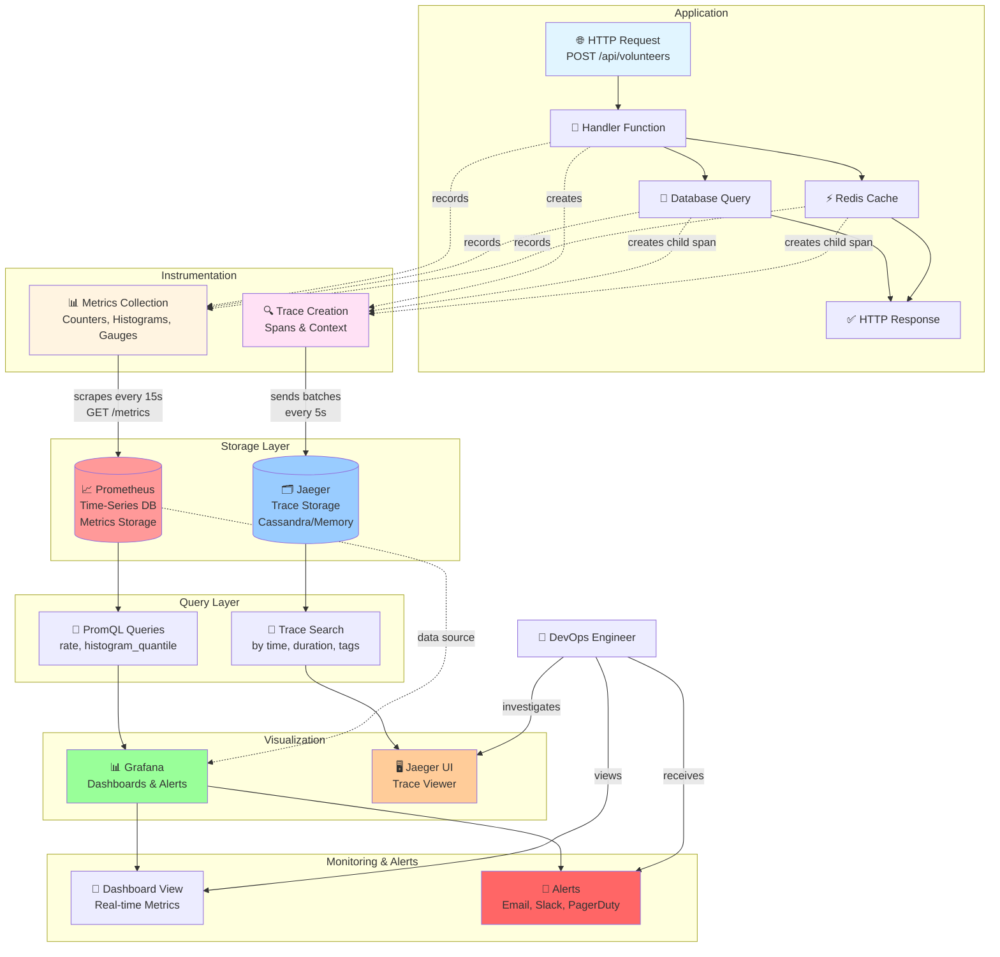

```mermaid
graph TB
    subgraph "Application"
        API[🌐 HTTP Request<br/>POST /api/volunteers]
        HANDLER[📝 Handler Function]
        DB[💾 Database Query]
        CACHE[⚡ Redis Cache]
        RESPONSE[✅ HTTP Response]
        
        API --> HANDLER
        HANDLER --> DB
        HANDLER --> CACHE
        DB --> RESPONSE
        CACHE --> RESPONSE
    end
    
    subgraph "Instrumentation"
        METRICS[📊 Metrics Collection<br/>Counters, Histograms, Gauges]
        TRACES[🔍 Trace Creation<br/>Spans & Context]
        
        HANDLER -.records.-> METRICS
        HANDLER -.creates.-> TRACES
        DB -.records.-> METRICS
        DB -.creates child span.-> TRACES
        CACHE -.records.-> METRICS
        CACHE -.creates child span.-> TRACES
    end
    
    subgraph "Storage Layer"
        PROM[(📈 Prometheus<br/>Time-Series DB<br/>Metrics Storage)]
        JAEGER[(🗂️ Jaeger<br/>Trace Storage<br/>Cassandra/Memory)]
        
        METRICS -->|scrapes every 15s<br/>GET /metrics| PROM
        TRACES -->|sends batches<br/>every 5s| JAEGER
    end
    
    subgraph "Query Layer"
        PROMQL[🔎 PromQL Queries<br/>rate, histogram_quantile]
        JAEGERSEARCH[🔎 Trace Search<br/>by time, duration, tags]
        
        PROM --> PROMQL
        JAEGER --> JAEGERSEARCH
    end
    
    subgraph "Visualization"
        GRAFANA[📊 Grafana<br/>Dashboards & Alerts]
        JAEGERUI[🖥️ Jaeger UI<br/>Trace Viewer]
        
        PROMQL --> GRAFANA
        JAEGERSEARCH --> JAEGERUI
        PROM -.data source.-> GRAFANA
    end
    
    subgraph "Monitoring & Alerts"
        DASHBOARD[📱 Dashboard View<br/>Real-time Metrics]
        ALERTS[🚨 Alerts<br/>Email, Slack, PagerDuty]
        
        GRAFANA --> DASHBOARD
        GRAFANA --> ALERTS
    end
    
    USER[👤 DevOps Engineer]
    USER -->|views| DASHBOARD
    USER -->|investigates| JAEGERUI
    USER -->|receives| ALERTS
    
    style API fill:#e1f5ff
    style METRICS fill:#fff4e1
    style TRACES fill:#ffe1f5
    style PROM fill:#ff9999
    style JAEGER fill:#99ccff
    style GRAFANA fill:#99ff99
    style JAEGERUI fill:#ffcc99
    style ALERTS fill:#ff6666
```