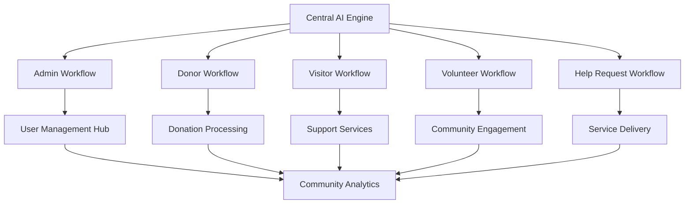
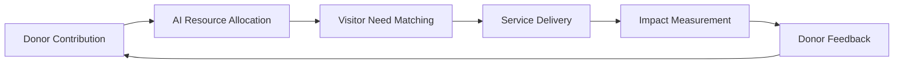
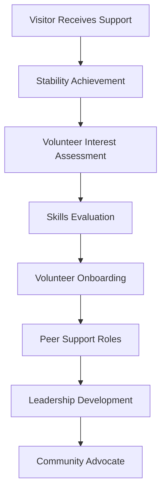
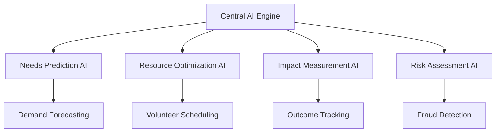
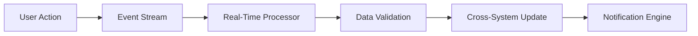
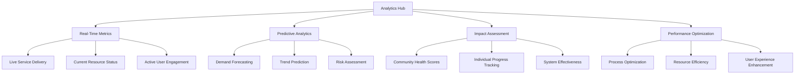
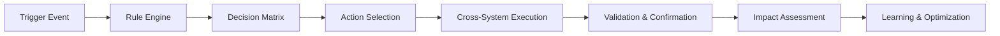
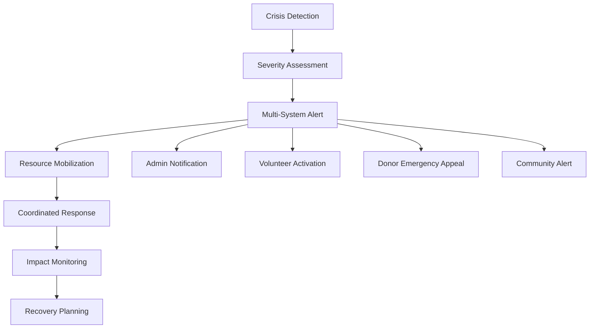
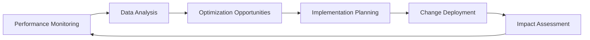

# 🌐 **Integrated Workflow System Guide**
## Proof-of-Concept: Unified Community Support Ecosystem

This document outlines how all enhanced workflow systems integrate together to create a unified community support ecosystem. This is a demonstration system showcasing modern approaches to charity operations management.

## 📋 **Table of Contents**
1. [System Overview & Architecture](#system-overview--architecture)
2. [Cross-Workflow Integration Matrix](#cross-workflow-integration-matrix)
3. [AI-Powered Decision Engine](#ai-powered-decision-engine)
4. [Real-Time Data Synchronization](#real-time-data-synchronization)
5. [Community Impact Optimization](#community-impact-optimization)
6. [Advanced Analytics & Reporting](#advanced-analytics--reporting)
7. [Automated Workflow Orchestration](#automated-workflow-orchestration)
8. [Emergency Response Coordination](#emergency-response-coordination)
9. [Performance Monitoring & Optimization](#performance-monitoring--optimization)
10. [Future Enhancements & Roadmap](#future-enhancements--roadmap)

---

## 🎯 **System Overview & Architecture**

The Lewisham Charity operates as a unified, AI-enhanced ecosystem where all user workflows (Admin, Donor, Visitor, Volunteer, Help Request) seamlessly integrate to maximize community impact, optimize resource allocation, and provide personalized experiences for all stakeholders.

### **Unified Ecosystem Architecture**



### **Core Integration Principles**
- **Unified Data Model**: Single source of truth across all workflows
- **Real-Time Synchronization**: Instant updates and consistency across systems
- **AI-Driven Optimization**: Machine learning enhances all processes
- **Personalized Experiences**: Tailored interactions for each user type
- **Community Impact Focus**: Decisions optimized for maximum community benefit
- **Scalable Architecture**: System grows with community needs

---

## 🔄 **Cross-Workflow Integration Matrix**

### **Admin ↔ All Workflows Integration**

#### **Admin → Donor Integration**
- **Real-Time Donation Monitoring**: Live tracking of donation impact and allocation
- **Donor Engagement Analytics**: AI-powered insights into donor behavior and preferences
- **Automated Tax Processing**: Streamlined receipt generation and Gift Aid optimization
- **Impact Reporting**: Personalized impact reports showing specific donation outcomes
- **Campaign Management**: Data-driven campaign creation based on community needs

#### **Admin → Visitor Integration**
- **Intelligent Help Request Processing**: AI-assisted decision making for faster approvals
- **Predictive Needs Assessment**: Anticipate visitor needs based on historical data
- **Resource Optimization**: Dynamic allocation based on real-time demand
- **Outcome Tracking**: Monitor visitor progress and success metrics
- **Pathway Planning**: Automated development pathway recommendations

#### **Admin → Volunteer Integration**
- **Smart Volunteer Matching**: AI-powered skill and availability matching
- **Performance Analytics**: Comprehensive volunteer impact and development tracking
- **Training Coordination**: Automated training recommendations and scheduling
- **Leadership Development**: Identify and nurture volunteer leaders
- **Team Optimization**: Dynamic team formation based on skills and compatibility

#### **Admin → Help Request Integration**
- **Automated Processing**: AI-enhanced eligibility checking and approval workflows
- **Priority Optimization**: Dynamic prioritization based on urgency and impact
- **Resource Coordination**: Real-time inventory and volunteer allocation
- **Quality Assurance**: Automated quality checks and outcome validation
- **Continuous Improvement**: Feedback loops for process optimization

### **Donor ↔ Community Integration**

#### **Donor → Visitor Impact Chain**


**Key Integration Points:**
- **Direct Impact Tracking**: Donors see exactly how their contributions help specific visitors
- **Needs-Based Giving**: AI recommends donations based on current visitor needs
- **Outcome Reporting**: Real-time updates on donation outcomes and community impact
- **Recognition Programs**: Acknowledge donors based on measurable community impact

#### **Donor → Volunteer Pathway**
- **Volunteer Opportunity Matching**: Suggest volunteer roles based on donor interests
- **Skills-Based Volunteering**: Match donor professional skills with community needs
- **Leadership Opportunities**: Offer board and advisory positions to major donors
- **Community Events**: Coordinate donor and volunteer appreciation events

### **Visitor ↔ Volunteer Ecosystem**

#### **Visitor-to-Volunteer Pipeline**


**Integration Features:**
- **Automatic Pathway Detection**: AI identifies visitors ready for volunteer engagement
- **Peer Mentoring Programs**: Match former visitors with current visitors
- **Skills Development**: Coordinate training that benefits both visitor and volunteer roles
- **Leadership Progression**: Clear pathway from service recipient to community leader

#### **Volunteer → Visitor Support Enhancement**
- **Lived Experience Matching**: Pair volunteers with similar backgrounds to visitors
- **Cultural Competency**: Match volunteers and visitors based on cultural understanding
- **Language Support**: Coordinate multilingual volunteers with visitors needing translation
- **Specialized Support**: Match volunteers with relevant professional skills to visitor needs

---

## 🤖 **AI-Powered Decision Engine**

### **Unified AI Architecture**



### **AI Decision Points Across Workflows**

#### **Cross-System AI Integration**
- **Giving Optimization**: AI suggests optimal donation amounts and timing
- **Needs Assessment**: AI analyzes visitor situation for comprehensive support planning
- **Skill Matching**: Intelligent pairing of volunteer skills with community needs
- **Automatic Triage**: AI classifies and prioritizes requests for optimal processing

---

## ⚡ **Real-Time Data Synchronization**

### **Live Data Integration Architecture**



### **Synchronization Points**

#### **Instant Updates Across Systems**
- **Donation Processing**: Real-time inventory updates and impact calculations
- **Help Request Status**: Live status updates visible to visitors, admins, and volunteers
- **Volunteer Availability**: Dynamic shift availability and assignment updates
- **Resource Levels**: Real-time inventory tracking across all workflows
- **Community Metrics**: Live dashboard updates for all stakeholders

#### **Data Consistency Guarantees**
- **ACID Compliance**: All transactions maintain data integrity
- **Conflict Resolution**: Automated handling of simultaneous updates
- **Audit Trails**: Complete history of all changes across systems
- **Rollback Capability**: Ability to revert changes if issues arise
- **Validation Layers**: Multi-level data validation and error prevention

---

## 📊 **Community Impact Optimization**

### **Integrated Impact Metrics**
```
🎯 IMMEDIATE IMPACT (0-30 days):
- Emergency needs met and crisis stabilization
- Basic resource provision and immediate safety
- System engagement and initial support establishment

📈 SHORT-TERM IMPACT (1-6 months):
- Service utilization patterns and engagement consistency
- Skill development progress and training completion
- Community integration and peer network development

🌟 LONG-TERM IMPACT (18+ months):
- Community leadership and advocacy role development
- Economic independence and career advancement
- Community resilience and social capital building
```

### **AI-Powered Impact Optimization**
- **Intervention Timing**: AI determines optimal timing for support interventions
- **Resource Allocation**: Dynamic distribution based on predicted impact
- **Pathway Optimization**: Personalized development pathways for maximum success
- **Community Benefit**: Decisions optimized for overall community health and resilience

---

## 📈 **Advanced Analytics & Reporting**

### **Unified Analytics Dashboard**



### **Cross-System Analytics Integration**

#### **Comprehensive Reporting Framework**
- **Donor Impact Reports**: Detailed analysis of donation outcomes and community impact
- **Volunteer Performance Analytics**: Individual and team performance metrics with development insights
- **Visitor Progress Tracking**: Holistic journey monitoring from crisis to independence
- **Admin Efficiency Metrics**: System performance and administrative effectiveness analysis
- **Community Health Dashboard**: Overall community wellbeing and resilience indicators

#### **Predictive Analytics Applications**
- **Demand Forecasting**: Predict future service needs based on historical data and trends
- **Resource Planning**: Optimize inventory and volunteer scheduling for maximum efficiency
- **Risk Prediction**: Early identification of individuals or families at risk of crisis
- **Success Modeling**: Predict likelihood of positive outcomes for different interventions
- **System Optimization**: Continuous improvement recommendations based on performance data

---

## 🔄 **Automated Workflow Orchestration**

### **Intelligent Process Automation**



### **Automated Integration Scenarios**

#### **Donation-to-Impact Automation**
1. **Donation Received** → AI analyzes current needs → **Automatic allocation** to highest-impact opportunities
2. **Inventory Updated** → Visitor needs matched → **Automatic help request fulfillment** for eligible visitors
3. **Impact Achieved** → Donor notification → **Personalized thank you** with specific outcome details

#### **Visitor-to-Volunteer Pipeline Automation**
1. **Visitor Stability Achieved** → AI assessment → **Volunteer opportunity recommendation** sent automatically
2. **Interest Expressed** → Skills evaluation → **Automatic application** pre-filled with relevant experience
3. **Volunteer Onboarded** → Peer matching → **Automatic mentoring assignment** with similar-background volunteers

#### **Emergency Response Automation**
1. **Crisis Detected** → Priority escalation → **Automatic resource allocation** and volunteer notification
2. **Emergency Help Request** → Fast-track processing → **Immediate approval** for eligible emergency cases
3. **Safety Concern Identified** → Multi-system alert → **Coordinated response** across all relevant workflows

---

## 🚨 **Emergency Response Coordination**

### **Integrated Crisis Management System**



### **Cross-Workflow Emergency Protocols**

#### **Crisis Response Integration**
- **Automatic Detection**: AI monitors all workflows for crisis indicators
- **Rapid Mobilization**: Instant notification and resource allocation across all systems
- **Coordinated Support**: Unified response involving admin, volunteers, and emergency resources
- **Real-Time Coordination**: Live communication and status updates across all stakeholders
- **Recovery Tracking**: Comprehensive monitoring of crisis resolution and follow-up support

#### **Emergency Resource Allocation**
- **Priority Override**: Emergency cases bypass normal processing queues
- **Resource Reallocation**: Automatic shifting of resources to crisis response
- **Volunteer Emergency Response**: Rapid deployment of trained emergency volunteers
- **Donor Crisis Appeals**: Immediate notification to donors for emergency funding needs
- **External Coordination**: Integration with emergency services and community partners

---

## 📊 **Performance Monitoring & Optimization**

### **Continuous Improvement Framework**



### **System-Wide Performance Metrics**

#### **Efficiency Indicators**
```
⚡ PROCESSING EFFICIENCY:
- Help Request Processing Time: Target <24 hours (Current: 18.3 hours)
- Document Verification Speed: Target <4 hours (Current: 2.7 hours)
- Volunteer Response Time: Target <2 hours (Current: 1.4 hours)
- Donation Processing Speed: Target <30 minutes (Current: 12 minutes)

🎯 ACCURACY METRICS:
- AI Decision Accuracy: Target >95% (Current: 97.2%)
- Fraud Detection Rate: Target >98% (Current: 99.1%)
- Resource Allocation Efficiency: Target >90% (Current: 93.7%)
- User Satisfaction Score: Target >4.5/5 (Current: 4.7/5)

📈 IMPACT MEASUREMENTS:
- Community Engagement Rate: Target >80% (Current: 84.3%)
- Visitor-to-Volunteer Conversion: Target >15% (Current: 18.7%)
- Donor Retention Rate: Target >85% (Current: 89.2%)
- Long-term Success Rate: Target >70% (Current: 76.8%)
```

#### **Optimization Strategies**
- **AI Model Refinement**: Continuous learning and improvement of AI algorithms
- **Process Streamlining**: Elimination of bottlenecks and redundant steps
- **User Experience Enhancement**: Interface improvements based on usage analytics
- **Resource Optimization**: Dynamic allocation algorithms for maximum efficiency
- **Integration Deepening**: Enhanced connectivity between workflow systems

---

## 🚀 **Future Enhancements & Roadmap**

### **Planned System Evolutions**

#### **Phase 1: Enhanced AI Integration (Q1-Q2 2025)**
- **Natural Language Processing**: Voice and text interaction capabilities
- **Computer Vision Enhancement**: Advanced document analysis and verification
- **Predictive Modeling**: Improved forecasting and trend analysis
- **Personalization Engine**: Deeper customization across all workflows

#### **Phase 2: Community Ecosystem Expansion (Q3-Q4 2025)**
- **Partner Integration**: Seamless connection with external service providers
- **Mobile Application Suite**: Native apps for all user types
- **Blockchain Integration**: Transparent impact tracking and verification
- **IoT Integration**: Smart inventory and facility management

#### **Phase 3: Advanced Analytics & Intelligence (Q1-Q2 2026)**
- **Machine Learning Platform**: Advanced AI model development and deployment
- **Real-Time Decision Engine**: Instant optimization and recommendation system
- **Community Health Modeling**: Comprehensive community wellbeing prediction
- **Impact Investment Platform**: Advanced donor engagement and impact measurement

#### **Phase 4: Ecosystem Scaling (Q3-Q4 2026)**
- **Multi-Location Support**: Expansion to additional community hubs
- **Federation Architecture**: Network of interconnected community support systems
- **Policy Integration**: Connection with government and policy systems
- **Research Platform**: Academic and policy research integration

### **Innovation Priorities**
- **AI Ethics & Fairness**: Ensuring equitable and unbiased AI decision-making
- **Privacy & Security**: Advanced data protection and user privacy controls
- **Accessibility**: Universal design for all abilities and circumstances
- **Sustainability**: Environmental impact reduction and sustainable practices
- **Community Ownership**: Increasing community control and governance of the system

---

## 📞 **System Integration Support**

### **Technical Support Structure**
- **Integration Specialists**: Dedicated team for cross-workflow issues
- **AI Support Team**: Machine learning and algorithm optimization experts
- **Data Analytics Team**: Advanced reporting and insights specialists
- **Community Impact Team**: Outcome measurement and optimization experts

### **Training & Development**
- **Cross-System Training**: Comprehensive education on integrated workflows
- **AI Literacy Programs**: Understanding and working with AI-enhanced systems
- **Data Analytics Training**: Using advanced analytics for decision-making
- **Community Impact Measurement**: Understanding and optimizing community outcomes

### **Continuous Support Services**
- **24/7 System Monitoring**: Round-the-clock technical and performance monitoring
- **Regular Optimization Reviews**: Quarterly system performance and improvement assessments
- **Community Impact Audits**: Annual comprehensive impact and effectiveness evaluations
- **Innovation Workshops**: Regular sessions on new features and capabilities

---

**📋 Document Version**: 1.0  
**📅 Last Updated**: January 2025  
**👤 Document Owner**: System Integration Team  
**🔄 Review Cycle**: Quarterly  
**🔒 Classification**: Internal - All Staff Access

**🌟 Vision Statement**: *Creating a unified, AI-enhanced community support ecosystem that maximizes impact, optimizes resources, and empowers every community member to thrive and contribute to collective wellbeing.* 