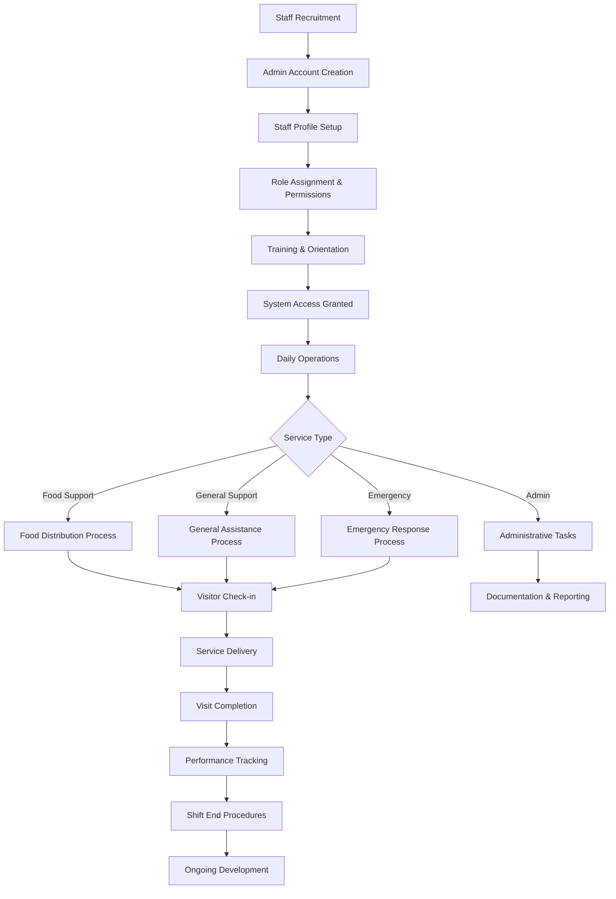

# 👥 Staff Workflow and Operations Guide
## Lewisham Charity - Comprehensive Staff Experience

---

## 📋 **Table of Contents**
1. [Overview](#overview)
2. [Staff Journey Map](#staff-journey-map)
3. [Onboarding & Account Setup](#onboarding--account-setup)
4. [Staff Roles & Responsibilities](#staff-roles--responsibilities)
5. [Daily Operations Workflow](#daily-operations-workflow)
6. [Queue Management System](#queue-management-system)
7. [Visitor Service Process](#visitor-service-process)
8. [Document Verification & Administration](#document-verification--administration)
9. [Help Request Processing](#help-request-processing)
10. [Performance Management](#performance-management)
11. [Schedule & Shift Management](#schedule--shift-management)
12. [Communication & Collaboration](#communication--collaboration)
13. [Emergency Procedures](#emergency-procedures)
14. [Technical Systems Guide](#technical-systems-guide)
15. [Training & Development](#training--development)
16. [Quality Assurance & Standards](#quality-assurance--standards)
17. [Troubleshooting Guide](#troubleshooting-guide)

---

## 🎯 **Overview**

The Lewisham Charity staff system provides a comprehensive platform for managing daily operations, visitor services, and administrative tasks. Staff members work across multiple service areas including food distribution, general support, emergency assistance, and administrative functions.

### **Service Areas & Operating Hours**
- **Food Support**: Fresh produce, dry goods, prepared meals (Tuesday-Thursday, 11:30-14:30)
- **General Support**: Advice, signposting, emergency assistance (Tuesday-Thursday, 10:30-14:30)
- **Emergency Support**: Urgent help with fast-track processing (Available daily)
- **Administrative Support**: Backend operations, document verification, reporting
- **Specialized Services**: Translation, childcare support, disability assistance
- **Community Outreach**: External partnerships, referral coordination

### **Key Staff Features**
- **Hierarchical Role System**: Clear progression from Staff Member to Manager
- **Real-time Dashboard**: Live queue status, visitor tracking, performance metrics
- **Integrated Workflows**: Seamless document verification and help request processing
- **Performance Analytics**: Individual and team productivity monitoring
- **Communication Hub**: Internal messaging, notifications, and collaboration tools
- **Training Platform**: Continuous learning and skill development
- **Quality Assurance**: Service standards monitoring and improvement tracking
- **Emergency Protocols**: Crisis response and incident management systems

---

## 🗺️ **Staff Journey Map**



---

## 📝 **Onboarding & Account Setup**

### **Step 1: Admin Account Creation**
**URL**: `https://lewishamCharity.org/admin/staff/create`

1. **User Account Setup**
   - Admin creates base user account
   - Assigns temporary password
   - Sets role as "Staff" in user management
   - Provides initial login credentials

2. **Staff Profile Creation**
   - **Employee ID**: Unique identifier (format: LDH-YYYY-XXX)
   - **Department Assignment**: Food, Emergency, General, Admin
   - **Position Level**: Staff Member, Senior Staff, Supervisor, Manager
   - **Supervisor Assignment**: Reporting structure setup
   - **Contact Information**: Phone, emergency contact details

### **Step 2: First Login & Profile Completion**
**URL**: `https://lewishamCharity.org/login`

1. **Initial Login Process**
   - Use provided temporary credentials
   - Mandatory password change on first login
   - Accept terms of employment and data protection policies
   - Complete mandatory training acknowledgment

2. **Profile Information**
   - **Personal Details**: Verify contact information
   - **Skills & Certifications**: Add relevant qualifications
   - **Availability**: Set work schedule preferences
   - **Emergency Contact**: Provide emergency contact details

### **Step 3: Training & Orientation**
**Duration**: 2-5 days (depending on role and experience)

#### **Day 1: Foundation Training**
- **Hub Overview**: Mission, values, service areas, community impact
- **System Navigation**: Complete dashboard tour and basic functions
- **Safety Procedures**: Health & safety protocols, emergency procedures
- **Communication Guidelines**: Professional standards, cultural sensitivity
- **Data Protection**: GDPR compliance, confidentiality requirements
- **Safeguarding**: Child protection, vulnerable adult protocols

#### **Day 2: Role-Specific Training**
- **Department Processes**: Detailed workflow training for assigned area
- **Visitor Interaction**: Customer service excellence, de-escalation techniques
- **System Operations**: Queue management, documentation, reporting
- **Quality Standards**: Service delivery expectations and KPIs
- **Problem Resolution**: Common issues and escalation procedures

#### **Day 3: Practical Application**
- **Shadowing**: Work alongside experienced staff mentors
- **Supervised Practice**: Handle real situations with guidance
- **System Practice**: Hands-on experience with all relevant systems
- **Feedback Session**: Initial performance discussion

#### **Day 4: Advanced Skills (Senior Staff+)**
- **Team Leadership**: Supervision and mentoring techniques
- **Performance Management**: Monitoring and improvement strategies
- **Advanced Systems**: Analytics, reporting, configuration
- **Stakeholder Relations**: Internal and external communication

#### **Day 5: Assessment & Certification**
- **Competency Evaluation**: Practical and theoretical assessment
- **Role-specific Certification**: Department-specific qualifications
- **Probation Planning**: 30-day probation goals and milestones
- **Ongoing Development**: Learning pathway and career progression

---

## 👤 **Staff Roles & Responsibilities**

### **Staff Member (Entry Level)**
**Department**: All departments
**Permissions**: Basic operational access

#### **Core Responsibilities**
- **Visitor Check-in**: Process visitor arrivals and queue management
- **Service Delivery**: Provide direct support to visitors
- **Documentation**: Record visit details and service provided
- **Inventory Management**: Monitor and report stock levels
- **Basic Reporting**: Complete daily activity logs

#### **System Access**
- ✅ Visitor check-in and queue management
- ✅ Service delivery tracking
- ✅ Basic reporting functions
- ❌ Admin functions
- ❌ Staff management
- ❌ System configuration

### **Senior Staff**
**Department**: Specialized by area
**Permissions**: Enhanced operational access

#### **Additional Responsibilities**
- **Quality Assurance**: Monitor service standards
- **Training Support**: Assist with new staff training
- **Complex Cases**: Handle difficult or sensitive situations
- **Inventory Coordination**: Manage stock distribution
- **Performance Monitoring**: Track team productivity

#### **System Access**
- ✅ All Staff Member permissions
- ✅ Advanced reporting and analytics
- ✅ Training module access
- ✅ Quality monitoring tools
- ❌ Full admin functions

### **Supervisor**
**Department**: Department-specific leadership
**Permissions**: Management access

#### **Leadership Responsibilities**
- **Team Management**: Supervise staff members
- **Schedule Coordination**: Manage shift assignments
- **Performance Reviews**: Conduct staff evaluations
- **Process Improvement**: Identify and implement improvements
- **Stakeholder Communication**: Liaise with management

#### **System Access**
- ✅ All Senior Staff permissions
- ✅ Staff scheduling and assignment
- ✅ Performance management tools
- ✅ Department analytics
- ✅ Limited admin functions

### **Manager**
**Department**: Cross-departmental oversight
**Permissions**: Full operational access

#### **Strategic Responsibilities**
- **Strategic Planning**: Develop service strategies
- **Resource Management**: Allocate staff and resources
- **Stakeholder Relations**: External partner coordination
- **Policy Development**: Create and update procedures
- **Crisis Management**: Handle emergency situations

#### **System Access**
- ✅ Full system access (except super admin)
- ✅ Cross-departmental analytics
- ✅ Staff management functions
- ✅ System configuration
- ✅ Advanced reporting

---

## 🔄 **Daily Operations Workflow**

### **Pre-Shift Setup (30 minutes before opening)**
**Time**: 10:00 AM (Service days)

#### **1. System Check & Login**
- **Staff Login**: Access staff dashboard
- **System Status**: Verify all systems operational
- **Queue Reset**: Clear previous day's queue data
- **Equipment Check**: Ensure all hardware functioning

#### **2. Inventory Review**
- **Stock Levels**: Check available food and supplies
- **Quality Check**: Verify food safety and freshness
- **Allocation Planning**: Estimate service capacity
- **Special Requirements**: Note dietary/accessibility needs

#### **3. Team Briefing**
- **Daily Goals**: Review expected visitor numbers
- **Special Cases**: Discuss priority or complex cases
- **Resource Allocation**: Assign staff to service areas
- **Communication Check**: Ensure all team members present

### **Service Hours Operations**
**Time**: 10:30 AM - 2:30 PM (Tuesday-Thursday)

#### **Visitor Flow Management**
1. **Check-in Process** (5-10 minutes per visitor)
   - Verify visitor identity and ticket
   - Update visitor status in system
   - Assign queue position
   - Provide estimated wait time

2. **Queue Monitoring** (Continuous)
   - Track queue progression
   - Manage wait times
   - Handle queue-related issues
   - Communicate delays or changes

3. **Service Delivery** (15-30 minutes per visitor)
   - Conduct needs assessment
   - Provide appropriate support
   - Document services provided
   - Complete visit records

#### **Administrative Tasks** (Throughout shift)
- **Real-time Documentation**: Record all visitor interactions
- **Inventory Updates**: Track resource usage
- **Communication**: Coordinate with team members
- **Issue Escalation**: Report problems to supervisors

### **Post-Shift Procedures** (30 minutes after closing)
**Time**: 3:00 PM onwards

#### **1. Data Completion**
- **Visit Records**: Finalize all visitor documentation
- **Inventory Count**: Update stock levels
- **Issue Reports**: Document any problems or concerns
- **Performance Metrics**: Review daily statistics

#### **2. Facility Cleanup**
- **Service Areas**: Clean and sanitize work spaces
- **Equipment**: Secure and maintain equipment
- **Inventory Storage**: Properly store remaining supplies
- **Security Check**: Ensure facility is secure

#### **3. Shift Handover**
- **Briefing Notes**: Prepare information for next shift
- **Outstanding Issues**: Document unresolved matters
- **Follow-up Actions**: Schedule necessary follow-ups
- **System Logout**: Secure system access

---

## 📊 **Queue Management System**

### **Queue Categories & Priorities**

#### **Priority Queue (Immediate Service)**
- **Emergency Cases**: Urgent assistance required
- **Accessibility Needs**: Mobility or health limitations
- **Family Priority**: Households with children under 5
- **Appointment Slots**: Pre-scheduled specific times

#### **Standard Queue (First-Come-First-Served)**
- **Regular Visitors**: Standard service requests
- **Walk-in Appointments**: Same-day service requests
- **Follow-up Visits**: Returning visitors

### **Queue Management Interface**
**URL**: `https://lewishamCharity.org/staff/queue`

#### **Dashboard Features**
- **Live Queue Status**: Real-time visitor tracking
- **Estimated Wait Times**: Automatic calculations
- **Service Allocation**: Staff assignment to visitors
- **Queue Analytics**: Performance metrics

#### **Staff Actions**
1. **Call Next Visitor**
   - System automatically selects next visitor
   - Sends notification to visitor
   - Updates queue status
   - Starts service timer

2. **Manage Special Cases**
   - Move visitors between queue categories
   - Add priority flags
   - Schedule specific appointments
   - Handle emergency situations

3. **Queue Communication**
   - Send updates to waiting visitors
   - Announce delays or changes
   - Provide accurate wait time estimates
   - Coordinate with other staff members

### **Service Time Management**

#### **Target Service Times**
- **Food Support**: 15-20 minutes per visitor
- **General Support**: 20-30 minutes per visitor
- **Emergency Support**: 10-15 minutes (initial assessment)
- **Document Verification**: 5-10 minutes per document

#### **Efficiency Monitoring**
- **Service Rate Tracking**: Visitors served per hour
- **Wait Time Analysis**: Average and maximum wait times
- **Staff Performance**: Individual productivity metrics
- **Bottleneck Identification**: Process improvement opportunities

---

## 🤝 **Visitor Service Process**

### **Check-in Procedure**

#### **Step 1: Identity Verification**
1. **Ticket Validation**
   - Scan QR code or enter ticket number
   - Verify visitor identity with photo ID
   - Check service eligibility
   - Confirm appointment details

2. **System Updates**
   - Mark visitor as "checked in"
   - Update queue position
   - Record check-in time
   - Send confirmation to visitor

#### **Step 2: Needs Assessment**
1. **Service Category Confirmation**
   - Verify requested service type
   - Assess current needs
   - Check for emergency situations
   - Identify special requirements

2. **Documentation Review**
   - Verify required documents
   - Check document validity
   - Note any missing information
   - Flag for follow-up if needed

### **Service Delivery Process**

#### **Food Support Service**
1. **Household Assessment** (5 minutes)
   - Confirm household size
   - Review dietary requirements
   - Check for allergies or restrictions
   - Assess special needs

2. **Food Selection** (10-15 minutes)
   - Guide visitor through available options
   - Ensure appropriate quantities
   - Consider nutritional balance
   - Respect visitor preferences

3. **Documentation** (2-3 minutes)
   - Record items provided
   - Note any special accommodations
   - Update inventory systems
   - Complete service record

#### **General Support Service**
1. **Situation Assessment** (5-10 minutes)
   - Listen to visitor's concerns
   - Identify primary needs
   - Assess urgency level
   - Determine appropriate response

2. **Support Provision** (10-20 minutes)
   - Provide relevant information
   - Make appropriate referrals
   - Coordinate with other services
   - Develop action plan

3. **Follow-up Planning** (3-5 minutes)
   - Schedule future appointments if needed
   - Provide contact information
   - Set expectations for next steps
   - Document support provided

#### **Emergency Support Service**
1. **Immediate Assessment** (2-5 minutes)
   - Evaluate urgency and risk
   - Identify immediate needs
   - Determine available resources
   - Escalate if necessary

2. **Emergency Response** (5-10 minutes)
   - Provide immediate assistance
   - Contact emergency services if needed
   - Coordinate with management
   - Document emergency actions

3. **Follow-up Coordination** (5 minutes)
   - Arrange ongoing support
   - Connect with appropriate services
   - Schedule follow-up contact
   - Complete emergency documentation

### **Visit Completion**

#### **Service Summary**
1. **Documentation Completion**
   - Finalize service records
   - Update visitor profile
   - Record any issues or concerns
   - Note follow-up requirements

2. **Visitor Communication**
   - Explain services provided
   - Provide relevant information
   - Schedule future appointments
   - Give contact information

#### **System Updates**
1. **Status Changes**
   - Mark visit as completed
   - Update queue status
   - Record service completion time
   - Calculate service duration

2. **Performance Tracking**
   - Log staff performance data
   - Update productivity metrics
   - Record any exceptional circumstances
   - Note training needs

---

## 📄 **Document Verification & Administration**

### **Document Verification Workflow**
**URL**: `https://lewishamCharity.org/staff/documents`

#### **Daily Document Review Process**

**1. Document Queue Management**
```
Priority Processing Order:
🔴 Emergency requests (same day)
🟡 Standard requests (7+ days pending)
🟢 Recent submissions (0-6 days)
🔵 Resubmissions after feedback
```

**2. Document Categories & Standards**
- **Photo ID Documents**:
  - UK Passport, Driving License, National ID
  - Quality check: Clear, unedited, all corners visible
  - Expiry validation and authenticity verification
  
- **Proof of Address**:
  - Utility bills (within 3 months), Bank statements, Council tax
  - Date validation and address matching
  - Cross-reference with visitor profile

- **Income Documentation**:
  - Benefits letters, Payslips, Universal Credit statements
  - Current validity and income threshold verification

#### **Verification Decision Process**

**Step 1: Document Quality Assessment**
1. **Technical Review**:
   - Image clarity and resolution check
   - File format and size validation
   - Metadata analysis for authenticity
   - OCR text extraction and validation

2. **Content Verification**:
   - Information consistency across documents
   - Name and address matching
   - Date validity and currency
   - Signature and security feature verification

**Step 2: Decision Making**
```
✅ Approval Criteria:
- Clear, legible document image
- Valid and current information
- Matches visitor profile data
- Authentic appearance and security features
- All required fields visible and readable

❌ Rejection Criteria:
- Poor image quality or incomplete document
- Expired or invalid document
- Information mismatch with profile
- Suspected tampering or forgery
- Missing required information
```

**Step 3: Action Processing**
1. **Document Approval**:
   - Click "Approve" with verification notes
   - Update visitor verification status
   - Trigger automatic notification to visitor
   - Enable help request submission capability

2. **Document Rejection**:
   - Select specific rejection reason from dropdown
   - Provide detailed improvement guidance
   - Set resubmission deadline (typically 14 days)
   - Send educational email with requirements

3. **Request Additional Information**:
   - Specify exact requirements needed
   - Provide upload instructions and examples
   - Set response deadline
   - Schedule follow-up reminder

#### **Bulk Document Operations**
- **Mass approval** for straightforward documents
- **Batch rejection** with standardized feedback
- **Export verification reports** for auditing
- **Quality control sampling** for accuracy verification

---

## 🆘 **Help Request Processing**

### **Help Request Review Dashboard**
**URL**: `https://lewishamCharity.org/staff/help-requests`

#### **Request Processing Workflow**

**1. Request Categorization & Prioritization**
```
🔴 EMERGENCY (0-4 hours response):
- Immediate housing crisis
- Food emergency (no resources)
- Safety concerns
- Medical emergency support

🟡 URGENT (24-48 hours response):
- Utility disconnection threats
- Eviction notices
- Child welfare concerns
- Benefit suspension issues

🟢 STANDARD (3-5 days response):
- Regular food assistance
- Clothing requests
- Household item needs
- General support services

🔵 LOW PRIORITY (5-14 days response):
- Non-essential items
- Duplicate services
- Educational materials
- Community event support
```

#### **Comprehensive Review Process**

**Step 1: Eligibility Verification**
1. **Automatic System Checks**:
   - Geographic eligibility (postcode verification)
   - Service frequency limits (time since last request)
   - Document verification status
   - Account standing and history

2. **Manual Assessment**:
   - Household composition validation
   - Income threshold evaluation
   - Special circumstances consideration
   - Risk assessment scoring

**Step 2: Needs Assessment**
1. **Service Appropriateness**:
   - Match request to available services
   - Assess quantity and scope
   - Consider household size and needs
   - Evaluate special requirements

2. **Resource Availability**:
   - Check current inventory levels
   - Verify volunteer coverage
   - Confirm appointment slot availability
   - Assess delivery capacity if needed

**Step 3: Decision Processing**
```
✅ Approval Process:
1. Verify all eligibility criteria met
2. Confirm resource availability
3. Select appropriate service level
4. Set visit date and time
5. Generate ticket automatically
6. Send approval notification

❌ Rejection Process:
1. Document specific rejection reason
2. Provide alternative suggestions
3. Include appeal process information
4. Offer referrals to other services
5. Send detailed explanation email

⏸️ Information Request Process:
1. Specify required additional information
2. Set clear deadline for response
3. Provide guidance and examples
4. Schedule automatic follow-up
5. Resume review when complete
```

#### **Ticket Generation & Management**
1. **Automatic Ticket Creation**:
   - Unique reference number (LDH-YYYY-NNNNNN)
   - QR code generation for scanning
   - Visit scheduling with optimal time slots
   - Service allocation and inventory reservation

2. **Ticket Customization**:
   - Special instructions and notes
   - Accessibility requirements
   - Dietary restrictions and preferences
   - Emergency contact information

3. **Visit Coordination**:
   - Volunteer assignment and notification
   - Resource preparation and allocation
   - Queue position optimization
   - Follow-up scheduling if needed

---

## 📈 **Performance Management**

### **Individual Performance Metrics**

#### **Productivity Indicators**
- **Visitors Served**: Daily and weekly totals
- **Average Service Time**: Efficiency measurements
- **Queue Management**: Wait time optimization
- **Documentation Quality**: Accuracy and completeness

#### **Quality Measures**
- **Visitor Satisfaction**: Feedback scores and comments
- **Service Standards**: Adherence to protocols
- **Professional Development**: Training completion
- **Team Collaboration**: Peer feedback and cooperation

### **Performance Dashboard**
**URL**: `https://lewishamCharity.org/staff/performance`

#### **Real-time Metrics**
- **Today's Performance**: Current shift statistics
- **Weekly Trends**: Performance over time
- **Comparative Analysis**: Team and individual comparisons
- **Goal Tracking**: Progress toward targets

#### **Development Planning**
- **Skill Assessments**: Identify development areas
- **Training Recommendations**: Suggested courses
- **Career Progression**: Advancement opportunities
- **Performance Improvement**: Action plans

### **Team Performance Analytics**

#### **Department Metrics**
- **Service Efficiency**: Department-wide productivity
- **Resource Utilization**: Staff and inventory optimization
- **Visitor Flow**: Queue management effectiveness
- **Quality Standards**: Consistency across team

#### **Operational Insights**
- **Peak Hours Analysis**: Staffing optimization
- **Service Bottlenecks**: Process improvement opportunities
- **Resource Planning**: Inventory and staffing needs
- **Trend Analysis**: Long-term performance patterns

---

## 📅 **Schedule & Shift Management**

### **Shift Patterns & Scheduling**

#### **Standard Operating Hours**
- **Service Days**: Tuesday, Wednesday, Thursday
- **Pre-Service Setup**: 10:00 AM - 10:30 AM
- **Service Hours**: 10:30 AM - 2:30 PM
- **Post-Service Cleanup**: 2:30 PM - 3:00 PM
- **Administrative Time**: 3:00 PM - 4:00 PM

#### **Shift Types**
1. **Full Day Shift** (6 hours)
   - **Time**: 10:00 AM - 4:00 PM
   - **Responsibilities**: Complete service cycle
   - **Breaks**: 30-minute lunch, 2x 15-minute breaks

2. **Morning Shift** (4 hours)
   - **Time**: 10:00 AM - 2:00 PM
   - **Focus**: Setup and peak service hours
   - **Breaks**: 15-minute break

3. **Afternoon Shift** (3 hours)
   - **Time**: 1:00 PM - 4:00 PM
   - **Focus**: Service completion and cleanup
   - **Breaks**: 15-minute break

### **Schedule Management System**
**URL**: `https://lewishamCharity.org/staff/schedule`

#### **Schedule Features**
- **Personal Calendar**: Individual shift assignments
- **Team Schedule**: Department-wide view
- **Availability Management**: Submit availability preferences
- **Shift Swapping**: Coordinate with colleagues

#### **Scheduling Process**
1. **Availability Submission**
   - Submit preferred working days/times
   - Indicate unavailable periods
   - Request specific assignments
   - Note special requirements

2. **Schedule Publication**
   - Weekly schedules published Friday
   - Two weeks advance notice minimum
   - Changes communicated immediately
   - Emergency coverage protocols

### **Attendance & Time Tracking**

#### **Check-in/Check-out Process**
1. **Shift Start**
   - Digital check-in via staff dashboard
   - Confirm scheduled assignments
   - Review daily briefing information
   - Access required system permissions

2. **Break Management**
   - Log break start and end times
   - Coordinate with team for coverage
   - Ensure service continuity
   - Track compliance with break policies

3. **Shift End**
   - Complete all documentation
   - Digital check-out with summary
   - Handover to next shift if applicable
   - Secure workspace and systems

#### **Attendance Monitoring**
- **Punctuality Tracking**: On-time arrival rates
- **Absence Management**: Sick leave and emergency absences
- **Overtime Recording**: Additional hours worked
- **Performance Impact**: Attendance effect on service delivery

---

## 💬 **Communication & Collaboration**

### **Internal Communication System**
**URL**: `https://lewishamCharity.org/staff/communications`

#### **Communication Channels**

**1. Real-time Messaging**
- **Team Chat**: Department-specific group messaging
- **Direct Messages**: One-on-one staff communication
- **Announcement Channel**: Management updates and notices
- **Emergency Alerts**: Urgent notifications and crisis communication

**2. Notification System**
- **Shift Notifications**: Schedule changes and assignments
- **Performance Alerts**: Target achievements and concerns
- **System Updates**: Technical changes and maintenance
- **Training Reminders**: Mandatory training and certification deadlines

#### **Collaboration Tools**

**1. Team Coordination**
- **Shared Calendar**: Team schedules and important dates
- **Task Management**: Assigned responsibilities and deadlines
- **Resource Sharing**: Documents, templates, and best practices
- **Knowledge Base**: Searchable information repository

**2. Cross-Department Integration**
- **Handover Notes**: Shift transition information
- **Case Referrals**: Complex visitor situations requiring specialist input
- **Resource Requests**: Inter-department support and assistance
- **Process Improvement**: Suggestions and feedback sharing

#### **External Communication Management**

**1. Visitor Communication**
- **Status Updates**: Help request and appointment notifications
- **Service Information**: Available services and requirements
- **Educational Content**: Community resources and guidance
- **Feedback Collection**: Service quality and improvement suggestions

**2. Partner Organization Liaison**
- **Referral Coordination**: External service connections
- **Resource Sharing**: Community partnership activities
- **Information Exchange**: Best practices and service updates
- **Joint Initiatives**: Collaborative community programs

### **Meeting & Briefing System**

#### **Daily Briefings**
- **Morning Huddle** (15 minutes): Day's priorities and special cases
- **Shift Handover** (10 minutes): Transition information and outstanding issues
- **End-of-Day Review** (15 minutes): Achievements, challenges, and improvements

#### **Weekly Team Meetings**
- **Performance Review**: Individual and team metrics discussion
- **Process Improvement**: Workflow optimization and suggestions
- **Training Updates**: New procedures and skill development
- **Community Feedback**: Visitor satisfaction and service quality

#### **Monthly Departmental Reviews**
- **Strategic Planning**: Long-term goals and initiatives
- **Resource Planning**: Staffing and inventory requirements
- **Quality Assurance**: Service standards and compliance
- **Professional Development**: Career progression and training opportunities

---

## 🚨 **Emergency Procedures**

### **Emergency Response Protocols**

#### **Visitor Medical Emergency**
1. **Immediate Response** (0-2 minutes)
   - Assess situation and ensure safety
   - Call emergency services if required (999)
   - Provide first aid if trained and safe to do so
   - Clear area and manage other visitors

2. **Communication** (2-5 minutes)
   - Notify supervisor immediately
   - Contact emergency services coordinator
   - Inform other staff members
   - Document incident details

3. **Follow-up** (5+ minutes)
   - Complete incident report
   - Coordinate with emergency services
   - Provide support to affected visitors
   - Review and improve procedures

#### **Security Incident**
1. **Assessment & Safety** (0-1 minute)
   - Evaluate threat level
   - Ensure personal and visitor safety
   - Call police if immediate danger (999)
   - Activate alarm system if available

2. **Containment** (1-3 minutes)
   - Secure area if safe to do so
   - Guide visitors to safety
   - Prevent escalation
   - Document incident details

3. **Resolution** (3+ minutes)
   - Cooperate with authorities
   - Complete incident documentation
   - Provide witness statements
   - Review security procedures

### **Emergency Communication System**

#### **Internal Communication**
- **Emergency Hotline**: Direct line to management
- **Team Communication**: Instant messaging system
- **Escalation Procedures**: Clear chain of command
- **Documentation Requirements**: Incident reporting protocols

#### **External Communication**
- **Emergency Services**: 999 for immediate threats
- **Management Team**: Emergency contact numbers
- **Partner Organizations**: Relevant support services
- **Family Notifications**: Emergency contact procedures

### **Crisis Management**

#### **Service Disruption**
1. **System Failures**
   - Switch to manual processes
   - Communicate delays to visitors
   - Document all actions taken
   - Coordinate with IT support

2. **Staffing Shortages**
   - Prioritize essential services
   - Contact backup staff
   - Adjust service delivery
   - Communicate changes to visitors

3. **Supply Shortages**
   - Assess available resources
   - Prioritize based on need
   - Contact suppliers
   - Implement rationing if necessary

---

## 💻 **Technical Systems Guide**

### **Staff Dashboard Overview**
**URL**: `https://lewishamCharity.org/staff/dashboard`

#### **Main Dashboard Features**
- **Today's Schedule**: Current shift and assignments
- **Queue Status**: Real-time visitor tracking
- **Performance Metrics**: Personal and team statistics
- **Notifications**: Important updates and messages
- **Quick Actions**: Common tasks and functions

#### **Navigation Structure**
```
Staff Dashboard
├── Queue Management
│   ├── Current Queue
│   ├── Call Next Visitor
│   ├── Priority Management
│   └── Queue Analytics
├── Visitor Services
│   ├── Check-in Process
│   ├── Service Delivery
│   ├── Documentation
│   └── Visit Completion
├── Performance
│   ├── Personal Metrics
│   ├── Team Statistics
│   ├── Goal Tracking
│   └── Development Plans
├── Schedule
│   ├── Personal Calendar
│   ├── Team Schedule
│   ├── Availability
│   └── Time Tracking
└── Administrative
    ├── Reporting
    ├── Inventory
    ├── Communications
    └── Help & Support
```

### **System Access Levels**

#### **Role-Based Permissions**
1. **Staff Member**
   - Basic operational functions
   - Personal performance data
   - Standard reporting
   - Limited administrative access

2. **Senior Staff**
   - Enhanced operational functions
   - Team performance data
   - Advanced reporting
   - Training module access

3. **Supervisor**
   - Full operational functions
   - Department management
   - Staff scheduling
   - Performance management

4. **Manager**
   - Complete system access
   - Cross-departmental functions
   - Strategic reporting
   - System configuration

### **Mobile Access & Features**

#### **Mobile-Optimized Interface**
- **Responsive Design**: Works on all device sizes
- **Touch-Friendly**: Optimized for tablet/phone use
- **Offline Capability**: Basic functions without internet
- **Quick Actions**: One-tap access to common tasks

#### **Mobile-Specific Features**
- **Queue Notifications**: Push alerts for queue changes
- **Emergency Contacts**: Quick access to emergency numbers
- **Schedule Updates**: Real-time schedule changes
- **Performance Tracking**: Mobile-friendly metrics

---

## 🔧 **Troubleshooting Guide**

### **Common System Issues**

#### **Login Problems**
**Problem**: Cannot access staff dashboard
**Solutions**:
1. **Check Credentials**: Verify username and password
2. **Clear Browser Cache**: Remove stored data
3. **Try Different Browser**: Use Chrome, Firefox, or Safari
4. **Contact IT Support**: Get technical assistance
5. **Check Network Connection**: Ensure stable internet

#### **Queue Management Issues**
**Problem**: Queue system not updating
**Solutions**:
1. **Refresh Page**: Reload the queue interface
2. **Check Internet**: Verify connection stability
3. **Clear Cache**: Remove browser cached data
4. **Switch to Manual**: Use backup paper system
5. **Report to Supervisor**: Escalate technical issues

### **Visitor Service Problems**

#### **Document Verification Issues**
**Problem**: Cannot verify visitor documents
**Solutions**:
1. **Manual Verification**: Use physical document check
2. **Contact Admin**: Get document status from office
3. **Temporary Access**: Provide limited service
4. **Schedule Follow-up**: Arrange document review
5. **Document Alternative**: Accept alternative proof

#### **Service Delivery Problems**
**Problem**: Unable to provide requested service
**Solutions**:
1. **Check Eligibility**: Verify visitor meets requirements
2. **Alternative Services**: Offer substitute support
3. **Escalate to Supervisor**: Get management guidance
4. **Schedule Follow-up**: Arrange future appointment
5. **External Referral**: Connect with partner services

### **Emergency Contacts**
- **IT Support**: tech@lewishamCharity.org
- **Staff Helpdesk**: staff@lewishamCharity.org
- **Emergency Line**: 020-XXXX-XXXX (24/7)
- **Management**: admin@lewishamCharity.org
- **Security**: security@lewishamCharity.org

---

## 📱 **Mobile Staff Experience**

### **Mobile Dashboard Features**
- **Quick Check-in**: Fast visitor processing
- **Queue Updates**: Real-time status changes
- **Performance Tracking**: On-the-go metrics
- **Emergency Access**: Quick emergency procedures

### **Offline Capabilities**
- **Basic Functions**: Core operations without internet
- **Data Sync**: Automatic sync when reconnected
- **Emergency Procedures**: Offline access to protocols
- **Contact Information**: Emergency numbers always available

---

## 🎯 **Success Metrics & KPIs**

### **Individual Performance Targets**
- **Visitor Satisfaction**: 4.5/5 stars minimum
- **Service Efficiency**: 95% within target times
- **Documentation Quality**: 98% accuracy rate
- **Professional Development**: 100% training completion

### **Team Performance Goals**
- **Service Delivery**: 90% visitor satisfaction
- **Operational Efficiency**: 85% capacity utilization
- **Quality Standards**: 95% protocol compliance
- **Team Collaboration**: 4.8/5 team rating

---

## 🚀 **Continuous Improvement**

### **Training & Development**
- **Monthly Skills Sessions**: Ongoing capability building
- **Cross-Department Training**: Broader service understanding
- **Leadership Development**: Career progression support
- **External Training**: Professional development opportunities

### **Process Enhancement**
- **Regular Reviews**: Monthly process evaluation
- **Staff Feedback**: Continuous improvement suggestions
- **Technology Updates**: System enhancements
- **Best Practice Sharing**: Cross-team learning

---

## 🎓 **Training & Development**

### **Continuous Learning Platform**
**URL**: `https://lewishamCharity.org/staff/training`

#### **Training Categories**

**1. Mandatory Training** (Annual Requirements)
- **Safeguarding**: Child protection and vulnerable adult awareness
- **Data Protection**: GDPR compliance and confidentiality
- **Health & Safety**: Workplace safety and emergency procedures
- **Equality & Diversity**: Inclusive service delivery and cultural competency
- **Professional Standards**: Code of conduct and ethical guidelines

**2. Role-Specific Training**
- **Customer Service Excellence**: Advanced communication and de-escalation
- **Document Verification**: Advanced fraud detection and assessment techniques
- **Crisis Intervention**: Mental health first aid and emergency response
- **Technology Skills**: System administration and troubleshooting
- **Leadership Development**: Team management and supervision skills

**3. Specialized Skills Development**
- **Language Support**: Basic phrases in community languages
- **Accessibility Awareness**: Disability support and accommodation
- **Mental Health Awareness**: Recognizing and responding to mental health needs
- **Trauma-Informed Care**: Supporting visitors with traumatic experiences
- **Cultural Competency**: Understanding diverse community needs

#### **Learning Pathways**

**1. Career Progression Tracks**
```
Staff Member → Senior Staff → Supervisor → Manager
Each level requires:
- Core competency demonstration
- Leadership skill development
- Performance target achievement
- Peer and supervisor recommendations
```

**2. Specialization Tracks**
- **Document Verification Specialist**: Advanced fraud detection and assessment
- **Crisis Response Coordinator**: Emergency intervention and support
- **Community Liaison**: External partnership and outreach
- **Training Coordinator**: Staff development and education
- **Quality Assurance Specialist**: Service standards and improvement

#### **Training Delivery Methods**
- **Online Modules**: Self-paced interactive learning
- **Workshop Sessions**: Hands-on practical training
- **Mentoring Programs**: One-on-one skill development
- **Peer Learning**: Cross-training and knowledge sharing
- **External Courses**: Professional development opportunities

### **Performance Development Planning**

#### **Individual Development Plans**
1. **Skill Assessment**: Current capabilities and improvement areas
2. **Goal Setting**: SMART objectives for professional growth
3. **Learning Plan**: Training activities and timelines
4. **Progress Monitoring**: Regular review and adjustment
5. **Career Planning**: Long-term advancement opportunities

#### **Mentoring & Coaching**
- **New Staff Mentoring**: 3-month intensive support program
- **Peer Coaching**: Cross-department skill sharing
- **Leadership Coaching**: Management development support
- **External Mentoring**: Professional network connections

---

## ✅ **Quality Assurance & Standards**

### **Service Quality Framework**

#### **Quality Standards**
1. **Visitor Experience Standards**
   - **Response Time**: 95% of visitors served within target times
   - **Service Quality**: 4.5/5 average satisfaction rating
   - **Professionalism**: 100% compliance with code of conduct
   - **Accuracy**: 98% documentation accuracy rate

2. **Operational Excellence**
   - **Efficiency**: 85% capacity utilization during service hours
   - **Reliability**: 99.5% system uptime and availability
   - **Consistency**: Standardized processes across all departments
   - **Continuous Improvement**: Monthly process optimization

#### **Quality Monitoring Process**

**1. Daily Quality Checks**
- **Service Observation**: Random quality assessments during shifts
- **Documentation Review**: Accuracy and completeness verification
- **Visitor Feedback**: Real-time satisfaction monitoring
- **System Performance**: Technical functionality and response times

**2. Weekly Quality Reviews**
- **Performance Analytics**: Individual and team metric analysis
- **Process Compliance**: Adherence to standard operating procedures
- **Training Needs**: Skill gaps and development requirements
- **Improvement Opportunities**: Process optimization suggestions

**3. Monthly Quality Audits**
- **Comprehensive Assessment**: Full service delivery evaluation
- **Stakeholder Feedback**: Visitor, volunteer, and partner input
- **Compliance Verification**: Regulatory and policy adherence
- **Strategic Alignment**: Goal achievement and target progress

### **Quality Improvement Process**

#### **Continuous Improvement Cycle**
1. **Identify**: Performance gaps and improvement opportunities
2. **Analyze**: Root cause analysis and impact assessment
3. **Plan**: Improvement strategies and implementation timelines
4. **Implement**: Changes with monitoring and support
5. **Evaluate**: Results measurement and effectiveness assessment
6. **Standardize**: Successful improvements across the organization

#### **Feedback Integration**
- **Visitor Feedback**: Service experience and satisfaction surveys
- **Staff Suggestions**: Process improvement recommendations
- **Volunteer Input**: Operational efficiency and support needs
- **Partner Feedback**: Collaboration effectiveness and outcomes

---

## 📞 **Support & Resources**

### **Internal Support**
- **Supervisor Support**: Direct line management
- **Peer Mentoring**: Colleague assistance program
- **Training Team**: Learning and development support
- **HR Support**: Employment and welfare assistance

### **External Resources**
- **Professional Development**: External training opportunities
- **Health & Wellbeing**: Employee assistance programs
- **Legal Support**: Employment rights and guidance
- **Career Services**: Progression and development advice

---

## 📊 **Analytics & Reporting**

### **Performance Analytics Dashboard**
**URL**: `https://lewishamCharity.org/staff/analytics`

#### **Key Performance Indicators (KPIs)**

**1. Service Delivery Metrics**
```
Daily/Weekly/Monthly Tracking:
- Visitors served per hour/day/week
- Average service time by category
- Queue wait times and efficiency
- Service completion rates
- Visitor satisfaction scores
```

**2. Individual Performance Metrics**
- **Productivity**: Visitors served, documentation completed
- **Quality**: Accuracy rates, visitor feedback scores
- **Efficiency**: Average service times, process adherence
- **Professional Development**: Training completion, skill progression

**3. Team Performance Analytics**
- **Department Efficiency**: Resource utilization and output
- **Collaboration Effectiveness**: Cross-team coordination success
- **Goal Achievement**: Target completion and milestone progress
- **Innovation Metrics**: Process improvements and suggestions implemented

#### **Custom Report Generation**
**1. Standard Reports**
- **Daily Activity Summary**: Shift performance and outcomes
- **Weekly Performance Review**: Individual and team metrics
- **Monthly Department Analysis**: Comprehensive service delivery assessment
- **Quarterly Strategic Review**: Goal progress and strategic alignment

**2. Ad-hoc Analysis**
- **Custom date ranges** and filter options
- **Comparative analysis** between periods and teams
- **Trend identification** and forecasting
- **Drill-down capabilities** for detailed investigation

### **Data-Driven Decision Making**

#### **Performance Insights**
- **Trend Analysis**: Identifying patterns and seasonal variations
- **Bottleneck Identification**: Process inefficiencies and improvement opportunities
- **Resource Optimization**: Staffing and inventory allocation
- **Predictive Analytics**: Demand forecasting and capacity planning

#### **Continuous Monitoring**
- **Real-time Dashboards**: Live performance tracking
- **Automated Alerts**: Performance threshold notifications
- **Exception Reporting**: Unusual patterns and outliers
- **Benchmark Comparisons**: Industry standards and best practices

---

## 🌟 **Recognition & Rewards**

### **Staff Recognition Program**

#### **Achievement Categories**
1. **Service Excellence**: Outstanding visitor service and satisfaction
2. **Innovation**: Process improvements and creative solutions
3. **Teamwork**: Collaboration and peer support
4. **Leadership**: Mentoring and team development
5. **Professional Growth**: Skill development and learning achievement

#### **Recognition Levels**
- **Daily Acknowledgment**: Peer nominations and supervisor recognition
- **Weekly Highlights**: Department-wide achievement sharing
- **Monthly Awards**: Formal recognition with certificates
- **Annual Excellence**: Organization-wide celebration and rewards

#### **Career Advancement Opportunities**
- **Internal Promotion**: Priority consideration for senior positions
- **Cross-Training**: Exposure to different departments and skills
- **Leadership Development**: Management training and preparation
- **External Opportunities**: Conference attendance and professional networking

---

## 🚀 **Innovation & Future Development**

### **Technology Enhancement Pipeline**

#### **Short-term Improvements (3-6 months)**
- **AI-Powered Queue Optimization**: Intelligent visitor flow management
- **Mobile Staff App**: Enhanced mobile functionality and offline capabilities
- **Advanced Analytics**: Predictive modeling and trend analysis
- **Automated Workflows**: Streamlined routine tasks and processes

#### **Medium-term Innovations (6-18 months)**
- **Voice Recognition**: Hands-free documentation and system interaction
- **Augmented Reality**: Enhanced training and guidance systems
- **Blockchain Integration**: Secure document verification and audit trails
- **IoT Sensors**: Environmental monitoring and resource tracking

#### **Long-term Vision (18+ months)**
- **Machine Learning**: Personalized service recommendations and optimization
- **Virtual Reality Training**: Immersive skill development and simulation
- **API Ecosystem**: Integration with external services and partners
- **Community Platform**: Enhanced stakeholder collaboration and engagement

### **Process Innovation**

#### **Continuous Improvement Culture**
- **Innovation Time**: Dedicated time for creative thinking and experimentation
- **Idea Management**: Systematic collection and evaluation of improvement suggestions
- **Pilot Programs**: Small-scale testing of new approaches and technologies
- **Knowledge Sharing**: Cross-organization learning and best practice dissemination

#### **Stakeholder Collaboration**
- **Visitor Co-design**: Service development with community input
- **Volunteer Innovation**: Leveraging volunteer expertise and creativity
- **Partner Integration**: Collaborative service delivery and resource sharing
- **Academic Partnerships**: Research and evidence-based practice development

---

## 📚 **Knowledge Management**

### **Information Repository**
**URL**: `https://lewishamCharity.org/staff/knowledge-base`

#### **Knowledge Categories**
1. **Standard Operating Procedures**: Step-by-step process guides
2. **Best Practices**: Proven approaches and successful strategies
3. **Case Studies**: Learning from complex situations and outcomes
4. **Resource Directories**: Contact information and service listings
5. **Training Materials**: Learning resources and development tools

#### **Knowledge Sharing Platform**
- **Searchable Database**: Quick access to relevant information
- **Version Control**: Up-to-date procedures and accurate guidance
- **Collaborative Editing**: Team contributions and continuous improvement
- **Expert Networks**: Access to specialized knowledge and expertise

### **Learning Organization Principles**

#### **Knowledge Creation**
- **Reflection Practices**: Learning from experience and outcomes
- **Research Integration**: Evidence-based practice and innovation
- **External Learning**: Industry trends and best practice adoption
- **Experimentation**: Safe-to-fail pilots and learning opportunities

#### **Knowledge Transfer**
- **Mentoring Programs**: Experience sharing and skill development
- **Communities of Practice**: Peer learning and collaboration
- **Documentation Standards**: Capturing and preserving organizational knowledge
- **Cross-Training**: Building organizational resilience and capability

---

## 📈 **Strategic Alignment & Impact**

### **Organizational Goals Integration**

#### **Mission Alignment**
- **Community Impact**: Measuring and maximizing positive outcomes
- **Service Excellence**: Continuous improvement in quality and accessibility
- **Stakeholder Engagement**: Building strong relationships and partnerships
- **Sustainability**: Long-term viability and resource stewardship

#### **Strategic Objectives**
- **Growth**: Expanding service capacity and community reach
- **Innovation**: Embracing new technologies and approaches
- **Excellence**: Achieving industry-leading performance standards
- **Collaboration**: Strengthening partnerships and networks

### **Impact Measurement**

#### **Community Outcomes**
- **Lives Improved**: Quantifiable impact on individual and family wellbeing
- **Community Resilience**: Strengthening local support networks
- **Social Cohesion**: Building connections and reducing isolation
- **Economic Impact**: Local economic contribution and resource circulation

#### **Organizational Development**
- **Capability Building**: Staff skill development and organizational learning
- **Process Maturity**: Systematic improvement in operational effectiveness
- **Culture Development**: Values-based practice and positive workplace culture
- **Stakeholder Satisfaction**: Meeting and exceeding expectations

---

**Last Updated**: June 2025
**Version**: 2.0
**Next Review**: September 2025

---

*This document is part of the Lewisham Charity staff onboarding package. For the most current information, always refer to the live system at https://lewishamCharity.org/staff*

**🌟 Excellence in Service** *Your dedication and professionalism directly impact families and individuals in our community, creating positive change through compassionate service delivery.* 