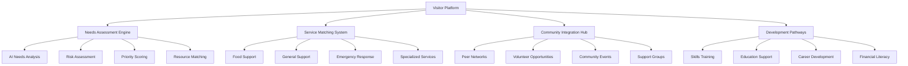
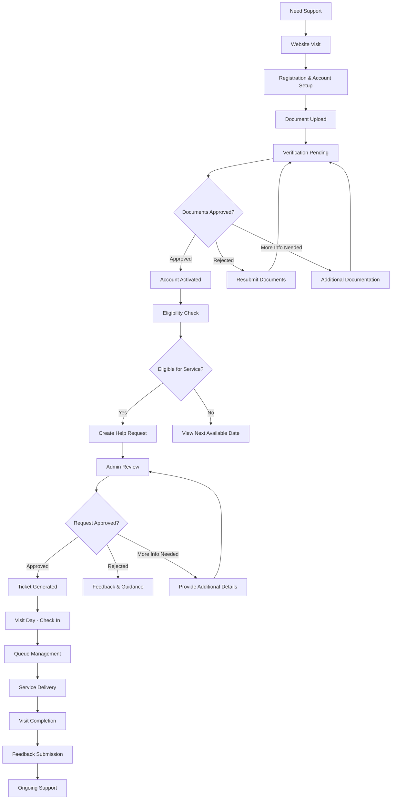

# 🏠 Visitor Workflow and User Journey Guide
## Lewisham Donation Hub - Advanced Visitor Support & Empowerment Platform

---

## 📋 **Table of Contents**
1. [Overview & Support Ecosystem](#overview--support-ecosystem)
2. [Enhanced Visitor Journey Map](#enhanced-visitor-journey-map)
3. [Smart Registration & Onboarding](#smart-registration--onboarding)
4. [AI-Enhanced Document Verification](#ai-enhanced-document-verification)
5. [Intelligent Help Request System](#intelligent-help-request-system)
6. [Optimized Visit Day Experience](#optimized-visit-day-experience)
7. [Comprehensive Support & Development](#comprehensive-support--development)
8. [Advanced Profile & Preference Management](#advanced-profile--preference-management)
9. [Community Integration & Opportunities](#community-integration--opportunities)
10. [Technical Requirements & Accessibility](#technical-requirements--accessibility)
11. [Support & Troubleshooting Guide](#support--troubleshooting-guide)

---

## 🎯 **Overview & Support Ecosystem**

The Lewisham Donation Hub visitor system provides an advanced, AI-enhanced digital platform for community members to access comprehensive support services through intelligent matching, personalized assistance pathways, and integrated community development opportunities. The platform creates a holistic support ecosystem that addresses immediate needs while fostering long-term empowerment and community integration.

### **Advanced Service Categories & Intelligent Matching**
- **AI-Powered Food Support**: Personalized nutrition matching with dietary preferences and health needs (Tuesday-Thursday, 11:30-14:30)
- **Comprehensive General Support**: Multi-service coordination including advice, signposting, and resource connection (Tuesday-Thursday, 10:30-14:30)
- **Emergency Response System**: 24/7 urgent support with crisis intervention and rapid response protocols (Available daily)
- **Development Support**: Skills training, education assistance, and career development pathways
- **Community Integration**: Social connections, peer support networks, and volunteer opportunities

### **Enhanced Platform Features**
- **Intelligent Help Request System**: AI-powered needs assessment and service matching
- **Predictive Eligibility Engine**: Real-time qualification checking with personalized guidance
- **Smart Document Management**: Automated verification with fraud detection and security
- **Dynamic Queue Optimization**: Real-time wait time prediction and appointment management
- **Comprehensive Progress Tracking**: Holistic journey monitoring with goal setting and achievement
- **Community Integration Hub**: Connections to volunteer opportunities, peer support, and development programs

### **Visitor Support Ecosystem**



### **Visitor Journey Stages & Support Levels**
```
🔴 CRISIS SUPPORT (Emergency Intervention):
- Immediate safety and basic needs assessment
- Emergency resource allocation and crisis intervention
- Rapid response coordination with external services
- Intensive case management and follow-up support

🟠 STABILIZATION SUPPORT (Short-term Assistance):
- Regular service access with needs monitoring
- Basic resource provision and service coordination
- Initial goal setting and pathway planning
- Introduction to community support networks

🟡 DEVELOPMENT SUPPORT (Medium-term Growth):
- Skills development and training opportunities
- Educational support and career pathway guidance
- Enhanced community integration and peer connections
- Goal achievement tracking and milestone recognition

🟢 EMPOWERMENT SUPPORT (Long-term Independence):
- Leadership development and volunteer opportunities
- Mentoring roles and community contribution pathways
- Advanced skills training and specialization
- Transition to community advocate and support roles

🔵 COMMUNITY LEADERSHIP (Graduated Support):
- Peer mentoring and community leadership roles
- Volunteer coordination and training responsibilities
- Community advocacy and policy input opportunities
- Alumni network participation and ongoing connection
```

---

## 🗺️ **Visitor Journey Map**



---

## 📝 **Registration & Account Setup**

### **Step 1: Initial Registration**
**URL**: `https://lewishamhub.org/register`

1. **Account Creation**
   - Visit the registration page
   - Select "Visitor" role from the tab options
   - Complete basic information:
     - First Name & Last Name
     - Email Address
     - Password (minimum 8 characters)
     - Phone Number
     - Address & Postcode
     - City

2. **Visitor-Specific Information**
   - **Household Size**: Number of people in your household
   - **Dietary Requirements**: Allergies, preferences, or special needs
     - Vegetarian, Vegan, Halal, Kosher
     - Gluten-free, Dairy-free
     - Other allergies or medical dietary needs
   - **Accessibility Needs**: Any assistance required
     - Wheelchair access
     - Hearing/visual impairments
     - Language support needs
   - **Emergency Contact**: Trusted contact person details

3. **Account Verification**
   - Email verification link sent automatically
   - Must verify email before proceeding
   - Check spam/junk folder if not received

### **Step 2: Account Activation**
**Initial Account Status**: `Active` but with limited access until document verification

#### **First Login Experience**
- **Welcome dashboard** with setup progress
- **Document upload priority** highlighted
- **Service availability** preview
- **Contact information** for support

#### **Account Limitations (Pre-Verification)**
- ❌ Cannot submit help requests
- ❌ Cannot join service queues
- ✅ Can view service information
- ✅ Can upload verification documents
- ✅ Can check eligibility requirements

---

## 📄 **Document Verification Process**

### **Required Documents**
**URL**: `https://lewishamhub.org/visitor/documents`

#### **Essential Documents (Required)**
1. **Photo ID** (One of the following):
   - UK Passport
   - UK Driving License
   - National Identity Card
   - Birth Certificate with supporting documents

2. **Proof of Address** (One of the following):
   - Recent utility bill (gas, electricity, water) - within 3 months
   - Council tax statement - current year
   - Bank statement - within 3 months
   - Tenancy agreement - current
   - Housing benefit letter - within 6 months

#### **Optional Supporting Documents**
- Benefit award letters (Universal Credit, ESA, PIP, etc.)
- Medical documentation (for accessibility needs)
- Income statements (for priority assessment)

### **Document Upload Process**

#### **Step 1: Document Preparation**
- **File Formats**: PDF, JPG, JPEG, PNG
- **File Size**: Maximum 5MB per document
- **Image Quality**: Clear, readable, all corners visible
- **Lighting**: Well-lit, no shadows or glare

#### **Step 2: Upload Interface**
1. **Select Document Type**
   - Choose from dropdown: "Photo ID" or "Proof of Address"
   - System validates file type and size

2. **File Upload**
   - Drag and drop or browse to select file
   - Preview thumbnail displayed
   - Option to add description/notes

3. **Submission Confirmation**
   - Document uploaded successfully
   - Assigned unique reference number
   - Estimated verification timeline provided

### **Verification Timeline & Process**

#### **Administrative Review (2-3 Business Days)**
1. **Initial Processing** (Same day)
   - Document received confirmation
   - Basic format and quality check
   - Assignment to verification team

2. **Detailed Review** (1-2 days)
   - Document authenticity verification
   - Information cross-checking
   - Quality assessment

3. **Final Decision** (1 day)
   - Approval/rejection determination
   - Visitor notification
   - Account status update

#### **Verification Outcomes**

**✅ Approved Documents**
- **Email notification** with approval confirmation
- **Account status** updated to "Verified"
- **Full service access** granted
- **Help request creation** enabled

**❌ Rejected Documents**
- **Detailed rejection** reason provided
- **Specific requirements** for resubmission
- **Support contact** information
- **Resubmission guidance** included

**⏳ Additional Information Required**
- **Specific requests** outlined
- **Supporting documents** needed
- **Clarification requirements**
- **Timeline for response**

### **Verification Status Tracking**
**URL**: `https://lewishamhub.org/visitor/documents`

#### **Document Status Indicators**
- 🟡 **Pending**: Uploaded, awaiting review
- 🟢 **Approved**: Verified and accepted
- 🔴 **Rejected**: Requires resubmission
- 🔵 **Under Review**: Currently being processed

#### **Progress Dashboard**
- **Overall Progress**: Percentage of required documents verified
- **Next Steps**: Clear guidance on remaining requirements
- **Estimated Timeline**: Expected completion date
- **Contact Options**: Help and support links

---

## 🆘 **Help Request Submission**

### **Eligibility Checking System**
**URL**: `https://lewishamhub.org/visitor/eligibility`

#### **Automatic Eligibility Assessment**
**Prerequisites**:
- ✅ Account verified (documents approved)
- ✅ Account status: Active
- ✅ Waiting period compliance

#### **Service-Specific Rules**

**Food Support Eligibility**:
- **Frequency Limit**: Maximum 1 visit per week
- **Waiting Period**: 7 days from last food visit
- **Available Days**: Tuesday, Wednesday, Thursday
- **Time Slots**: 11:30 AM - 2:30 PM

**General Support Eligibility**:
- **Frequency Limit**: 1 visit per month for regular support
- **Waiting Period**: 30 days from last general visit
- **Available Days**: Tuesday, Wednesday, Thursday
- **Time Slots**: 10:30 AM - 2:30 PM
- **First-Time Visitors**: No waiting period

**Emergency Support Eligibility**:
- **Availability**: Available daily with urgent processing
- **Assessment**: Individual case-by-case review
- **Response Time**: Within 4 hours
- **Priority**: Fast-track processing

### **Help Request Creation Process**
**URL**: `https://lewishamhub.org/visitor/help-request/new`

#### **Step 1: Eligibility Verification**
- **Automatic Check**: System verifies current eligibility
- **Status Display**: Clear indication of service availability
- **Next Available**: If not eligible, shows next available date
- **Category Selection**: Based on eligibility results

#### **Step 2: Service Category Selection**
1. **Food Support**
   - Fresh produce and groceries
   - Dietary requirements consideration
   - Household size allocation

2. **General Support**
   - Advice and guidance
   - Signposting to other services
   - Emergency assistance coordination

3. **Emergency Support**
   - Urgent help required
   - Fast-track processing
   - Priority queue placement

#### **Step 3: Visit Scheduling**
1. **Date Selection**
   - **Available Days**: System shows available dates
   - **Capacity Checking**: Real-time slot availability
   - **Calendar Interface**: Interactive date picker

2. **Time Slot Selection**
   - **Morning Slots**: 10:30 AM - 12:30 PM
   - **Afternoon Slots**: 12:30 PM - 2:30 PM
   - **Estimated Duration**: 30-45 minutes per visitor

#### **Step 4: Request Details**
1. **Specific Needs**
   - **Details Box**: Describe your situation and needs
   - **Household Information**: Confirm household size
   - **Special Requirements**: Accessibility needs, language support

2. **Contact Preferences**
   - **Email Notifications**: Request updates and confirmations
   - **SMS Alerts**: For urgent updates
   - **Call Preferences**: Preferred contact times

#### **Step 5: Submission & Confirmation**
1. **Review Information**
   - **Summary Display**: All request details
   - **Edit Options**: Modify before submission
   - **Terms Acceptance**: Service terms and conditions

2. **Request Submission**
   - **Reference Number**: Unique identifier generated
   - **Confirmation Email**: Sent immediately
   - **Next Steps**: Clear guidance provided

### **Request Status Tracking**
**URL**: `https://lewishamhub.org/visitor/help-requests`

#### **Status Indicators**
- 🟡 **Pending**: Submitted, awaiting admin review
- 🔵 **Under Review**: Being processed by admin team
- 🟢 **Approved**: Approved, ticket generation in progress
- 🎫 **Ticket Issued**: Ready for visit day
- 🔴 **Rejected**: Not approved, reason provided
- ✅ **Completed**: Visit completed successfully
- ❌ **Cancelled**: Cancelled by visitor or admin

#### **Real-Time Updates**
- **Email Notifications**: Status change alerts
- **Dashboard Updates**: Live status display
- **SMS Alerts**: For urgent updates
- **Timeline View**: Request processing history

---

## 📅 **Visit Day Experience**

### **Pre-Visit Preparation**

#### **Ticket Information**
**URL**: `https://lewishamhub.org/visitor/ticket`
- **Ticket Number**: Unique identifier for your visit
- **QR Code**: For quick check-in process
- **Visit Details**: Date, time, service category
- **Instructions**: What to bring and expect

#### **What to Bring**
- **Ticket Number**: Digital or printed copy
- **Photo ID**: For identity verification
- **Proof of Address**: Recent document
- **Shopping Bags**: For food support visits
- **Mobile Phone**: For queue status updates

### **Arrival & Check-In Process**

#### **Check-In Methods**
**Location**: Main reception desk

1. **QR Code Scanning**
   - **Mobile Display**: Show QR code on phone
   - **Printed Code**: Present printed ticket
   - **Staff Assistance**: Help available for scanning

2. **Manual Check-In**
   - **Ticket Number**: Provide to staff member
   - **Identity Verification**: Photo ID check
   - **Details Confirmation**: Contact information update

#### **Check-In Outcome**
- **Queue Position**: Current position number
- **Estimated Wait**: Approximate waiting time
- **Queue Card**: Physical reference card
- **Instructions**: Where to wait and what to expect

### **Queue Management System**

#### **Digital Queue Status**
**URL**: `https://lewishamhub.org/visitor/queue`

**Real-Time Information**:
- **Current Position**: Your place in queue
- **People Ahead**: Number waiting before you
- **Average Wait Time**: Current estimated wait
- **Service Rate**: How quickly queue is moving

**Notification Options**:
- **SMS Updates**: Position updates to your phone
- **Email Alerts**: Queue status changes
- **Push Notifications**: If using mobile app
- **Audio Announcements**: In-building announcements

#### **Queue Categories**
1. **Priority Queue**: Emergency cases, accessibility needs
2. **Standard Queue**: Regular visitors by arrival time
3. **Family Queue**: Households with children under 5
4. **Appointment Queue**: Pre-scheduled specific times

#### **While Waiting**
- **Comfortable Seating**: Designated waiting areas
- **Information Displays**: Service information, community resources
- **Children's Area**: Safe space for families
- **Refreshments**: Water and basic refreshments available
- **WiFi Access**: Free internet access
- **Community Board**: Local services and opportunities

### **Service Delivery**

#### **Being Called for Service**
1. **Notification Methods**
   - **Name Called**: Staff announcement
   - **Number Display**: Digital board updates
   - **Mobile Alert**: SMS notification
   - **Personal Approach**: Staff member finds you

2. **Service Desk Assignment**
   - **Desk Number**: Directed to specific station
   - **Staff Introduction**: Meet your service coordinator
   - **Service Overview**: Explanation of process

#### **Service Process**
1. **Needs Assessment** (5-10 minutes)
   - **Situation Review**: Discuss current needs
   - **Household Size**: Confirm people being served
   - **Dietary Requirements**: Special needs consideration
   - **Additional Support**: Other services needed

2. **Service Allocation** (15-20 minutes)
   - **Food Selection**: Choose from available items
   - **Quantity Guidelines**: Appropriate amounts for household
   - **Quality Check**: Fresh and appropriate items
   - **Packing Assistance**: Help with bags and transport

3. **Additional Support** (5-10 minutes)
   - **Information Sharing**: Relevant services and resources
   - **Future Planning**: Next visit guidance
   - **Emergency Support**: If immediate help needed
   - **Contact Details**: Updated information collection

### **Visit Completion**

#### **Check-Out Process**
1. **Service Confirmation**
   - **Items Received**: Record of support provided
   - **Next Visit Eligibility**: When you can return
   - **Additional Referrals**: Other services recommended

2. **Feedback Opportunity**
   - **Service Rating**: Quick feedback form
   - **Comments**: Optional detailed feedback
   - **Suggestions**: Improvements or additional needs
   - **Contact Permissions**: Future follow-up consent

#### **Post-Visit Information**
- **Visit Summary**: Email confirmation with details
- **Next Steps**: Guidance for ongoing support
- **Resources**: Links to additional help
- **Emergency Contacts**: 24/7 support information

---

## 🔄 **Ongoing Support & Services**

### **Regular Service Access**

#### **Recurring Help Requests**
- **Eligibility Monitoring**: Automatic system checks
- **Easy Resubmission**: Simplified repeat requests
- **Pattern Recognition**: System learns your preferences
- **Proactive Outreach**: Support team follow-up

#### **Service Categories Management**
1. **Food Support**
   - **Weekly Planning**: Plan visits in advance
   - **Dietary Tracking**: System remembers preferences
   - **Seasonal Variations**: Special holiday provisions
   - **Community Events**: Special distribution days

2. **General Support**
   - **Ongoing Casework**: Continued support coordination
   - **Progress Tracking**: Goal achievement monitoring
   - **Service Connections**: Links to external support
   - **Regular Check-ins**: Scheduled support calls

### **Emergency Support Access**

#### **Crisis Intervention**
**Available 24/7**: `020-XXXX-XXXX` (Emergency Hotline)

1. **Immediate Assessment**
   - **Urgency Evaluation**: Risk and need assessment
   - **Resource Allocation**: Available support options
   - **Response Timeline**: When help will arrive
   - **Contact Plan**: How you'll be reached

2. **Emergency Services**
   - **Food Parcels**: Same-day delivery available
   - **Emergency Cash**: Vouchers for essential needs
   - **Accommodation**: Temporary housing assistance
   - **Immediate Support**: Crisis intervention services

### **Additional Services & Resources**

#### **Health & Wellbeing**
- **Mental Health Support**: Counseling referrals
- **Health Checks**: Basic health monitoring
- **Medication Support**: Prescription assistance
- **Wellness Programs**: Community health initiatives

#### **Education & Skills**
- **Digital Literacy**: Computer and internet training
- **Language Support**: English classes and translation
- **Job Seeking**: Employment preparation assistance
- **Financial Education**: Budgeting and debt advice

#### **Community Connections**
- **Social Groups**: Community activities and events
- **Volunteer Opportunities**: Give back to the community
- **Peer Support**: Connect with others in similar situations
- **Local Resources**: Community services and support

---

## 👤 **Profile & Settings Management**

### **Personal Profile Management**
**URL**: `https://lewishamhub.org/visitor/profile`

#### **Basic Information Updates**
- **Contact Details**: Phone, email, address changes
- **Emergency Contact**: Update trusted contact person
- **Household Changes**: Size and composition updates
- **Accessibility Needs**: New or changed requirements

#### **Service Preferences**
- **Dietary Requirements**: Update food allergies and preferences
- **Communication Preferences**: Email, SMS, call preferences
- **Language Support**: Translation service needs
- **Visit Scheduling**: Preferred days and times

### **Document Management**
**URL**: `https://lewishamhub.org/visitor/documents`

#### **Document Updates**
- **Expired Documents**: Upload renewed documents
- **Address Changes**: New proof of address
- **Additional Documents**: Supporting documentation
- **Document History**: Track all submissions

#### **Verification Status**
- **Current Status**: Real-time verification state
- **Expiry Warnings**: Documents needing renewal
- **Update Notifications**: Requirements for resubmission
- **Support Contacts**: Help with document issues

### **Privacy & Security Settings**
**URL**: `https://lewishamhub.org/visitor/profile/settings`

#### **Account Security**
- **Password Management**: Change login password
- **Email Verification**: Update verified email address
- **Login History**: Review account access
- **Two-Factor Authentication**: Enhanced security option

#### **Privacy Controls**
- **Data Sharing**: Control information sharing permissions
- **Communication Consent**: Marketing and survey preferences
- **Feedback Sharing**: Allow feedback to be used anonymously
- **Research Participation**: Community research consent

### **Notification Preferences**
**URL**: `https://lewishamhub.org/visitor/notifications`

#### **Communication Channels**
- **Email Notifications**: Service updates, appointments
- **SMS Alerts**: Urgent updates and reminders
- **Push Notifications**: Mobile app notifications
- **Postal Mail**: Traditional mail preferences

#### **Notification Types**
- **Service Updates**: Appointment confirmations, changes
- **Eligibility Alerts**: When you can request support again
- **Emergency Notices**: Urgent service announcements
- **Community News**: Local resources and opportunities

---

## 📊 **Visit History & Feedback**

### **Visit History Tracking**
**URL**: `https://lewishamhub.org/visitor/visits`

#### **Complete Visit Record**
- **Visit Dates**: Full chronological history
- **Service Types**: Food, general, emergency support
- **Support Received**: Details of help provided
- **Service Quality**: Ratings and feedback given

#### **Analytics & Insights**
- **Support Received**: Total value of assistance
- **Visit Frequency**: Pattern analysis and trends
- **Service Impact**: Progress tracking over time
- **Goal Achievement**: Personal development milestones

### **Feedback System**
**URL**: `https://lewishamhub.org/visitor/feedback`

#### **Visit Feedback**
1. **Service Quality Rating** (1-5 stars)
   - Staff helpfulness and professionalism
   - Wait times and efficiency
   - Quality of support provided
   - Overall visit experience

2. **Detailed Comments**
   - What worked well
   - Areas for improvement
   - Specific staff recognition
   - Additional needs or suggestions

3. **Anonymous Options**
   - Submit feedback without identification
   - Sensitive issue reporting
   - Complaints and concerns
   - Suggestions for service improvement

#### **Feedback Follow-Up**
- **Admin Response**: Staff replies to feedback
- **Action Taken**: Changes made based on suggestions
- **Progress Updates**: Service improvements implemented
- **Thank You**: Recognition of feedback contribution

---

## 💻 **Technical Requirements**

### **Device Compatibility**
- **Desktop/Laptop**: Windows 10+, macOS 10.14+, Linux (Ubuntu 18.04+)
- **Mobile Devices**: iOS 12+, Android 8.0+
- **Tablets**: iPad (iOS 12+), Android tablets (8.0+)

### **Browser Requirements**
- **Recommended**: Chrome 90+, Firefox 88+, Safari 14+, Edge 90+
- **JavaScript**: Must be enabled for full functionality
- **Cookies**: Required for login and preferences
- **Local Storage**: Used for offline capability

### **Internet Connection**
- **Minimum**: 1 Mbps for basic functionality
- **Recommended**: 5 Mbps for optimal experience
- **Mobile Data**: Works on 3G/4G/5G networks
- **Offline Mode**: Basic functionality available offline

### **Accessibility Features**
- **Screen Reader**: NVDA, JAWS, VoiceOver compatible
- **Keyboard Navigation**: Full keyboard accessibility
- **High Contrast**: Vision-friendly color schemes
- **Text Scaling**: Adjustable text size (up to 200%)
- **Voice Control**: Voice recognition support

### **Security & Privacy**
- **Data Encryption**: All data transmitted securely (HTTPS)
- **Privacy Compliance**: GDPR and UK data protection compliant
- **Secure Storage**: Personal information protected
- **Regular Backups**: Data safety and recovery

---

## 🔧 **Troubleshooting Guide**

### **Common Login Issues**

**Problem**: Cannot log in with credentials
**Solutions**:
1. **Verify Email**: Ensure email address is correct
2. **Check Password**: Try typing password manually
3. **Password Reset**: Use "Forgot Password" link
4. **Browser Issues**: Clear cache and cookies
5. **Account Status**: Verify account is activated

**Problem**: Email verification not received
**Solutions**:
1. **Check Spam**: Look in junk/spam folders
2. **Wait Time**: Allow 15-20 minutes for delivery
3. **Resend Verification**: Request new verification email
4. **Email Provider**: Some providers block emails
5. **Contact Support**: Get direct assistance

### **Help Request Issues**

**Problem**: Cannot submit help request
**Solutions**:
1. **Eligibility Check**: Verify you meet requirements
2. **Document Status**: Ensure documents are approved
3. **Waiting Period**: Check if waiting period has passed
4. **Account Status**: Confirm account is active
5. **Browser Refresh**: Try refreshing the page

**Problem**: "Not eligible" error message
**Solutions**:
1. **Review Requirements**: Check eligibility criteria
2. **Document Verification**: Ensure all documents approved
3. **Waiting Period**: Check next available date
4. **Contact Support**: Get personal eligibility review
5. **Alternative Services**: Explore other support options

### **Document Upload Issues**

**Problem**: Document upload fails
**Solutions**:
1. **File Size**: Ensure file is under 5MB
2. **File Format**: Use PDF, JPG, JPEG, or PNG
3. **Internet Connection**: Check connection stability
4. **Browser Settings**: Enable file uploads
5. **Try Different Device**: Use computer instead of phone

**Problem**: Document rejected
**Solutions**:
1. **Review Feedback**: Read specific rejection reasons
2. **Improve Quality**: Ensure document is clear and readable
3. **Correct Document**: Verify you uploaded the right type
4. **Recent Date**: Check document is within required timeframe
5. **Contact Support**: Get specific guidance

### **Visit Day Issues**

**Problem**: Cannot find check-in location
**Solutions**:
1. **Arrive Early**: Allow extra time for first visit
2. **Ask for Directions**: Staff available to help
3. **Check Instructions**: Review ticket instructions
4. **Call Ahead**: Contact center for guidance
5. **Alternative Entrance**: Ask about accessibility options

**Problem**: QR code not scanning
**Solutions**:
1. **Screen Brightness**: Increase phone screen brightness
2. **Clean Screen**: Wipe phone screen clean
3. **Hold Steady**: Keep phone steady while scanning
4. **Manual Entry**: Provide ticket number instead
5. **Staff Help**: Ask volunteer for scanning assistance

### **Technical Support Issues**

**Problem**: Page loading slowly or not at all
**Solutions**:
1. **Internet Speed**: Test your connection speed
2. **Browser Cache**: Clear browser data and refresh
3. **Different Browser**: Try Chrome, Firefox, or Safari
4. **Device Restart**: Restart your phone or computer
5. **Contact IT Support**: Report persistent issues

**Problem**: Mobile app not working properly
**Solutions**:
1. **App Update**: Check for latest app version
2. **Device Storage**: Free up space on your device
3. **Network Connection**: Switch between WiFi and mobile data
4. **App Restart**: Close and reopen the app
5. **Alternative Access**: Use web browser version

### **Emergency Contacts**
- **General Support**: support@lewishamhub.org
- **Visitor Services**: visitors@lewishamhub.org
- **Emergency Hotline**: 020-XXXX-XXXX (24/7)
- **Technical Help**: tech@lewishamhub.org
- **Document Support**: docs@lewishamhub.org

---

## 📱 **Mobile Visitor Experience**

### **Mobile-Optimized Features**
- **Responsive Design**: Adapts to all screen sizes
- **Touch Interface**: Finger-friendly buttons and forms
- **Quick Actions**: One-tap access to common tasks
- **Offline Access**: View tickets and basic info without internet

### **Mobile-Specific Workflows**
1. **Quick Eligibility Check**: Instant status from phone
2. **Mobile Document Upload**: Take photos and upload immediately
3. **QR Code Generation**: Display ticket QR code on phone
4. **GPS Integration**: Directions to service location
5. **Push Notifications**: Real-time queue and appointment updates

### **Mobile App Features** (Progressive Web App)
- **Install on Home Screen**: Works like native app
- **Background Notifications**: Updates even when not using
- **Offline Functionality**: Access key features without internet
- **Camera Integration**: Easy document photography
- **Location Services**: Find nearest services

---

## 🎯 **Success Metrics & KPIs**

### **Visitor Experience Metrics**
- **Registration Completion Rate**: 90%+
- **Document Approval Rate**: 85%+
- **Help Request Approval Rate**: 80%+
- **Visit Completion Rate**: 95%+
- **User Satisfaction**: 4.5/5 stars

### **Service Efficiency**
- **Help Request Processing**: <24 hours (4 hours for emergency)
- **Document Verification**: <72 hours
- **Queue Wait Time**: <30 minutes average
- **System Uptime**: 99.5%+
- **Mobile Responsiveness**: <3 seconds load time

### **Community Impact**
- **Regular Visitors Supported**: 500+ monthly
- **Emergency Support Response**: <4 hours
- **Service Utilization Rate**: 85%+ capacity
- **Community Satisfaction**: 4.6/5 rating
- **Return Visitor Rate**: 70%+ (indicating effective support)

---

## 🚀 **Future Enhancements**

### **Planned Features**
- **Native Mobile App**: iOS and Android applications
- **AI-Powered Support**: Chatbot assistance and smart recommendations
- **Video Consultations**: Remote support options
- **Multi-Language Support**: Full translation for key languages
- **Advanced Analytics**: Personal support journey tracking
- **Integration Platform**: Connect with external support services

### **Service Expansions**
- **Home Delivery**: For mobility-impaired visitors
- **Virtual Queuing**: Skip physical waiting with digital queue
- **Appointment Booking**: Pre-scheduled visit slots
- **Peer Support Network**: Connect visitors with similar experiences
- **Skills Development**: Online training and education programs

### **Continuous Improvement**
- **User Feedback Integration**: Regular surveys and feedback analysis
- **Accessibility Enhancements**: Ongoing accessibility improvements
- **Performance Optimization**: Speed and reliability improvements
- **Security Updates**: Enhanced privacy and data protection
- **Mobile Experience**: Touch interface and gesture improvements

---

## 📞 **Contact & Support**

### **Getting Help**
- **Live Chat**: Available during service hours (Tue-Thu, 10 AM-3 PM)
- **Email Support**: visitors@lewishamhub.org
- **Phone Support**: 020-XXXX-XXXX (Mon-Fri 9 AM-5 PM)
- **Emergency Line**: 020-XXXX-XXXX (24/7 crisis support)
- **In-Person Help**: Available during visit days

### **Specialized Support**
- **Document Help**: docs@lewishamhub.org
- **Technical Issues**: tech@lewishamhub.org
- **Accessibility Support**: access@lewishamhub.org
- **Language Support**: Available in Arabic, Bengali, Polish, Spanish
- **Benefits Advice**: External partners for benefits guidance

### **Community Resources**
- **Citizens Advice**: Free advice on benefits, housing, debt
- **Lewisham Council**: Local authority support services
- **NHS Services**: Health and mental health support
- **Job Centre Plus**: Employment and training opportunities
- **Legal Aid**: Free legal advice and representation

### **Feedback & Suggestions**
- **Service Feedback**: feedback@lewishamhub.org
- **Website Issues**: Report bugs and technical problems
- **General Suggestions**: ideas@lewishamhub.org
- **Compliments & Recognition**: recognition@lewishamhub.org
- **Anonymous Feedback**: Available through feedback forms

---

## 📍 **Location & Opening Hours**

### **Main Service Location**
**Lewisham Donation Hub**
123 High Street
Lewisham, London SE13 6XX

### **Service Hours**
- **Tuesday**: 10:30 AM - 2:30 PM
- **Wednesday**: 10:30 AM - 2:30 PM
- **Thursday**: 10:30 AM - 2:30 PM
- **Emergency Support**: 24/7 (by phone)
- **Office Hours**: Mon-Fri 9:00 AM - 5:00 PM

### **Transportation**
- **Bus Routes**: 47, 54, 75, 202, 208
- **Train Stations**: Lewisham Station (5-minute walk)
- **Parking**: Limited street parking, disabled spaces available
- **Accessibility**: Wheelchair accessible entrance and facilities

---

**Last Updated**: June 2025
**Version**: 1.0
**Next Review**: September 2025

---

*This document is part of the Lewisham Donation Hub visitor onboarding package. For the most current information, always refer to the live system at https://lewishamhub.org*
