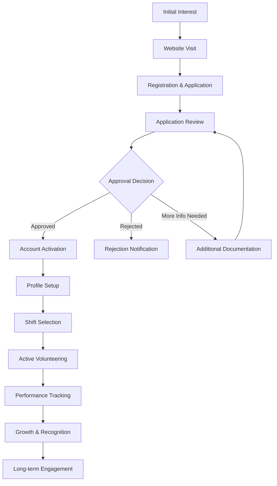

# 🤝 Volunteer Workflow and User Journey Guide
## Lewisham Charity - Advanced Volunteer Engagement & Development Platform

---

## 📋 **Table of Contents**
1. [Overview & Volunteer Ecosystem](#overview--volunteer-ecosystem)
2. [Enhanced Volunteer Journey Map](#enhanced-volunteer-journey-map)
3. [Smart Registration & Skills Assessment](#smart-registration--skills-assessment)
4. [AI-Powered Approval & Matching](#ai-powered-approval--matching)
5. [Advanced Daily Operations & Impact](#advanced-daily-operations--impact)
6. [Intelligent Shift Management & Optimization](#intelligent-shift-management--optimization)
7. [Performance Analytics & Career Development](#performance-analytics--career-development)
8. [Community Leadership & Mentoring](#community-leadership--mentoring)
9. [Advanced Support & Communication Hub](#advanced-support--communication-hub)
10. [Technical Requirements & Mobile Experience](#technical-requirements--mobile-experience)
11. [Optimization & Troubleshooting Guide](#optimization--troubleshooting-guide)

---

## 🎯 **Overview**

The Lewisham Charity volunteer system provides a comprehensive digital platform for community volunteers to contribute to local support services. Volunteers can apply, manage shifts, track performance, assist visitors, and grow their community impact through an integrated web-based dashboard.

### **Volunteer Roles & Capabilities**

Our volunteer system includes a comprehensive role hierarchy with specific capabilities and permissions for each level:

#### **🟢 General Volunteers** *(Entry Level)*
- **Primary Activities**: Food distribution, visitor assistance, basic administrative support
- **Dashboard Features**: 
  - Personal shift scheduling and history
  - Basic performance metrics and achievements
  - Community interaction features
  - Standard training modules
- **System Access**: 
  - View own shifts and availability
  - Sign up for available shifts
  - Access general training materials
  - Participate in community forums

#### **🟡 Specialized Volunteers** *(Intermediate Level)*
- **Advanced Capabilities**: 
  - **Specialization Areas**: Translation services, IT support, counseling, childcare, emergency response
  - **Enhanced Training**: Access to specialized skill development modules
  - **Mentor Assignments**: May be assigned mentors for skill development
- **Dashboard Features**:
  - Role badge showing specialization areas
  - Advanced performance analytics
  - Specialized shift recommendations
  - Access to role-specific training materials
- **System Access**:
  - Priority access to specialized shifts
  - Enhanced reporting capabilities
  - Skill-based task assignments

#### **🔴 Lead Volunteers** *(Advanced Level)*
- **Leadership Responsibilities**:
  - **Team Management**: Supervise and coordinate volunteer teams
  - **Training Authority**: Authorized to train and mentor other volunteers
  - **Shift Management**: Can create, modify, and manage volunteer shifts
  - **Emergency Response**: Certified for emergency volunteer coordination
- **Dashboard Features**:
  - Crown badge indicating leadership status
  - Team management dashboard with member overview
  - Advanced analytics and reporting tools
  - Emergency response notification system
- **System Access**:
  - Full team member management
  - Shift creation and modification permissions
  - Advanced reporting and analytics
  - Emergency alert system access
  - Mentor assignment capabilities

#### **Role Progression & Recognition**
- **Automatic Progression**: Based on hours, performance, and skill development
- **Manual Promotion**: Through supervisor recommendation and assessment
- **Role Badges**: Prominently displayed in dashboard and profile
- **Capability Indicators**: Visual badges for training, shift management, and emergency response
- **Team Information**: Lead volunteers see their team member count and management tools

---

## 🗺️ **Volunteer Journey Map**

---

## 📝 **Registration & Application Process**

### **Step 1: Initial Registration**
**URL**: `https://lewishamCharity.org/register`

1. **Account Creation**
   - Visit the registration page
   - Select "Volunteer" role from the tab options
   - Complete basic information:
     - First Name & Last Name
     - Email Address
     - Password (minimum 8 characters)
     - Phone Number
     - Address & Postcode
     - City

2. **Volunteer-Specific Information**
   - **Skills**: Select from predefined options or add custom skills
     - Driving, Administration, Counselling
     - Food handling, Customer service
     - IT support, Translation services
   - **Experience**: Describe relevant volunteer or work experience
   - **Availability**: When you're available to volunteer
     - Weekdays, Weekends, Evenings
     - Holiday periods, Emergency coverage

3. **Account Verification**
   - Email verification link sent automatically
   - Must verify email before proceeding
   - Check spam/junk folder if not received

### **Step 2: Detailed Application**
**URL**: `https://lewishamCharity.org/volunteer/apply`

#### **Personal Information (Step 1/5)**
- Full contact details
- Date of birth
- Complete address
- Emergency contact information

#### **Availability & Skills (Step 2/5)**
- Detailed availability schedule:
  - Morning shifts (6 AM - 12 PM)
  - Afternoon shifts (12 PM - 6 PM)
  - Evening shifts (6 PM - 10 PM)
  - Weekend availability
  - Holiday coverage
- Skill selection from comprehensive list:
  - Food distribution & kitchen assistance
  - Administrative support & data entry
  - Visitor reception & customer service
  - Transportation & delivery services
  - Event support & organization
  - Fundraising & community outreach
  - IT & digital support
  - Counseling & emotional support
  - Childcare support
  - Translation services

#### **Experience & Motivation (Step 3/5)**
- Previous volunteer experience
- Relevant work experience
- Motivation for volunteering
- Personal goals and expectations

#### **References (Step 4/5)**
- Two character references required
- Reference contact information
- Relationship to applicant

#### **Agreements & Consent (Step 5/5)**
- Background check consent
- Data protection agreement
- Terms and conditions acceptance
- Code of conduct acknowledgment

### **Application Submission**
- Comprehensive review before submission
- Application status: "Pending Review"
- Automated confirmation email sent
- Reference contact notifications sent

---

## ✅ **Approval & Onboarding**

### **Application Review Process**
1. **Initial Review** (1-3 business days)
   - Application completeness check
   - Basic eligibility verification
   - Reference contact initiation

2. **Background Check** (3-7 business days)
   - DBS check (if required)
   - Reference verification
   - Identity confirmation

3. **Interview Process** (Optional)
   - Phone or video interview
   - Skills assessment
   - Role matching discussion

### **Approval Outcomes**

#### **✅ Approved Applications**
- **Welcome email** with login credentials
- **Account activation** with volunteer dashboard access
- **Role Assignment**: Automatic assignment as General Volunteer with progression path
- **Onboarding checklist** provided with role-specific training requirements
- **Initial shift recommendations** based on skills and role level

#### **❌ Rejected Applications**
- **Rejection notification** with reason
- **Appeal process** information
- **Reapplication guidance** (if applicable)

#### **⏳ Pending More Information**
- **Specific requirements** outlined
- **Document upload** instructions
- **Timeline for completion**

### **Account Activation Process**
1. **Login Credentials**
   - Email: [Your registration email]
   - Temporary password: Provided in welcome email
   - **Must change password** on first login

2. **Profile Completion**
   - Update personal information
   - Set availability preferences
   - Upload profile photo (optional)
   - Complete safety training modules

3. **Dashboard Orientation**
   - Interactive tour of volunteer features
   - **Role-specific feature explanation**
   - Key navigation explanation
   - Quick start guide tailored to volunteer level

---

## 💼 **Daily Volunteer Operations**

### **Volunteer Dashboard Overview**
**URL**: `https://lewishamCharity.org/volunteer`

#### **Enhanced Main Dashboard Features** ✨
- **Modern Gradient Design**: Beautiful blue-to-purple gradient backgrounds with smooth animations
- **Role Information Display**
  - **Role Badge**: Prominently shows current volunteer level (General/Specialized/Lead) with enhanced visual design
  - **Capability Indicators**: Visual badges for special permissions:
    - 🎓 **Trainer Badge**: Can train other volunteers
    - 📅 **Shift Manager Badge**: Can manage volunteer shifts  
    - 🛡️ **Emergency Response Badge**: Certified for emergency situations
  - **Specialization Tags**: Shows areas of expertise for specialized volunteers
  - **Team Information**: Lead volunteers see team member count and management access

- **Enhanced Statistics Cards** 📊
  - **Color-Coded Design**: Each stat has its own color theme and gradient
  - **Upcoming Shifts**: Blue theme with CalendarDays icon
  - **Hours This Month**: Green theme with Timer icon  
  - **Total Hours**: Purple theme with Award icon
  - **People Helped**: Orange theme with Heart icon
  - **Real-time Updates**: Stats refresh automatically after shift activities

- **Interactive Elements** ⚡
  - **Framer Motion Animations**: Smooth page transitions and staggered loading effects
  - **Hover Effects**: Cards lift and change appearance on interaction
  - **Enhanced CTAs**: Beautiful gradient buttons with smooth color transitions
  - **Touch-Friendly Design**: Optimized for mobile and tablet interactions

- **Improved Navigation** 🔀
  - **Icon-Enhanced Tabs**: Each section has relevant icons for better UX
  - **Smart Tab Design**: Rounded corners with active state highlighting
  - **Responsive Layout**: Adapts perfectly to all screen sizes
  - **Breadcrumb Navigation**: Easy to track current location

- **Role-Specific Quick Actions**
  - **All Volunteers**: Schedule management, shift browsing, training hub, performance metrics
  - **Specialized Volunteers**: Advanced training modules, specialized shift access
  - **Lead Volunteers**: Team management dashboard, training coordinator access, emergency response center

- **Next Shift Information** 📅
  - **Enhanced Display**: Improved card design with better typography
  - **Countdown Timer**: Real-time countdown to next shift
  - **Contact Information**: Direct access to coordinator details
  - **Special Instructions**: Highlighted important notes
  - **Quick Actions**: Easy cancellation and modification options

- **Activity Feed** 📈
  - **Real-time Updates**: Live feed of volunteer activities
  - **Achievement Notifications**: Instant recognition for milestones
  - **Community Highlights**: Showcasing volunteer impact stories
  - **System Announcements**: Important updates and news

- **Role Capabilities Panel** 🎯
  - **Training Authorization**: Shows if volunteer can train others
  - **Shift Management**: Displays shift management permissions
  - **Emergency Response**: Shows emergency response certification status
  - **Team Leadership**: For lead volunteers, shows team member count and management link
  - **Mentor Information**: Displays assigned mentor details if applicable

### **Core Volunteer Activities**

#### **1. Visitor Assistance**
**URL**: `https://lewishamCharity.org/volunteer/check-in`

**Check-in Process:**
1. **Visitor Search**
   - Search by name, ticket number, or email
   - Verify visitor identity
   - Check eligibility status

2. **Service Assignment**
   - Determine visitor needs
   - Assign to appropriate queue
   - Provide estimated wait time

3. **Documentation**
   - Record visit details
   - Note special requirements
   - Update visitor status

#### **2. Queue Management**
**URL**: `https://lewishamCharity.org/volunteer/queue`

**Queue Operations:**
- **Monitor queue status**
  - Real-time visitor count
  - Average wait times
  - Service desk availability

- **Call next visitor**
  - Notify visitors when ready
  - Manage priority cases
  - Handle no-shows

- **Assist with special needs**
  - Wheelchair accessibility
  - Language barriers
  - Emergency situations

#### **3. Administrative Support**
- **Data entry and filing**
- **Phone support and enquiries**
- **Document verification**
- **Inventory management**

---

## 📅 **Enhanced Shift Management System**

### **Modern Shift Management Interface** ✨
**URL**: `https://lewishamCharity.org/volunteer/shifts`

#### **Enhanced Visual Design Features**
- **Beautiful Gradient Backgrounds**: Sophisticated slate-to-blue gradients with dark mode support
- **Impact Hub Branding**: Prominent "Volunteer Impact Hub" header with sparkle icon
- **Animated Interactions**: Framer Motion animations for smooth user experience
- **Color-Coded Statistics**: Each metric has its own visual theme and icon
- **Modern Card Design**: Enhanced shadows, hover effects, and rounded corners

#### **Interactive Statistics Dashboard** 📊
- **Upcoming Shifts**: Blue gradient card with CalendarDays icon
- **Hours This Month**: Green gradient card with Timer icon
- **Total Hours**: Purple gradient card with Award icon
- **People Helped**: Orange gradient card with Heart icon
- **Real-time Updates**: All stats refresh automatically after activities
- **Visual Feedback**: Smooth animations and color transitions

#### **Enhanced Tab Navigation** 🔀
- **Icon-Enhanced Tabs**: Overview (Target), My Shifts (Calendar), Opportunities (Zap)
- **Modern Tab Design**: Rounded corners with blue active states
- **Responsive Layout**: Adapts to all screen sizes perfectly
- **Smooth Transitions**: Animated tab switching with visual feedback

### **Finding Available Shifts**
**URL**: `https://lewishamCharity.org/volunteer/shifts/available`

#### **Enhanced Search & Filter System**
- **Smart Filtering Options**
  - Date range selection with calendar picker
  - Time preferences with visual time slots
  - Location filtering with map integration
  - Role type filtering based on volunteer level
  - Skill requirements matching
  - Priority level indicators

#### **Modern Shift Display Cards** 🎨
- **Visual Priority Indicators**: Color-coded badges for urgency levels
- **Enhanced Information Layout**:
  - **Card Headers**: Title and priority with improved typography
  - **Detailed Descriptions**: Better text formatting and readability
  - **Icon-Enhanced Details**: Calendar, Clock, and MapPin icons with colors
  - **Action Buttons**: Gradient buttons with hover effects
  - **Group Interaction**: Cards lift on hover with smooth transitions

#### **Improved Application Process** ⚡
1. **Enhanced Selection Interface**: Modern card-based shift browsing
2. **Quick Preview**: Hover effects show additional details
3. **Streamlined Application**: Single-click application with confirmation
4. **Instant Feedback**: Real-time status updates and notifications
5. **Mobile Optimization**: Touch-friendly design for all devices

### **My Shifts Management** 📋
**URL**: `https://lewishamCharity.org/volunteer/shifts/my-shifts`

#### **Enhanced Shift Categories**
- **Upcoming Shifts**: Modern blue-themed cards with countdown timers
- **Active Shifts**: Real-time status with live updates
- **Completed Shifts**: Historical view with performance feedback
- **All Shifts**: Comprehensive view with advanced filtering

#### **Improved Shift Cards Design** 🎯
- **Status Indicators**: Color-coded badges for shift status
- **Enhanced Details**: Better typography and information hierarchy
- **Action Buttons**: Consistent styling with gradient effects
- **Responsive Grid**: Adaptive layout for all screen sizes
- **Interactive Elements**: Smooth hover effects and transitions

#### **Smart Empty States** 💡
- **Engaging Visuals**: Large icons in gradient containers
- **Motivational Messaging**: Encouraging call-to-action copy
- **Strategic CTAs**: Well-placed action buttons for next steps
- **Visual Consistency**: Matching design language throughout

### **Flexible Shift System** ⚡
#### **Enhanced Flexible Shift Signup**
- **Modern Dialog Interface**: Clean, modal-based signup process
- **Smart Time Picker**: Intuitive time selection with validation
- **Real-time Availability**: Live checking of time slot availability
- **Instant Confirmation**: Immediate feedback on successful signup
- **Calendar Integration**: Automatic addition to personal calendar

#### **Improved Shift Display**
- **Calendar View**: Visual calendar showing all upcoming shifts
- **Mixed Shift Types**: Both fixed and flexible shifts displayed seamlessly
- **Status Tracking**: Real-time status updates for all shift types
- **Easy Management**: Simple cancellation and modification options

### **Shift Attendance Process**
1. **Pre-shift preparation**
   - Review shift details
   - Prepare required materials
   - Check in early if needed

2. **Arrival and check-in**
   - Report to shift supervisor
   - Confirm attendance in system
   - Receive specific assignments

3. **During the shift**
   - Follow role responsibilities
   - Log activities as required
   - Communicate issues promptly

4. **Post-shift completion**
   - Confirm completion in system
   - Submit any required reports
   - Log hours accurately

---

## 📊 **Performance & Growth**

### **Performance Analytics**
**URL**: `https://lewishamCharity.org/volunteer/performance`

#### **Key Metrics Tracked**
- **Total volunteer hours** with role-based milestones
- **Number of people helped** with impact scoring
- **Average rating** from coordinators and team members
- **Reliability score** (attendance rate)
- **Role progression score** based on contributions and skill development
- **Leadership activities** for advanced volunteers

#### **Role-Specific Metrics**
- **General Volunteers**: Focus on hours, reliability, and basic skill development
- **Specialized Volunteers**: Track specialization-specific metrics and advanced training completion
- **Lead Volunteers**: Include team management effectiveness, training delivery, and emergency response performance

#### **Goal Setting & Progress**
- **Monthly hour targets** adjusted by volunteer level
- **Skill development goals** with role-specific pathways
- **Service quality targets** with peer and supervisor feedback
- **Role advancement objectives** with clear progression criteria

#### **Skills Assessment**
- **Radar charts** showing skill levels
- **Growth tracking** over time
- **Training recommendations**
- **Certification progress**

### **Recognition & Achievements**
- **Role Progression Badges**: Visual recognition for advancing through volunteer levels
- **Milestone badges** for hour milestones (adjusted by role)
- **Service awards** for exceptional contributions
- **Leadership recognition** for taking initiative and team management
- **Specialization certificates** for completing advanced training
- **Community impact** certifications with measurable outcomes

### **Volunteer Ranking & Progression**
- **Role-based leaderboards** by category (hours, impact, reliability, leadership)
- **Progression tracking** towards next volunteer level
- **Mentorship opportunities** for specialized and lead volunteers
- **Trend tracking** (improving, stable, declining) with role-specific insights

---

## 💬 **Support & Communication**

### **Notification System**
**URL**: `https://lewishamCharity.org/volunteer/notifications`

#### **Notification Types**
- **Shift reminders** and confirmations
- **New shift opportunities** matching your skills and role level
- **Role progression notifications** and advancement opportunities
- **Training requirements** and certification deadlines
- **Team management alerts** for lead volunteers
- **System announcements** and updates
- **Achievement notifications** and badge awards
- **Emergency alerts** and urgent needs (role-dependent access)

#### **Communication Preferences**
- **Email notifications** (customizable frequency)
- **SMS alerts** for urgent matters
- **In-app notifications** for real-time updates
- **Push notifications** on mobile devices

### **Enhanced Profile Management** 👤
**URL**: `https://lewishamCharity.org/volunteer/profile`

#### **Modern Profile Interface** ✨
- **Gradient Background Design**: Beautiful slate-to-blue gradients with smooth animations
- **Enhanced Header Section**: 
  - **Role Badge Display**: Prominent role indicators with appropriate icons
  - **Profile Photo Management**: Easy upload with camera icon overlay
  - **Safe Name Handling**: Robust error handling for missing or incomplete profile data
  - **Initials Fallback**: Automatic generation of profile initials when photos unavailable

#### **Comprehensive Information Management** 📋
- **Personal Information Section**
  - **Contact Details**: Editable with real-time validation
  - **Emergency Contacts**: Secure storage with quick access
  - **Profile Bio**: Rich text editing with character limits
  - **Safe Data Handling**: Protection against undefined/null values

- **Volunteer Preferences & Settings**
  - **Role Preferences**: Career advancement interests and goals
  - **Availability Updates**: Interactive schedule management
  - **Skill Set Management**: Add/remove skills with auto-suggestions
  - **Training Preferences**: Certification goals and learning paths
  - **Location Preferences**: Travel capabilities and preferred locations
  - **Team Leadership Interest**: Expression of leadership aspirations

#### **Enhanced Skills & Interests System** 🎯
- **Dynamic Skill Management**: 
  - **Array Safety**: Robust handling of undefined or malformed skill arrays
  - **Interactive Tags**: Click to remove, easy addition interface
  - **Auto-suggestions**: Smart recommendations based on role and experience
  - **Validation**: Duplicate prevention and length limits

- **Interest Tracking**:
  - **Safe Array Operations**: Protection against non-array data types
  - **Visual Tag System**: Color-coded interest categories
  - **Easy Management**: Add/remove with single clicks
  - **Personalization**: Tailored recommendations based on interests

#### **Robust Error Handling** 🛡️
- **Data Safety Measures**:
  - **Null/Undefined Protection**: All profile fields safely handle missing data
  - **Array Validation**: Ensures all arrays are properly formatted before operations
  - **Fallback Values**: Sensible defaults for incomplete profiles
  - **Type Checking**: Runtime validation of data types
  - **Error Recovery**: Graceful handling of API failures

#### **Enhanced Security & Privacy** 🔒
- **Advanced Privacy Controls**:
  - **Granular Notification Settings**: Email, SMS, and push notification preferences
  - **Profile Visibility**: Control who can see volunteer information
  - **Data Sharing Permissions**: Explicit consent for third-party integrations
  - **Account Security Options**: Two-factor authentication and password policies

#### **Mobile-Optimized Experience** 📱
- **Responsive Design**: Perfect adaptation to all screen sizes
- **Touch-Friendly Interface**: Large buttons and easy navigation
- **Offline Capability**: Local storage for essential profile data
- **Quick Actions**: Streamlined mobile workflows

### **Support Resources**
- **FAQ section** with common questions
- **Video tutorials** for system features
- **Contact forms** for specific issues
- **Emergency contact** information

---

## 🎖️ **Volunteer Role System Implementation**

### **Role Display Features**
The volunteer dashboard now prominently displays your current role and capabilities:

#### **Role Badge System**
- **🟢 General Volunteer Badge**: Green gradient with UserCog icon
- **🟡 Specialized Volunteer Badge**: Purple gradient with GraduationCap icon  
- **🔴 Lead Volunteer Badge**: Golden/orange gradient with Crown icon

#### **Capability Indicators**
Visual badges that appear based on your permissions:
- **🎓 Trainer Badge**: "Can train other volunteers" - Blue accent
- **📅 Shift Manager Badge**: "Can manage volunteer shifts" - Purple accent
- **🛡️ Emergency Response Badge**: "Certified for emergency response" - Red accent

#### **Specialization Display**
- **Specialized volunteers** see their areas of expertise as individual badges
- **Count indicator** shows number of specializations
- **Clickable tags** provide more details about each specialization

#### **Team Management (Lead Volunteers Only)**
- **Team member count** displayed prominently
- **Quick access link** to team management dashboard
- **Leadership skills** description if available
- **Direct team member contact** options

#### **Mentor Information**
- **Assigned mentor details** for volunteers with mentors
- **Contact information** and direct communication options
- **Mentorship progress** tracking and goals

### **Role-Specific Dashboard Features**

#### **General Volunteers**
- Standard shift scheduling and performance tracking
- Basic training module access
- Community participation features
- Progression pathway display

#### **Specialized Volunteers**  
- Advanced training module recommendations
- Specialization-specific shift priorities
- Enhanced skill development tracking
- Mentor assignment display

#### **Lead Volunteers**
- Team management quick actions
- Training coordination tools
- Emergency response center access
- Advanced reporting and analytics
- Shift creation and management tools

### **API Integration Points**
- **Endpoint**: `/api/v1/volunteer/role/info`
- **Authentication**: Bearer token required
- **Response**: Complete role information including permissions and team data
- **Real-time updates**: Role changes reflected immediately in dashboard
- **Fallback handling**: Graceful degradation if API unavailable

---

## 💻 **Enhanced Technical Requirements & System Reliability**

### **Modern Web Technologies** ⚡
- **Framework**: Next.js 14+ with React 18+
- **Styling**: Tailwind CSS with custom design system
- **Animations**: Framer Motion for smooth interactions
- **API**: RESTful backend with real-time capabilities
- **Database**: PostgreSQL with optimized queries
- **Caching**: Redis for improved performance

### **Device Compatibility** 📱
- **Desktop/Laptop**: Windows 10+, macOS 10.14+, Linux (Ubuntu 18.04+)
- **Mobile Devices**: iOS 12+, Android 8.0+
- **Tablets**: iPad (iOS 12+), Android tablets (8.0+)
- **Progressive Web App**: Installable on all modern devices
- **Offline Support**: Core functionality available without internet

### **Enhanced Browser Requirements** 🌐
- **Recommended**: Chrome 90+, Firefox 88+, Safari 14+, Edge 90+
- **Modern JavaScript**: ES2020+ features with polyfills
- **CSS Grid & Flexbox**: Full support required
- **Local Storage**: Enhanced caching and state persistence
- **Service Workers**: Background sync and offline capabilities

### **Performance Optimizations** 🚀
- **Code Splitting**: Lazy loading of volunteer-specific features
- **Image Optimization**: WebP format with fallbacks
- **Caching Strategy**: Intelligent resource caching
- **Bundle Size**: Minimized JavaScript bundles
- **CDN Integration**: Global content delivery network

### **Enhanced Accessibility Features** ♿
- **WCAG 2.1 AA Compliance**: Full accessibility standard compliance
- **Screen Reader Optimization**: Enhanced ARIA labels and descriptions
- **Keyboard Navigation**: Complete functionality without mouse
- **High Contrast Mode**: Multiple theme options
- **Text Scaling**: Up to 200% zoom support
- **Voice Recognition**: Advanced voice command support
- **Motion Preferences**: Reduced motion options for sensitive users

### **Security Enhancements** 🔒
- **HTTPS Encryption**: End-to-end secure connections
- **JWT Authentication**: Secure token-based authentication
- **CSRF Protection**: Cross-site request forgery prevention
- **Input Validation**: Comprehensive server-side validation
- **Rate Limiting**: API abuse prevention
- **Data Encryption**: Sensitive data encrypted at rest

### **Internet Connection Requirements** 🌐
- **Minimum**: 1 Mbps for basic functionality
- **Recommended**: 5 Mbps for optimal experience with animations
- **Mobile Data**: Optimized for 3G/4G/5G networks
- **Offline Mode**: Essential features work without connection
- **Background Sync**: Automatic data synchronization when reconnected

### **System Monitoring & Reliability** 📊
- **Uptime Monitoring**: 99.9% availability target
- **Performance Metrics**: Real-time system health monitoring
- **Error Tracking**: Comprehensive error logging and alerting
- **Load Balancing**: Distributed system architecture
- **Backup Systems**: Regular automated backups
- **Disaster Recovery**: Comprehensive recovery procedures

---

## 🔧 **Enhanced Troubleshooting Guide & System Reliability**

### **Common Issues & Modern Solutions** 🛠️

#### **Authentication & Profile Issues**
**Problem**: Cannot log in with credentials
**Enhanced Solutions**:
1. **Smart Email Verification**: Check for correct email format and domain
2. **Password Strength Validation**: Ensure minimum 8 characters with mixed case
3. **Advanced Password Reset**: Multi-step verification process
4. **Browser Compatibility Check**: Clear cache, cookies, and try incognito mode
5. **Session Management**: Clear expired sessions and tokens
6. **Multi-Device Support**: Sync across devices with secure token refresh

**Problem**: Profile data not loading or saving correctly
**Solutions**:
1. **Data Validation**: Check all required fields are properly formatted
2. **API Connection**: Verify backend connectivity and API status
3. **Error Handling**: Review browser console for specific error messages
4. **Safe Data Recovery**: Automatic backup restoration for corrupted profiles
5. **Real-time Sync**: Force synchronization of profile data

#### **Enhanced Shift Management Solutions** 📅
**Problem**: Shifts not appearing or updating correctly
**Advanced Solutions**:
1. **Cache Refresh**: Clear local storage and force API refresh
2. **Data Synchronization**: Check for conflicting shift data
3. **Real-time Updates**: Verify WebSocket connections for live updates
4. **Role Permissions**: Ensure volunteer level grants appropriate access
5. **Filter Reset**: Clear all filters and search parameters
6. **API Status Check**: Verify backend service availability

**Problem**: Flexible shift signup not working
**Solutions**:
1. **Time Validation**: Check for valid time ranges and availability
2. **Conflict Detection**: Verify no scheduling conflicts exist
3. **Permissions Check**: Ensure volunteer has flexible shift access
4. **Form Validation**: Complete all required fields in signup form
5. **Session Refresh**: Log out and back in to refresh permissions

#### **UI/UX & Performance Issues** ⚡
**Problem**: Animations or interactions not working smoothly
**Solutions**:
1. **Hardware Acceleration**: Enable GPU acceleration in browser
2. **Motion Preferences**: Check reduced motion settings
3. **Browser Performance**: Close unnecessary tabs and extensions
4. **Device Resources**: Ensure sufficient RAM and processing power
5. **Network Optimization**: Verify stable internet connection

**Problem**: Mobile interface not responsive or touch-unfriendly
**Solutions**:
1. **Viewport Settings**: Check mobile browser zoom and orientation
2. **Touch Targets**: Ensure elements are large enough for touch interaction
3. **Progressive Web App**: Install as PWA for better mobile experience
4. **Browser Updates**: Update to latest mobile browser version
5. **Mobile-First Design**: Switch to mobile-optimized view if available

#### **Data & Synchronization Issues** 🔄
**Problem**: Dashboard stats not updating after activities
**Solutions**:
1. **Real-time Refresh**: Force manual refresh of dashboard data
2. **Background Sync**: Check service worker status and background sync
3. **API Latency**: Allow time for backend processing (30-60 seconds)
4. **Cache Invalidation**: Clear application cache and reload
5. **Data Consistency**: Verify data integrity across multiple endpoints

**Problem**: Notifications not working or delayed
**Solutions**:
1. **Permission Check**: Verify browser notification permissions
2. **Service Workers**: Ensure push notification service is registered
3. **Network Status**: Check for stable internet connection
4. **Background Apps**: Verify browser allows background processing
5. **Notification Settings**: Review profile notification preferences

### **Advanced Troubleshooting Tools** 🔍

#### **System Diagnostics**
- **Browser Console**: Press F12 to view detailed error messages
- **Network Tab**: Monitor API calls and response times
- **Application Tab**: Check local storage and service worker status
- **Performance Monitor**: Analyze page load times and bottlenecks

#### **Self-Help Resources**
- **Interactive Help**: In-app guided tutorials and tooltips
- **Video Tutorials**: Step-by-step visual guides
- **FAQ Database**: Searchable knowledge base with solutions
- **Community Forum**: Peer support and shared solutions

### **Escalation Procedures** 📞

#### **Emergency Contacts**
- **Technical Support**: support@lewishamcharity.org (Priority response)
- **Volunteer Coordinator**: volunteers@lewishamcharity.org
- **Emergency Hotline**: 020-XXXX-XXXX (24/7 for urgent volunteer issues)
- **System Status**: status.lewishamcharity.org (Real-time system health)

#### **Support Ticket System**
1. **Automated Diagnostics**: System automatically gathers relevant information
2. **Priority Classification**: Issues categorized by impact and urgency
3. **Progress Tracking**: Real-time updates on resolution progress
4. **Knowledge Base Integration**: Suggested solutions based on issue type
5. **Escalation Automation**: Automatic escalation for unresolved issues

#### **When to Contact Support**
- **Profile corruption or data loss**
- **Persistent login failures after troubleshooting**
- **System-wide performance issues**
- **Security concerns or suspicious activity**
- **Emergency volunteer coordination needs**

---

## 📱 **Mobile Volunteer Experience**

### **Mobile-Optimized Features**
- **Responsive design** adapts to screen size
- **Touch-friendly** interface elements
- **Quick actions** prominently displayed
- **Offline capability** for essential functions

### **Mobile-Specific Workflows**
1. **Quick check-in** from mobile device
2. **Emergency shift pickup** notifications
3. **Location-based** shift recommendations
4. **Photo uploads** for documentation
5. **GPS tracking** for mobile volunteers

---

## 🎯 **Success Metrics & KPIs**

### **Volunteer Engagement Metrics**
- **Registration completion rate**: 85%+
- **Application approval rate**: 75%+
- **First shift completion**: 90%+
- **Monthly retention rate**: 80%+
- **Average session duration**: 15+ minutes

### **Operational Efficiency**
- **Shift fill rate**: 95%+
- **Cancellation rate**: <5%
- **Average response time**: <2 hours
- **System uptime**: 99.5%+
- **User satisfaction**: 4.5/5 stars

### **Community Impact**
- **People helped per volunteer**: 50+ monthly
- **Total volunteer hours**: Growing 10%+ monthly
- **Skill development**: 2+ new skills per volunteer annually
- **Leadership progression**: 15% promoted to lead roles

---

## 🚀 **Recent Enhancements & Future Development**

### **July 2025 System Updates** ✨

#### **Major UI/UX Improvements**
- **🎨 Modern Design System**: Complete visual overhaul with gradient backgrounds, enhanced typography, and cohesive color schemes
- **⚡ Framer Motion Integration**: Smooth animations and transitions throughout the volunteer experience
- **📱 Mobile-First Responsive Design**: Optimized layouts for all devices with touch-friendly interactions
- **🎯 Enhanced Statistics Dashboard**: Color-coded metrics with real-time updates and visual feedback
- **🔄 Interactive Elements**: Hover effects, button animations, and smooth state transitions

#### **Technical Infrastructure Upgrades**
- **🛡️ Enhanced Error Handling**: Robust protection against undefined data and runtime errors
- **🔧 React Key Optimization**: Fixed duplicate key errors and improved component rendering
- **📊 Real-time Data Sync**: Improved API integration with live updates and background sync
- **🔒 Security Enhancements**: Advanced input validation and secure data handling
- **⚡ Performance Optimization**: Faster loading times and reduced resource usage

#### **Volunteer Experience Enhancements**
- **👤 Profile Safety**: Comprehensive null/undefined protection for all profile data
- **📅 Shift Management**: Enhanced calendar views, flexible shift signup, and improved filtering
- **🎖️ Role System**: Visual role badges with capability indicators and team management features
- **📈 Progress Tracking**: Enhanced metrics display with role-specific advancement paths
- **💬 Communication**: Improved notification system and coordinator contact options

#### **System Reliability Improvements**
- **🔍 Advanced Debugging**: Comprehensive error tracking and resolution procedures
- **📱 Cross-Platform Compatibility**: Consistent experience across all devices and browsers
- **🔄 Background Sync**: Automatic data synchronization and offline capability
- **📊 Performance Monitoring**: Real-time system health tracking and optimization
- **🛠️ Enhanced Support**: Improved troubleshooting guides and self-help resources

### **Planned Features & Roadmap** 🗺️

#### **Q3 2025 (August - September)**
- **📱 Native Mobile Apps**: iOS and Android applications with push notifications
- **🤖 AI-Powered Matching**: Intelligent shift recommendations based on skills and preferences
- **🌐 Multi-Language Support**: Internationalization for diverse volunteer communities
- **📈 Advanced Analytics**: Comprehensive impact tracking and performance insights
- **🎮 Gamification Elements**: Achievement systems and volunteer leaderboards

#### **Q4 2025 (October - December)**
- **🤝 Social Features**: Volunteer networking, mentorship programs, and community forums
- **📚 Learning Management**: Integrated training modules with certification tracking
- **🔗 External Integrations**: Third-party volunteer platform connections
- **📊 Reporting Dashboard**: Advanced analytics for coordinators and administrators
- **🌍 Virtual Volunteering**: Remote volunteer opportunities and digital engagement

#### **2026 Strategic Initiatives**
- **🧠 Machine Learning**: Predictive analytics for volunteer retention and engagement
- **🌟 Impact Measurement**: Comprehensive community impact tracking and reporting
- **🔄 Workflow Automation**: Intelligent task assignment and schedule optimization
- **🌐 Platform Expansion**: Multi-organization support and federated volunteer networks
- **♿ Advanced Accessibility**: Enhanced support for volunteers with disabilities

### **Continuous Improvement Process** 🔄

#### **User Feedback Integration**
- **📝 Regular Surveys**: Monthly volunteer experience assessments
- **💬 Real-time Feedback**: In-app feedback collection and suggestion box
- **🔍 User Testing**: Regular usability testing sessions with volunteers
- **📊 Analytics Monitoring**: Data-driven insights for feature development
- **🤝 Community Input**: Volunteer advisory board for strategic guidance

#### **Quality Assurance Measures**
- **🧪 Automated Testing**: Comprehensive test suites for all volunteer features
- **🔒 Security Audits**: Regular security assessments and vulnerability testing
- **⚡ Performance Testing**: Load testing and optimization for peak usage
- **♿ Accessibility Testing**: Regular compliance checks and improvement cycles
- **📱 Cross-Platform Testing**: Device and browser compatibility verification

#### **Innovation & Research**
- **🔬 Technology Research**: Exploration of emerging technologies for volunteer engagement
- **📈 Best Practices**: Industry research and adoption of volunteer management standards
- **🌍 Global Trends**: Monitoring international volunteer platform developments
- **🤝 Partnership Opportunities**: Collaboration with other charitable organizations
- **🎓 Academic Partnerships**: Research collaborations with universities and institutes

---

## 📞 **Contact & Support**

### **Getting Help**
- **In-app chat**: Available during business hours
- **Email support**: volunteers@lewishamCharity.org
- **Phone support**: 020-XXXX-XXXX (Mon-Fri 9AM-5PM)
- **FAQ database**: Searchable help articles
- **Video tutorials**: Step-by-step guides

### **Feedback & Suggestions**
- **Feature requests**: Submit via feedback form
- **Bug reports**: Include browser and device info
- **General feedback**: Annual volunteer survey
- **Improvement ideas**: Monthly suggestion box

---

**Last Updated**: July 2025
**Version**: 2.2
**Next Review**: October 2025

---

*This document is part of the Lewisham Charity volunteer onboarding package. For the most current information, always refer to the live system at https://lewishamCharity.org*
